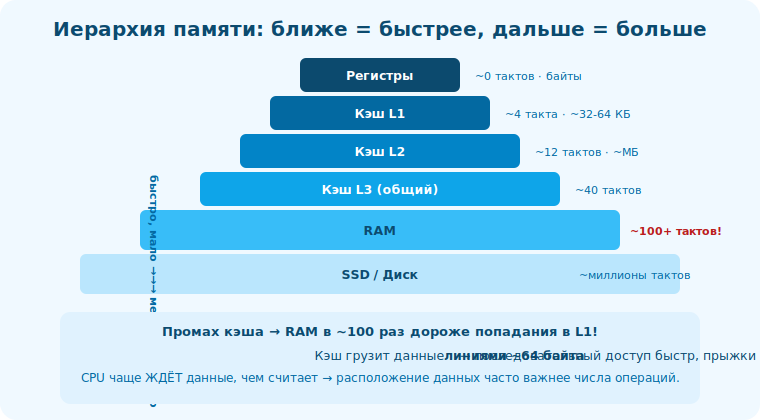

# 08 · Кэш L1/L2/L3 🖼️⭐⭐

> 🎯 **Цель блока:** разобраться в кэше — главном механизме, скрывающем медлительность RAM, — и
> понять, как писать код, который его любит.

---

## 📖 Кэш — быстрый буфер между CPU и RAM

```
   КЭШ — маленькая быстрая память рядом с ядром, хранящая КОПИИ недавно/часто используемых данных
   из RAM. идея: большинство обращений попадёт в кэш (быстро), и лишь редкие пойдут в RAM (медленно).

   уровни (больше номер = больше и медленнее):
   L1 — крошечный (~32-64КБ), мгновенный (~4 такта), отдельный на ядро, часто отдельно для кода/данных.
   L2 — больше (~256КБ-1МБ), ~12 тактов, на ядро.
   L3 — большой (~МБ-десятки), ~40 тактов, ОБЩИЙ для всех ядер.
```

🖼️
```
   CPU запрашивает данные:
   в L1? ──да──► ~4 такта ✅ (попадание/hit)
     └─нет─► в L2? ──да──► ~12 тактов
              └─нет─► в L3? ──да──► ~40 тактов
                       └─нет─► RAM ~100-300 тактов ❌ (промах/miss — ДОРОГО)
   цель: максимум попаданий в L1/L2.
```



💡 ⭐ Кэш работает **автоматически** (железо решает, что держать) — ты им не управляешь напрямую.
Но ты влияешь на него **тем, как обращаешься к памяти**: локальный, предсказуемый доступ → высокий
процент попаданий → быстро. Хаотичный → промахи → медленно.

---

## ⭐ Кэш-линии: данные грузятся блоками

```
   кэш хранит не отдельные байты, а КЭШ-ЛИНИИ — блоки фиксированного размера (обычно 64 байта).
   обратился к одному int → в кэш подтянулась вся линия (64 байта = ~16 int рядом).
   → СОСЕДНИЕ данные оказались в кэше «заодно» (пространственная локальность работает!).

   следствие:
   • идёшь по массиву подряд → первый элемент промах, следующие ~15 — попадания (линия уже тут). быстро.
   • прыгаешь по памяти с шагом > 64 байт → каждый раз новая линия, промах за промахом. медленно.
```

💡 ⭐ Кэш-линия — ключевое понятие. Поэтому обход массива **по порядку** быстр (используешь всю
подтянутую линию), а случайный доступ или большой «страйд» — медленный (тянешь линию ради одного
элемента, остальное зря).

---

## ⭐⭐ Cache-friendly код

```
   как писать код, который любит кэш (превью Уровня 4):
   ✅ ПОСЛЕДОВАТЕЛЬНЫЙ доступ — иди по памяти подряд (массивы, а не разбросанные узлы).
   ✅ ЛОКАЛЬНОСТЬ ДАННЫХ — держи вместе то, что используется вместе.
   ✅ КОМПАКТНОСТЬ — меньше данных → больше влезает в кэш (упаковка структур, нужные поля).
   ✅ ПРАВИЛЬНЫЙ ПОРЯДОК обхода матриц — по строкам (как лежит в памяти), а не по столбцам.
   ✅ SoA vs AoS — иногда «структура массивов» кэш-дружнее «массива структур» (обрабатываешь одно поле).

   ❌ враги кэша: связные списки/деревья указателей (прыжки), случайный доступ, раздутые структуры,
      обход матрицы по столбцам, ложное разделение (false sharing) в многопотоке.
```

🖼️
```
   матрица в памяти лежит ПО СТРОКАМ:  [строка0][строка1][строка2]...
   обход по строкам:    ▓▓▓▓ ▓▓▓▓ ▓▓▓▓  → подряд → кэш-попадания → быстро ✅
   обход по столбцам:   ▓... ▓... ▓...   → прыжки через всю строку → промахи → медленно ❌
   ОДИН И ТОТ ЖЕ результат, разница в РАЗЫ только из-за порядка доступа.
```

💡 ⭐⭐ Это самый практичный вывод трека о скорости: **расположение и порядок доступа к данным
часто важнее количества операций**. Кэш-дружелюбный код бывает в разы быстрее «такого же» по
Big-O. Связь с [C: AoS-SoA, cache-line](../../C/04-senior/22-cache-optimization.md) и [Алгоритмами].

---

## 📖 False sharing (для многопотока, кратко)

```
   в многопоточном коде: два потока пишут в РАЗНЫЕ переменные, но они в ОДНОЙ кэш-линии →
   ядра постоянно «отбирают» линию друг у друга (синхронизация кэшей) → резкое замедление.
   это ЛОЖНОЕ разделение (false sharing). лечится разнесением данных потоков по разным линиям.
   (упоминаем как мост к многопоточности — треки C++/Rust/ОС.)
```

---

## ⚠️ Ловушки

- ❌ Игнорировать кэш — «промах в RAM» дороже сотни инструкций.
- ❌ Случайный доступ/прыжки по указателям в горячем коде.
- ❌ Обход матрицы по столбцам вместо строк.
- ❌ Раздутые структуры (тянут лишнее в кэш, меньше полезного влезает).
- ❌ Оптимизировать инструкции, когда узкое место — промахи кэша (профилируй!).
- ❌ False sharing в многопотоке.

---

## ✅ Упражнения

1. **Матрица.** Напиши обход матрицы по строкам и по столбцам, замерь время. Разница? Объясни через
   кэш-линии.
2. **Массив vs список.** Замерь суммирование 10млн элементов в массиве vs связном списке. Почему
   массив быстрее (та же Big-O)?
3. **Кэш-линия.** Если линия 64 байта и int = 4 байта, сколько int в одной линии? Сколько промахов
   при обходе массива из 1600 int по порядку (примерно)?
4. **perf.** (Linux) Запусти `perf stat` на программе и посмотри cache-misses. Сравни локальный и
   случайный доступ.

---

## ❓ Проверь себя

1. Что такое кэш и зачем уровни L1/L2/L3?
2. Что такое кэш-линия и почему последовательный доступ быстр?
3. Назови 3 приёма cache-friendly кода.
4. Почему массив часто быстрее списка несмотря на ту же Big-O?

---

## ✅ Чек-лист

- [ ] Понимаю кэш и уровни как буфер перед медленной RAM
- [ ] Знаю про кэш-линии (блоки ~64 байта)
- [ ] Умею писать cache-friendly код (последовательность, локальность, компактность)
- [ ] Понимаю, почему расположение данных часто важнее числа операций

➡️ Дальше: [✅ Задачи уровня 1](TASKS.md) · [🚀 Проект](PROJECT.md) · затем
[Уровень 2 · От кода к программе](../02-toolchain/09-build-stages.md)
