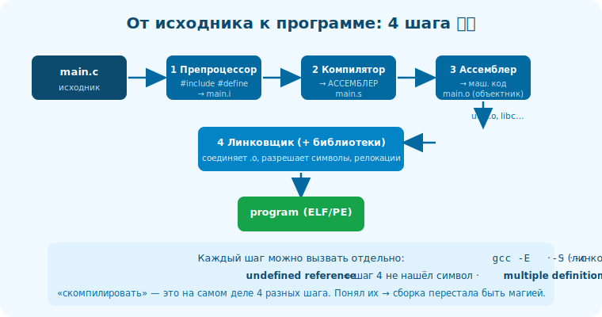

# 09 · Этапы сборки 🖼️⭐⭐

> 🎯 **Цель блока:** понять весь путь `исходник → исполняемый файл` по шагам — препроцессор,
> компилятор, ассемблер, линковщик. Это рассеивает «магию сборки».

---

## 📖 «Скомпилировать» — это на самом деле 4 шага

```
   `gcc main.c -o program` выглядит как один шаг, но внутри — конвейер из ЧЕТЫРЁХ:

   1. ПРЕПРОЦЕССОР  — обрабатывает #include, #define, #if → чистый расширенный исходник.
   2. КОМПИЛЯТОР    — переводит исходник в АССЕМБЛЕР (для целевой ISA).
   3. АССЕМБЛЕР     — переводит ассемблер в МАШИННЫЙ КОД → объектный файл (.o).
   4. ЛИНКОВЩИК     — соединяет объектные файлы и библиотеки → ИСПОЛНЯЕМЫЙ файл.
```

🖼️
```
   main.c
     │ 1. препроцессор (cpp)         → main.i  (раскрытые include/define)
     │ 2. компилятор (cc1)           → main.s  (АССЕМБЛЕР)
     │ 3. ассемблер (as)             → main.o  (объектный: машинный код + символы)
     │ 4. линковщик (ld)  + libs     → program (исполняемый ELF/PE)
     ▼
   program  → готов к запуску
```



💡 ⭐⭐ Каждый шаг можно вызвать отдельно и **посмотреть результат** — это и есть способ понять
сборку: не верить, а видеть промежуточные файлы. `gcc -E` (только препроцессор), `gcc -S` (до
ассемблера), `gcc -c` (до объектника), `gcc` (всё до исполняемого).

---

## ⭐ Шаг 1: препроцессор

```
   работает с ТЕКСТОМ, до всякого «понимания» кода:
   • #include <stdio.h>  → ВСТАВЛЯЕТ содержимое файла-заголовка целиком.
   • #define MAX 100      → ЗАМЕНЯЕТ MAX на 100 по всему тексту.
   • #if / #ifdef         → условно включает/выключает куски кода.
   результат — один большой «расширенный» исходник без директив #.
   посмотреть: gcc -E main.c
```

💡 Поэтому заголовочные файлы — это просто «вставляемый текст». Понимание препроцессора объясняет
include guards, макросы, и почему «тяжёлые» заголовки замедляют компиляцию (много вставляемого текста).

---

## ⭐⭐ Шаг 2: компиляция (исходник → ассемблер)

```
   САМЫЙ сложный шаг. компилятор:
   • разбирает синтаксис (парсинг), проверяет типы, строит внутреннее представление.
   • ОПТИМИЗИРУЕТ (на -O1/-O2/-O3): убирает лишнее, разворачивает циклы, инлайнит и т.д. (Уровень 4).
   • генерирует АССЕМБЛЕР под целевую ISA (x86-64/ARM).
   результат — .s файл (ассемблер). посмотреть: gcc -S main.c → main.s
```

💡 ⭐⭐ Это та граница, где высокоуровневое становится низкоуровневым: твои циклы, условия, функции
превращаются в инструкции и переходы. Именно здесь живёт оптимизация. **godbolt показывает ровно
этот шаг** — исходник → ассемблер. Это центр всего трека.

---

## ⭐ Шаг 3: ассемблирование (ассемблер → объектный файл)

```
   АССЕМБЛЕР (программа `as`) переводит текст ассемблера в МАШИННЫЙ КОД почти один-к-одному.
   результат — ОБЪЕКТНЫЙ ФАЙЛ (.o): машинный код + таблица СИМВОЛОВ (имена функций/переменных) +
   информация для линковки (модуль 12).
   ⚠️ объектник ещё НЕ исполняемый: в нём есть «дырки» — ссылки на то, что определено в ДРУГИХ
   файлах (например, printf), пока не разрешённые.
```

---

## ⭐⭐ Шаг 4: линковка (объектники → исполняемый)

```
   ЛИНКОВЩИК (`ld`) собирает финальную программу:
   • СОЕДИНЯЕТ несколько .o файлов в один.
   • РАЗРЕШАЕТ СИМВОЛЫ: находит, где определена каждая используемая функция (твоя или из библиотеки),
     и «связывает» вызовы с определениями (заполняет «дырки»).
   • ПОДКЛЮЧАЕТ БИБЛИОТЕКИ (стандартную, твои) — статически или динамически (модуль 13).
   • формирует исполняемый файл (ELF/PE) с правильной раскладкой.
   результат — программа, готовая к запуску.
```

💡 ⭐⭐ Большинство «непонятных» ошибок сборки — это шаг 4: `undefined reference to 'foo'` =
линковщик не нашёл, где определена `foo` (забыл файл/библиотеку). `multiple definition` = нашёл
дважды. Понимая, что линковщик соединяет символы, ты сразу понимаешь эти ошибки (модуль 12).

---

## 📖 Зачем разделять на шаги

```
   • РАЗДЕЛЬНАЯ КОМПИЛЯЦИЯ: меняешь один .c → перекомпилируешь только его .o → линкуешь. быстро
     (не пересобирать весь проект). основа систем сборки (make/CMake).
   • ПЕРЕИСПОЛЬЗОВАНИЕ: библиотеки компилируются раз, линкуются много куда.
   • ЯЗЫКОНЕЗАВИСИМОСТЬ линковки: .o от C и от другого языка можно слинковать (общий ABI — модуль 18,
     и трек Interop).
```

> 🧭 Это объясняет [структуру проектов и сборку в C](../../C/03b-projects-api/01-project-structure.md)
> (.h/.c, компиляция, Makefile) на уровне «что реально происходит».

---

## ⚠️ Ловушки

- ❌ Считать «компиляцию» одним шагом — это 4 разных (препроцессор/компилятор/ассемблер/линковщик).
- ❌ Путать ошибки компиляции (синтаксис/типы) и линковки (символы) — это разные шаги.
- ❌ Не знать, что объектник ещё не исполняемый (нужна линковка).
- ❌ Бояться `undefined reference` — это просто «линковщик не нашёл определение».

---

## ✅ Упражнения

1. **Все шаги вручную.** Возьми `main.c`. Прогони по очереди: `gcc -E` (посмотри расширенный),
   `gcc -S` (ассемблер), `gcc -c` (объектник), `gcc` (исполняемый). Что на каждом шаге?
2. **Препроцессор.** Поставь `#define` и `#include`, сделай `gcc -E`. Найди, во что они превратились.
3. **Ошибка линковки.** Объяви функцию, вызови её, но НЕ определяй. Получи `undefined reference`.
   Теперь определи — пропало. Понял шаг 4?
4. **Раздельная сборка.** Раздели программу на 2 файла, скомпилируй каждый в .o, слинкуй. Измени
   один — пересобери только его.

---

## ❓ Проверь себя

1. Назови 4 шага сборки и что делает каждый.
2. Что делает препроцессор (3 примера)?
3. Чем объектный файл отличается от исполняемого?
4. Что значит ошибка `undefined reference` и на каком это шаге?

---

## ✅ Чек-лист

- [ ] Знаю 4 шага: препроцессор → компилятор → ассемблер → линковщик
- [ ] Умею вызвать каждый отдельно и посмотреть результат
- [ ] Различаю ошибки компиляции и линковки
- [ ] Понимаю смысл раздельной компиляции

➡️ Следующий: [10 · Язык ассемблера: читаем](10-assembly.md)
