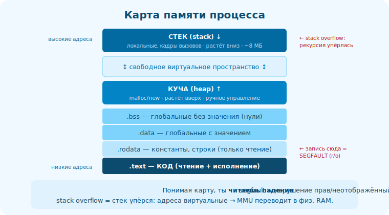

# 16 · Раскладка процесса в памяти 🖼️⭐⭐

> 🎯 **Цель блока:** увидеть, как устроено адресное пространство запущенной программы — где код,
> данные, куча, стек. Это объясняет указатели, segfault и многое другое.

---

## 📖 Карта памяти процесса

```
   у каждого процесса — своё ВИРТУАЛЬНОЕ адресное пространство (модуль 19). в нём — области:

   высокие адреса
   ┌────────────────────┐
   │   СТЕК (stack)      │ ← растёт ВНИЗ; локальные переменные, кадры вызовов (модуль 17)
   │        ↓           │
   │                    │
   │        ↑           │
   │   КУЧА (heap)      │ ← растёт ВВЕРХ; malloc/new (динамическая память)
   ├────────────────────┤
   │   .bss             │ ← глобальные/статические БЕЗ значения (нули)
   │   .data            │ ← глобальные/статические С значением
   │   .rodata          │ ← константы, строковые литералы (только чтение)
   │   .text            │ ← КОД программы (только чтение + исполнение)
   └────────────────────┘
   низкие адреса
   (+ области динамических библиотек где-то посередине)
```



💡 ⭐⭐ Это «карта», которую обязан знать системный разработчик. Каждая область из ELF-секций
(модуль 12/14) переехала сюда при загрузке (модуль 15) + добавились динамические стек и куча. Где
лежит переменная → определяет её время жизни, скорость, и какие ошибки возможны.

---

## ⭐ Где что живёт

```
   ЛОКАЛЬНЫЕ переменные, аргументы  → СТЕК (быстро, авто-освобождение при выходе из функции).
   malloc/new (динамическое)        → КУЧА (живёт, пока не освободишь; гибко, но медленнее, фрагментация).
   ГЛОБАЛЬНЫЕ/СТАТИЧЕСКИЕ            → .data (с значением) / .bss (нулевые); живут всю программу.
   КОНСТАНТЫ, СТРОКИ-ЛИТЕРАЛЫ        → .rodata (только чтение — запись = крэш).
   КОД                              → .text (только чтение/исполнение).
```

💡 ⭐ Это ровно [модель памяти из C](../../C/02-memory/08-memory-model.md), но теперь ты видишь её
происхождение: статические области — из ELF-секций, стек и куча — созданы при запуске. «Стек vs
куча» — фундаментальный выбор: стек быстрый и авто, куча гибкая, но ручная/медленнее.

---

## ⭐⭐ Объяснение классических ошибок

```
   теперь segfault и подобное — не магия, а нарушение карты памяти:

   ❌ SEGFAULT (segmentation fault) — обращение к адресу, который нельзя (не отображён / нет прав):
      • разыменование NULL или «мусорного» указателя.
      • запись в .text/.rodata (например, в строковый литерал) — только чтение.
      • выход за выделенную память (часто).

   ❌ STACK OVERFLOW — стек растёт вниз и упёрся в предел (бесконечная рекурсия, огромный локальный
      массив). стек ограничен (обычно ~8 МБ).

   ❌ ПОРЧА КУЧИ (heap corruption) — запись за границу malloc-блока, double free, use-after-free.

   ❌ УТЕЧКА — malloc без free: куча растёт, память не возвращается (трек C).
```

💡 ⭐⭐ Понимая карту, ты ЧИТАЕШЬ падения: «segfault при записи» + адрес в области .rodata = пишешь в
константу. «Падение после глубокой рекурсии» = переполнение стека. Адрес NULL (0x0) = разыменование
нуля. Это превращает отладку крэшей из гадания в анализ (связь с [методологией отладки Senior](../../Senior/03-practices/13-debugging-method.md)).

---

## 📖 Посмотреть карту реального процесса

```
   Linux: cat /proc/<pid>/maps  — показывает РЕАЛЬНЫЕ области адресного пространства процесса:
      адреса, права (rwx), что отображено (бинарник, .so, [stack], [heap]).
   gdb: info proc mappings ; печать адресов переменных (&local, &global, malloc-указатель) —
      увидишь, что они в разных диапазонах (стек высоко, куча ниже, код ещё ниже).
```

> 🧭 Виртуальные адреса и страницы — это [виртуальная память (модуль 19 + трек ОС)](../../OS/02-memory/08-why-virtual-memory.md):
> карта процесса — это виртуальное пространство, которое MMU отображает на физическую RAM.

---

## ⚠️ Ловушки

- ❌ Не знать, где живут переменные (стек/куча/глоб/код) — основа понимания ошибок.
- ❌ Писать в строковый литерал / .rodata → segfault.
- ❌ Возвращать указатель на локальную переменную (стек освободится) — use-after-return.
- ❌ Глубокая рекурсия/огромные локальные массивы → переполнение стека.
- ❌ Считать segfault «случайным» — это всегда нарушение карты памяти.

---

## ✅ Упражнения

1. **Адреса.** Напечатай адреса: глобальной переменной, локальной (&local), malloc-указателя,
   функции (&func). Сравни диапазоны — узнаёшь карту?
2. **/proc/maps.** (Linux) Запусти программу, посмотри `cat /proc/<pid>/maps`. Найди [stack],
   [heap], код, библиотеки.
3. **Segfault.** Намеренно: запиши в строковый литерал (`char* s="x"; s[0]='y';`). Где упало? Почему
   (.rodata)?
4. **Stack overflow.** Сделай бесконечную рекурсию. Какое падение? Почему (стек упёрся в предел)?

---

## ❓ Проверь себя

1. Нарисуй карту памяти процесса (что где).
2. Где живут локальные, malloc, глобальные, константы, код?
3. Объясни segfault и stack overflow через карту памяти.
4. Откуда берутся статические области, стек и куча при запуске?

---

## ✅ Чек-лист

- [ ] Знаю карту памяти процесса (стек/куча/.bss/.data/.rodata/.text)
- [ ] Понимаю, где живёт каждый вид данных
- [ ] Объясняю segfault/stack overflow/утечки через карту
- [ ] Умею посмотреть реальную карту (/proc/maps, адреса)

➡️ Следующий: [17 · Стек вызовов в деталях](17-call-stack.md)
