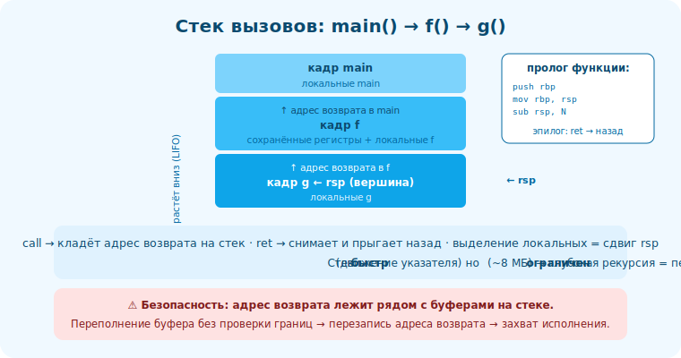

# 17 · Стек вызовов в деталях 🖼️⭐⭐

> 🎯 **Цель блока:** понять, как реализованы вызовы функций — стек, кадры, адрес возврата. Это
> основа функций, рекурсии, локальных переменных и многих уязвимостей.

---

## 📖 Стек — как функции «помнят», куда вернуться

```
   когда функция A вызывает B, нужно ПОТОМ вернуться в A на нужное место. как? через СТЕК:
   • при вызове (call) на стек кладётся АДРЕС ВОЗВРАТА (куда вернуться в A).
   • B создаёт свой КАДР (frame): локальные переменные, сохранённые регистры.
   • при возврате (ret) адрес возврата снимается со стека → прыжок обратно в A.
   стек растёт ВНИЗ (к меньшим адресам), вершина — в регистре rsp.
```

🖼️
```
   main() вызывает f() вызывает g():
   стек (растёт вниз):
   ┌────────────────────┐ ← высокие адреса
   │ кадр main          │  локальные main
   ├────────────────────┤
   │ адрес возврата в main │
   │ кадр f             │  локальные f
   ├────────────────────┤
   │ адрес возврата в f │
   │ кадр g             │  локальные g   ← rsp (вершина)
   └────────────────────┘ ← низкие адреса
   g завершилась → её кадр снят, ret → вернулись в f. и т.д. (LIFO!)
```



💡 ⭐⭐ Стек — это структура **LIFO** ([стек из Алгоритмов](../../Algorithms/01-structures/05-stack-queue.md)),
реализованная аппаратно. Каждый вложенный вызов кладёт кадр сверху; возврат снимает. Поэтому
рекурсия работает (каждый вызов — свой кадр) и поэтому глубокая рекурсия переполняет стек (кадры
накапливаются).

---

## ⭐ Кадр стека (stack frame)

```
   КАДР функции содержит:
   • адрес возврата (куда вернуться)
   • сохранённые регистры (которые функция должна восстановить)
   • локальные переменные
   • иногда аргументы (если не влезли в регистры — модуль 18)

   указатели:
   • rsp — вершина стека (двигается при push/pop, выделении локальных).
   • rbp — база кадра (опционально; «якорь» для доступа к локальным как [rbp-N]).

   пролог функции:  push rbp ; mov rbp,rsp ; sub rsp,N  (выделить N байт под локальные)
   эпилог:          mov rsp,rbp ; pop rbp ; ret          (освободить, вернуться)
```

💡 ⭐ В ассемблере (модуль 10-11) ты видел `push rbp`/`mov rbp,rsp`/`sub rsp,N` — это пролог,
создающий кадр. `[rbp-8]` — локальная переменная. Теперь понятно: функция «выделяет» место на
стеке сдвигом rsp, освобождает — обратным сдвигом. Авто-управление памятью стека = просто движение
указателя (потому стек так быстр).

---

## ⭐⭐ Почему стек быстрый, а его переполнение опасно

```
   ✅ СТЕК БЫСТРЫЙ: выделить локальные = сдвинуть rsp на N (одна инструкция). освободить = сдвинуть
      обратно. никакого поиска свободного места (в отличие от кучи/malloc). + верхушка стека
      обычно в кэше → очень быстро.

   ⚠️ СТЕК ОГРАНИЧЕН (обычно ~8 МБ):
   • глубокая/бесконечная рекурсия → кадры накапливаются → STACK OVERFLOW → крэш.
   • огромный локальный массив (int big[10000000]) → не влезает → крэш. большие данные — на кучу.
```

💡 ⭐⭐ Trade-off стек/куча, теперь на уровне механики: стек — мгновенное выделение/освобождение
(движение указателя), но ограничен и недолговечен (кадр умирает с функцией). Куча — гибкая и
долгоживущая, но медленнее (поиск места) и ручная. Отсюда правила: маленькое/временное — стек,
большое/долгое — куча.

---

## 📖 Связь с уязвимостями (stack buffer overflow)

```
   адрес возврата лежит на стеке РЯДОМ с локальными буферами. если писать в локальный буфер БЕЗ
   проверки размера (gets, strcpy без границ) и переполнить его — можно ПЕРЕЗАПИСАТЬ адрес возврата
   → перенаправить исполнение. это классическая уязвимость «переполнение буфера на стеке».
   защиты: проверка границ (трек безопасности, валидация), stack canaries, ASLR, NX-бит, безопасные
   языки (Rust!). понимая кадр стека, ты понимаешь и атаку, и защиту.
```

> 🧭 Прямая связь с [безопасностью (валидация, память)](../../Security/03-defensive-code/16-input-validation.md)
> и [Rust](../../Rust/README.md) (где такие ошибки невозможны by design).

---

## ⚠️ Ловушки

- ❌ Возвращать указатель/ссылку на локальную переменную (кадр исчезнет — use-after-return).
- ❌ Глубокая рекурсия без базового случая → переполнение стека.
- ❌ Огромные массивы на стеке (большое — на кучу).
- ❌ Не проверять границы при записи в локальные буферы (переполнение → перезапись адреса возврата).
- ❌ Думать, что стек «бесконечный» (обычно ~8 МБ).

---

## ✅ Упражнения

1. **Кадры в gdb.** Поставь breakpoint в глубокой функции, `backtrace` — увидишь стек вызовов
   (кадры). Кто кого вызвал?
2. **Пролог.** В godbolt найди `push rbp`/`mov rbp,rsp`/`sub rsp,N` и эпилог. Где локальные (`[rbp-N]`)?
3. **Stack overflow.** Бесконечная рекурсия → крэш. Глубину видно? Почему упало?
4. **Стек vs куча.** Объяви `int big[10000000]` локально (крэш/overflow) и через malloc (ок).
   Объясни разницу.

---

## ❓ Проверь себя

1. Как стек реализует вызовы функций (адрес возврата, кадры)?
2. Что в кадре стека и что делают пролог/эпилог?
3. Почему стек быстрый, но ограниченный?
4. Как переполнение буфера на стеке связано с адресом возврата?

---

## ✅ Чек-лист

- [ ] Понимаю стек вызовов (кадры, адрес возврата, LIFO)
- [ ] Узнаю пролог/эпилог и доступ к локальным в ассемблере
- [ ] Понимаю, почему стек быстр, но ограничен
- [ ] Вижу связь кадра стека с уязвимостями и защитой

➡️ Следующий: [18 · Calling convention и ABI](18-calling-convention.md)
