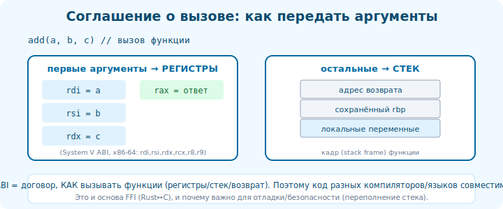

# 18 · Calling convention и ABI 🖼️⭐⭐

> 🎯 **Цель блока:** понять «контракт вызова функций» — где передаются аргументы и результат — и
> ABI, который делает возможной совместимость между файлами, языками и библиотеками.

---

## 📖 Calling convention — договор о вызове

```
   когда A вызывает B, надо договориться:
   • ГДЕ B возьмёт аргументы? (какие регистры / стек)
   • ГДЕ вернёт результат?
   • КТО чистит стек?
   • какие регистры B может портить, а какие обязан сохранить?

   это CALLING CONVENTION — соглашение, которому следуют ОБЕ стороны. иначе вызов сломается.
   компилятор генерирует код по конвенции; все функции одной платформы ей следуют → совместимы.
```



💡 ⭐⭐ Без единой конвенции код одной функции не смог бы вызвать другую (особенно из другого файла/
языка/библиотеки). Конвенция — это «протокол» вызовов. Понимая её, ты читаешь ассемблер вызовов и
понимаешь, как разные языки [вызывают друг друга (Interop/FFI)](../../Interop/01-basics/03-ffi-idea.md).

---

## ⭐ System V AMD64 (Linux/Mac x86-64) — на практике

```
   ЦЕЛОЧИСЛЕННЫЕ/УКАЗАТЕЛИ АРГУМЕНТЫ (первые 6): rdi, rsi, rdx, rcx, r8, r9
   ДРОБНЫЕ (float/double): xmm0–xmm7
   ОСТАЛЬНЫЕ аргументы (7-й и далее): на СТЕКЕ
   РЕЗУЛЬТАТ: rax (целое/указатель), xmm0 (дробное)

   пример: int f(int a, int b, int c)
   → a в edi, b в esi, c в edx ; результат в eax

   регистры:
   • CALLER-SAVED (volatile) — вызывающий сам сохраняет, если нужно (rax, rcx, rdx, rsi, rdi, r8-r11).
   • CALLEE-SAVED — вызываемая функция обязана восстановить перед возвратом (rbx, rbp, r12-r15).
```

🖼️
```
   int add(int a, int b)            вызов  add(2, 3):
   ; a → edi, b → esi               mov edi, 2
   add eax, edi, esi  (концептуально) mov esi, 3
   ret  (результат в eax)           call add
                                     ; результат теперь в eax
```

💡 ⭐ Это объясняет, почему в ассемблере (модуль 11) аргументы «появляются» в edi/esi, а результат
читается из eax. Windows x64 использует ДРУГУЮ конвенцию (аргументы в rcx, rdx, r8, r9) — поэтому
ABI платформозависим.

---

## ⭐⭐ ABI — бинарный контракт платформы

```
   ABI (Application Binary Interface) — ШИРЕ, чем calling convention. это полный «бинарный договор»
   платформы, как код и данные взаимодействуют на уровне машины:
   • calling convention (передача аргументов/результата)
   • как РАЗЛОЖЕНЫ типы в памяти (размеры, выравнивание, padding структур — трек C)
   • формат объектных файлов/исполняемых (ELF)
   • как работают системные вызовы
   • name mangling (для C++)

   зачем: ABI делает возможной БИНАРНУЮ СОВМЕСТИМОСТЬ:
   • твой .o линкуется с чужой библиотекой (оба следуют ABI).
   • программа на C вызывает библиотеку, скомпилированную годы назад.
   • один язык вызывает другой (C ABI — «лингва франка» межъязыкового взаимодействия).
```

💡 ⭐⭐ ABI — это то, что позволяет кускам, собранным РАЗДЕЛЬНО (разные файлы, компиляторы, языки,
время), работать вместе на уровне байтов. **C ABI** стал универсальным «общим языком»: почти любой
язык умеет вызывать C-функции, потому что C ABI прост и стабилен. Поэтому биндинги и FFI строятся
через C (трек [Interop](../../Interop/02-boundary/08-abi-layout.md)).

---

## 📖 Почему ABI должен быть стабильным

```
   • если библиотека меняет ABI (порядок полей структуры, конвенцию) — старые программы, слинкованные
     с ней, СЛОМАЮТСЯ (читают данные «не там»). поэтому системные ABI берегут десятилетиями.
   • API (исходный интерфейс) ≠ ABI (бинарный). можно сохранить API, но сломать ABI (добавил поле
     в середину структуры) → перекомпиляция обязательна.
   • стабильный ABI = можно обновлять .so без пересборки программ (модуль 13, динамическая линковка).
```

> 🧭 Это [граница памяти из Interop](../../Interop/02-boundary/09-memory-ownership.md): раскладка
> данных и конвенции вызова — то, о чём «договариваются» куски на бинарном уровне.

---

## ⚠️ Ловушки

- ❌ Думать, что конвенция вызова одна везде (Linux SysV ≠ Windows x64).
- ❌ Путать API (исходный интерфейс) и ABI (бинарный контракт).
- ❌ Менять раскладку структуры в библиотеке → ломать ABI → крэши у старых клиентов.
- ❌ Не использовать `extern "C"` при вызове C++ из C (name mangling сломает символы).
- ❌ Не учитывать ABI при FFI/межъязыковом взаимодействии (передаёшь данные «не так»).

---

## ✅ Упражнения

1. **Регистры аргументов.** В godbolt для `int f(int a,int b,int c)` найди, в каких регистрах a,b,c
   и где результат. Сверь с SysV.
2. **7+ аргументов.** Сделай функцию с 8 аргументами. Где 7-й и 8-й (на стеке)? Найди в ассемблере.
3. **Windows vs Linux.** В godbolt сравни ту же функцию под Linux (gcc) и Windows (MSVC). Разные
   регистры аргументов?
4. **C ABI.** Подумай (или попробуй, трек Interop): почему Python/Rust/Go умеют вызывать C-функции,
   но не напрямую функции друг друга?

---

## ❓ Проверь себя

1. Что описывает calling convention (аргументы, результат, регистры)?
2. Где в SysV AMD64 первые аргументы и результат?
3. Что такое ABI и чем он шире calling convention?
4. Почему C ABI — «лингва франка» межъязыкового взаимодействия?

---

## ✅ Чек-лист

- [ ] Понимаю calling convention (где аргументы/результат)
- [ ] Знаю основы SysV AMD64 (rdi/rsi/... , rax)
- [ ] Понимаю ABI как полный бинарный контракт платформы
- [ ] Вижу роль C ABI в совместимости и FFI

➡️ Следующий: [19 · Виртуальная память глазами программы](19-virtual-memory.md)
