# ⚙️ Трек · Как работает компьютер (Computer Science)

> **Чтобы писать быстрый и предсказуемый код, нужно понимать, что под ним.** Этот трек — про
> слой между твоей программой и железом: как CPU исполняет инструкции, как работает кэш, и —
> главное — **как твой код превращается в машинный код и запускается** (компиляция, ассемблер,
> линковка, ELF/PE, ABI, calling convention).

> 🧭 Этот трек дополняет остальные: [ОС](../OS/README.md) объясняет *рантайм* (процессы,
> планировщик, виртуальная память как ресурс), [языки](../C/README.md) — как ты *используешь*
> память; а здесь — **железо и тулчейн**: что происходит «под» языком и «над» транзисторами.

---

## 🗺️ Дорожная карта

```mermaid
graph TD
    subgraph L0 [🥚 Уровень 0 — Введение]
        A0[00 · Зачем понимать компьютер]
        A1[01 · Слои абстракции]
        A2[02 · Инструменты: godbolt, objdump, readelf]
    end
    subgraph L1 [🐣 Уровень 1 — Железо исполняет код]
        B0[03 · CPU: цикл fetch-decode-execute]
        B1[04 · Регистры]
        B2[05 · Машинный код и инструкции]
        B3[06 · Конвейер и предсказание ветвлений]
        B4[07 · RAM, шина, иерархия памяти]
        B5[08 · Кэш L1/L2/L3]
    end
    subgraph L2 [🐥 Уровень 2 — От кода к программе ⭐ ядро]
        C0[09 · Этапы сборки ⭐⭐]
        C1[10 · Язык ассемблера: читаем]
        C2[11 · Из C в ассемблер]
        C3[12 · Объектные файлы и символы]
        C4[13 · Линковка: статическая и динамическая]
        C5[14 · ELF и PE]
    end
    subgraph L3 [🦅 Уровень 3 — Запуск программы]
        D0[15 · Загрузчик: как ОС запускает ELF]
        D1[16 · Раскладка процесса в памяти]
        D2[17 · Стек вызовов в деталях]
        D3[18 · Calling convention и ABI]
        D4[19 · Виртуальная память глазами программы]
        D5[20 · Динамические библиотеки, PLT/GOT]
    end
    subgraph L4 [🚀 Уровень 4 — Производительность на уровне железа]
        E0[21 · Как компилятор оптимизирует]
        E1[22 · Что мешает CPU]
        E2[23 · Cache-friendly код]
        E3[24 · SIMD и векторизация]
        E4[25 · Профилирование на уровне инструкций]
        E5[26 · Итог: знание железа → быстрый код]
    end
    L0 --> L1 --> L2 --> L3 --> L4 --> Done([⚙️ Понимаю машину до железа])
```

---

## 🎯 Ядро трека — от кода к программе

> **Самое непрозрачное для большинства разработчиков — это путь `исходник → запущенный
> процесс`.** Препроцессор, компилятор, ассемблер, линковщик, загрузчик — каждый делает свой
> шаг. Поймёшь этот конвейер — перестанешь воспринимать сборку и «странные ошибки линковки» как
> магию.

Поэтому центр трека (Уровень 2) — **этапы сборки и ассемблер**: как `int x = a + b;` становится
инструкциями процессора, как файлы соединяются в исполняемый, что внутри ELF.

---

## 📂 Содержание

### 🥚 Уровень 0 — Введение
- [00 · Зачем разработчику понимать компьютер](00-intro/00-why-understand.md)
- [01 · Слои абстракции: от транзистора до программы](00-intro/01-abstraction-layers.md)
- [02 · Инструменты: godbolt, objdump, readelf, gdb](00-intro/02-tools.md)

### 🐣 Уровень 1 — Железо исполняет код
- [03 · CPU: цикл fetch-decode-execute](01-hardware/03-cpu-cycle.md)
- [04 · Регистры](01-hardware/04-registers.md)
- [05 · Машинный код и инструкции](01-hardware/05-machine-code.md)
- [06 · Конвейер и предсказание ветвлений](01-hardware/06-pipeline.md)
- [07 · RAM, шина и иерархия памяти](01-hardware/07-ram-hierarchy.md)
- [08 · Кэш L1/L2/L3](01-hardware/08-cache.md)
- ✅ [Задачи уровня 1](01-hardware/TASKS.md) · 🚀 [Проект](01-hardware/PROJECT.md)

### 🐥 Уровень 2 — От кода к программе ⭐ ядро
- [09 · Этапы сборки ⭐⭐](02-toolchain/09-build-stages.md)
- [10 · Язык ассемблера: читаем](02-toolchain/10-assembly.md)
- [11 · Из C в ассемблер](02-toolchain/11-c-to-asm.md)
- [12 · Объектные файлы и символы](02-toolchain/12-object-files.md)
- [13 · Линковка: статическая и динамическая](02-toolchain/13-linking.md)
- [14 · ELF и PE](02-toolchain/14-elf-pe.md)
- ✅ [Задачи уровня 2](02-toolchain/TASKS.md) · 🚀 [Проект](02-toolchain/PROJECT.md)

### 🦅 Уровень 3 — Запуск программы
- [15 · Загрузчик: как ОС запускает ELF](03-execution/15-loader.md)
- [16 · Раскладка процесса в памяти](03-execution/16-process-layout.md)
- [17 · Стек вызовов в деталях](03-execution/17-call-stack.md)
- [18 · Calling convention и ABI](03-execution/18-calling-convention.md)
- [19 · Виртуальная память глазами программы](03-execution/19-virtual-memory.md)
- [20 · Динамические библиотеки, PLT/GOT](03-execution/20-dynamic-libs.md)
- ✅ [Задачи уровня 3](03-execution/TASKS.md) · 🚀 [Проект](03-execution/PROJECT.md)

### 🚀 Уровень 4 — Производительность на уровне железа
- [21 · Как компилятор оптимизирует](04-performance/21-compiler-optimization.md)
- [22 · Что мешает CPU работать быстро](04-performance/22-cpu-bottlenecks.md)
- [23 · Cache-friendly код](04-performance/23-cache-friendly.md)
- [24 · SIMD и векторизация](04-performance/24-simd.md)
- [25 · Профилирование на уровне инструкций](04-performance/25-profiling.md)
- [26 · Итог: знание железа → быстрый код](04-performance/26-conclusion.md)
- ✅ [Задачи уровня 4](04-performance/TASKS.md) · 🚀 [Проект](04-performance/PROJECT.md)

---

## 🧭 Как проходить

Лучший способ — **смотреть на ассемблер своего кода** ([Compiler Explorer / godbolt](00-intro/02-tools.md))
и разбирать настоящие бинарники (`objdump`, `readelf`). Теория без этого — абстракция; с этим —
озарение «а, вот что на самом деле происходит». Идеально проходить **параллельно с [C](../C/README.md)**:
C — самый прозрачный язык, его легко сопоставить с ассемблером.

➡️ Начни с [00 · Зачем разработчику понимать компьютер](00-intro/00-why-understand.md)
