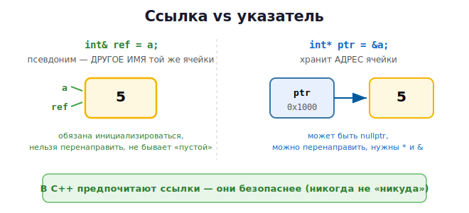

# 08 · Модель памяти и ссылки 🖼️⭐

> 🎯 **Цель блока:** освежить модель памяти (стек/куча) и до конца понять **ссылки** —
> ключевой инструмент C++, который заменяет указатели из C во многих местах.

---

## 📖 Модель памяти — та же, что в C

C++ работает с памятью так же, как C (подробно — в
[C-курсе, модуль 08](../../C/02-memory/08-memory-model.md)):

```
   STACK (стек)  — локальные переменные, чистятся АВТОМАТИЧЕСКИ при выходе из {}
   HEAP  (куча)  — динамическая память (new/delete, умные указатели)
   DATA / TEXT   — глобальные данные и код
```

🎯 Главная стратегия C++: **предпочитай стек куче**. Локальные объекты на стеке
уничтожаются автоматически и предсказуемо — это основа безопасности C++ (увидишь в RAII).

```cpp
void func() {
    int x = 5;                  // STACK — удалится в конце функции сам
    std::string s = "привет";   // STACK (хотя строка внутри хранит данные в куче —
}                               // но s сама уберёт их в деструкторе! Это RAII)
```

---

## ⭐ Ссылка — это псевдоним (другое имя) переменной

```cpp
int a = 5;
int& ref = a;        // ref — ДРУГОЕ ИМЯ для a (не копия!)

ref = 10;            // меняем ref → меняется a
std::cout << a;      // 10
```

🖼️ Ссылка `ref` и переменная `a` — два имени одной ячейки:



💡 Ссылка — это не объект и не указатель, а **альтернативное имя** существующего объекта.
Через `ref` ты работаешь напрямую с `a`.

### Правила ссылок
```cpp
int a = 5;
int& ref = a;        // ✅ ссылку ОБЯЗАТЕЛЬНО инициализировать при объявлении
// int& bad;         // ❌ ошибка — ссылка не может быть «пустой»
ref = b;             // ⚠️ это НЕ перенаправление! Это присваивание: a = b
```

| Ссылка | Указатель (из C) |
|--------|------------------|
| псевдоним объекта | хранит адрес |
| обязана быть инициализирована | может быть `nullptr` |
| нельзя перенаправить | можно менять цель |
| синтаксис обычной переменной | нужны `*` и `&` |

---

## ⭐ Зачем ссылки: эффективность и удобство

### 1. Передача в функции без копирования
```cpp
void process(const std::vector<int>& data) {   // НЕ копируем весь вектор
    for (int x : data) { /* ... */ }
}
```
🖼️ Без `&` копировался бы весь вектор (может быть мегабайты!). Со ссылкой — передаётся
лишь «имя», копирования нет.

### 2. Изменение оригинала
```cpp
void increment(int& x) { x++; }
int n = 5;
increment(n);            // n стало 6
```

### 3. const-ссылка — читать без копий и без изменений
```cpp
void print(const std::string& s) { std::cout << s; }  // быстро и безопасно
```

💡 Это «золотое правило» из модуля 07: **большие объекты — по `const&`**. Теперь ты
понимаешь, почему: ссылка не копирует.

---

## 📖 Указатели в C++ тоже есть

C++ полностью поддерживает сырые указатели из C (`*`, `&`, `nullptr`):

```cpp
int a = 5;
int* ptr = &a;       // указатель на a
std::cout << *ptr;   // 5 — разыменование
ptr = nullptr;       // в C++ используют nullptr, а не NULL
```

> ⚠️ Но в современном C++ **сырые указатели для владения памятью почти не используют** —
> их заменили умные указатели (модуль 11). Сырой указатель оставляют только как
> «необязательную ссылку» или для невладеющего доступа. Об этом — дальше.

---

## 📖 nullptr вместо NULL

```cpp
int* p = nullptr;        // ✅ C++ способ
// int* p = NULL;        // старый C-стиль, избегай
// int* p = 0;           // тоже плохо

if (p != nullptr) { /* безопасно разыменовать */ }
```

💡 `nullptr` — типобезопасная «пустота» для указателей. Используй её.

---

## ✅ Задачи

1. **Псевдоним.** Создай переменную и ссылку на неё. Измени через ссылку, покажи, что
   оригинал изменился.
2. **swap по ссылке.** Реализуй `swap(int&, int&)` без указателей.
3. **Без копий.** Напиши функцию, принимающую большой `std::vector<int>` по `const&`,
   считающую сумму. Объясни, почему `&` важна.
4. **Ссылка vs указатель.** Сделай одно и то же изменение переменной через ссылку и через
   указатель. Сравни синтаксис.
5. **range-for со ссылкой.** Удвой все элементы вектора через `for (auto& x : v)`.
6. **nullptr.** Напиши функцию, безопасно печатающую значение по указателю (или «нет
   данных», если `nullptr`).

---

## ❓ Проверь себя

1. Какие сегменты памяти есть в C++? Что чистится автоматически?
2. Что такое ссылка? Чем она отличается от копии и от указателя?
3. Почему ссылку нельзя оставить неинициализированной?
4. Зачем передавать большие объекты по `const&`?
5. Почему в C++ предпочитают `nullptr`, а не `NULL`?
6. Почему сырые указатели для владения памятью теперь избегают?

---

## ✅ Чек-лист

- [ ] Помню модель памяти и стратегию «предпочитай стек»
- [ ] Понимаю ссылку как псевдоним
- [ ] Использую `const&` для передачи больших объектов
- [ ] Знаю отличия ссылки и указателя
- [ ] Использую `nullptr`

➡️ Следующий: [09 · new / delete и ручная память](09-new-delete.md)
