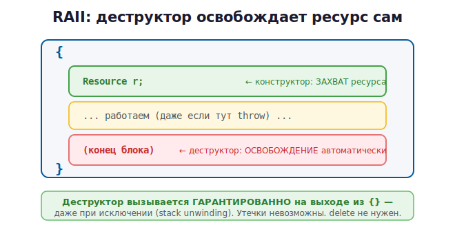

# 10 · RAII — главная идея C++ 🖼️⭐⭐

> 🎯 **Цель блока:** понять RAII — концепцию, которая делает C++ безопасным **без**
> сборщика мусора. Это **самая важная идея всего языка**. Прочитай очень внимательно.

---

## 📖 Проблема, которую решает RAII

Из прошлого модуля: ручной `delete` ненадёжен — легко забыть, исключения его ломают.
Нужен способ освобождать ресурсы **автоматически и гарантированно**.

🎯 Решение C++ — **RAII** (Resource Acquisition Is Initialization, «получение ресурса
есть инициализация»):

> **Привяжи ресурс (память, файл, блокировку) к объекту на стеке. Конструктор захватывает
> ресурс, деструктор освобождает. Когда объект выходит из области видимости — деструктор
> вызывается АВТОМАТИЧЕСКИ, и ресурс освобождается. Гарантированно.**

---

## ⭐ Деструктор — функция, которая вызывается при уничтожении

```cpp
class Resource {
public:
    Resource()  { std::cout << "Захватили ресурс\n"; }   // конструктор
    ~Resource() { std::cout << "Освободили ресурс\n"; }  // ДЕСТРУКТОР (с ~)
};

int main() {
    Resource r;          // "Захватили ресурс"
    std::cout << "Работаем...\n";
}                        // "Освободили ресурс" — деструктор вызван АВТОМАТИЧЕСКИ
```

Вывод:
```
Захватили ресурс
Работаем...
Освободили ресурс
```

🖼️ Деструктор `~Resource()` срабатывает сам, когда `r` выходит из области видимости `{}`:



💡 Это и есть **детерминированное разрушение**: ты точно знаешь, **когда** освободится
ресурс — в момент выхода из `{}`. Не «когда-нибудь потом», как в Python.

---

## ⭐ RAII-обёртка над памятью

Завернём `new`/`delete` в объект, который сам всё освобождает:

```cpp
class IntArray {
    int* data;
public:
    IntArray(int size) { data = new int[size]; }   // захват в конструкторе
    ~IntArray()        { delete[] data; }           // освобождение в деструкторе

    int& operator[](int i) { return data[i]; }      // доступ к элементам
};

void func() {
    IntArray arr(100);   // выделили память
    arr[0] = 42;
    // ... используем ...
}                        // ← деструктор САМ вызовет delete[]. Утечки невозможны!
```

🖼️ Сравни два мира:

```
   Ручной new/delete:           RAII:
   int* p = new int[100];       IntArray arr(100);
   ...                          ...
   delete[] p;  ← можно забыть! } ← деструктор НЕ забудет, вызовется всегда
```

---

## ⭐⭐ Почему RAII спасает от исключений

Вспомни проблему: исключение между `new` и `delete` → утечка. С RAII этой проблемы **нет**:

```cpp
void safe() {
    IntArray arr(1000);   // RAII-объект на стеке
    doSomething();        // даже если ЗДЕСЬ исключение...
}                         // ...деструктор arr ВСЁ РАВНО вызовется при «разматывании
                          //    стека» → память освобождена. Гарантия.
```

🖼️
```
   doSomething() бросает исключение
        │
        ▼
   стек «разматывается» — для каждого локального объекта
   вызывается деструктор → arr освобождает память АВТОМАТИЧЕСКИ
        │
        ▼
   утечки НЕТ, даже при ошибке
```

> 💡 Это называется **stack unwinding** (разматывание стека). При исключении C++
> гарантированно вызывает деструкторы всех локальных объектов. Поэтому RAII —
> единственный надёжный способ управления ресурсами в C++.

---

## ⭐ RAII работает с ЛЮБЫМИ ресурсами, не только памятью

Это универсальный принцип. Файлы, блокировки, соединения:

```cpp
// Файл закроется сам (RAII внутри std::ifstream)
{
    std::ifstream file("data.txt");   // конструктор открывает файл
    // ... читаем ...
}   // ← деструктор file закрывает файл автоматически

// Блокировка снимется сама (RAII)
{
    std::lock_guard<std::mutex> lock(my_mutex);   // захват блокировки
    // ... критическая секция ...
}   // ← деструктор снимает блокировку — даже при исключении
```

💡 «Захватил в конструкторе — освободил в деструкторе» работает для всего. Это делает C++
код безопасным и чистым: ресурсы не текут.

🆚 Сравни с другими языками:
- **C:** надо вручную `free`, `fclose` — легко забыть.
- **Python:** нужен `with` для файлов, `del` не гарантирован.
- **C++:** автоматически через RAII — ничего не надо помнить.

---

## 📖 Стандартная библиотека вся построена на RAII

Тебе редко нужно писать свои RAII-классы — STL уже это делает:

```cpp
std::vector<int> v(1000);    // сам выделит и освободит память
std::string s = "привет";    // сама управляет своей памятью
std::ifstream f("file.txt"); // сам закроет файл
```

Все они освобождают ресурсы в деструкторе. Поэтому в современном C++ ты **почти не
пишешь `delete`** — за тебя это делают RAII-объекты.

---

## ✅ Задачи

1. **Деструктор.** Создай класс с конструктором и деструктором, печатающими сообщения.
   Создай объект в блоке `{}`, убедись, что деструктор вызывается на выходе.
2. **Порядок разрушения.** Создай три объекта подряд, проследи порядок вызова
   деструкторов (он обратный созданию — LIFO, как стек!).
3. **RAII-массив.** Напиши `IntArray` (как в уроке) с `new[]`/`delete[]` в
   конструкторе/деструкторе. Проверь под ASan — нет утечек.
4. **Исключение.** Внутри функции с RAII-объектом брось исключение (`throw`). Убедись, что
   деструктор всё равно вызвался (печать) и память освобождена (ASan).
5. **RAII-таймер.** Класс, который в конструкторе запоминает время, а в деструкторе
   печатает, сколько прожил объект.
6. ⭐ **RAII-файл.** Оберни `FILE*` (`fopen`/`fclose`) в RAII-класс, который закрывает
   файл в деструкторе.

---

## ❓ Проверь себя

1. Что означает RAII? В чём его суть?
2. Когда вызывается деструктор?
3. Что такое детерминированное разрушение и чем оно лучше сборщика мусора?
4. Почему RAII спасает от утечек при исключениях (что такое stack unwinding)?
5. На какие ресурсы (кроме памяти) распространяется RAII?
6. Почему в современном C++ редко пишут `delete` вручную?

---

## ✅ Чек-лист

- [ ] Понимаю RAII: захват в конструкторе, освобождение в деструкторе
- [ ] Знаю, что деструктор вызывается автоматически на выходе из области видимости
- [ ] Понимаю, почему RAII надёжен при исключениях (stack unwinding)
- [ ] Вижу RAII в `vector`, `string`, `ifstream`
- [ ] Написал свой RAII-класс

> 🏆 RAII — фундамент всего C++. Если понял его — понял суть языка. Теперь — готовые
> RAII-обёртки для памяти: умные указатели.

➡️ Следующий: [11 · Умные указатели](11-smart-pointers.md)
