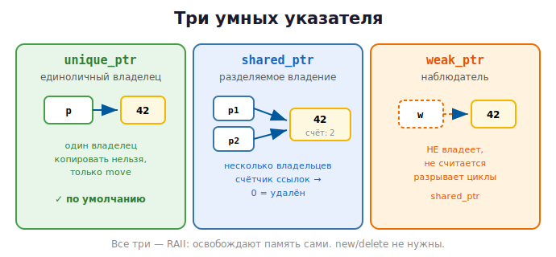

# 11 · Умные указатели 🖼️⭐⭐

> 🎯 **Цель блока:** освоить умные указатели — готовые RAII-обёртки, которые управляют
> памятью **за тебя**. Это то, чем заменяют `new`/`delete` в современном C++.

---

## 📖 Что такое умный указатель

**Умный указатель** — это объект, который ведёт себя как указатель, но **сам освобождает
память** в деструкторе (RAII!). Тебе не нужен `delete` — он происходит автоматически.

Три вида (из `#include <memory>`):

| Указатель | Владение | Когда |
|-----------|----------|-------|
| `std::unique_ptr` | **единоличное** | по умолчанию — почти всегда |
| `std::shared_ptr` | **разделяемое** (счётчик) | когда владельцев несколько |
| `std::weak_ptr` | **наблюдение** (не владеет) | разрыв циклов shared_ptr |



---

## ⭐ unique_ptr — единоличный владелец

Самый важный и частый. Владеет объектом один; когда `unique_ptr` уничтожается — объект
удаляется.

```cpp
#include <memory>

std::unique_ptr<int> p = std::make_unique<int>(42);   // выделить int(42)
std::cout << *p << "\n";        // 42 — как обычный указатель
*p = 100;
// delete НЕ нужен! при выходе из области видимости память освободится сама
```

🖼️
```
   {
       auto p = std::make_unique<int>(42);   // владеет int в куче
       ...
   }   ← p уничтожается → автоматически delete. Утечки невозможны.
```

💡 `std::make_unique<T>(args)` — правильный способ создать. Не пиши `new` вручную.

### Единоличность: нельзя копировать, только перемещать
```cpp
auto p1 = std::make_unique<int>(42);
// auto p2 = p1;            // ❌ ошибка! unique_ptr нельзя копировать
auto p2 = std::move(p1);   // ✅ передать владение (p1 станет пустым)
// теперь владеет p2, p1 == nullptr
```

🖼️
```
   до:  p1 ──► [42]      p2 (пусто)
   move:
   после: p1 (пусто)     p2 ──► [42]      владение ПЕРЕДАНО, не скопировано
```

💡 Это гарантирует, что у объекта **ровно один владелец** — никакого двойного `delete`.
Передачу владения (`std::move`) подробно разберём в [модуле 12](12-move-semantics.md).

---

## ⭐ shared_ptr — разделяемое владение

Когда на объект должны ссылаться **несколько** владельцев. Внутри — **счётчик ссылок**
(как в Python!): объект удаляется, когда счётчик падает до нуля.

```cpp
auto p1 = std::make_shared<int>(42);   // счётчик = 1
{
    auto p2 = p1;                      // счётчик = 2 (оба владеют)
    std::cout << *p2 << "\n";
}                                      // p2 уничтожен → счётчик = 1
// объект ещё жив, владеет p1
// когда и p1 уйдёт → счётчик = 0 → объект удалён
```

🖼️
```
   p1 ──┐
        ├──► [42 | счётчик: 2]      пока счётчик > 0 — объект жив
   p2 ──┘
   p2 уходит → счётчик 1 → p1 уходит → счётчик 0 → 🗑 удалён
```

💡 `shared_ptr` использует ту же идею, что сборщик мусора Python (подсчёт ссылок), но
**только** для объектов, которыми явно делятся. Это дороже `unique_ptr` (нужно считать
ссылки потокобезопасно), поэтому используй его, **только когда владельцев правда несколько**.

> ⚠️ Не делай всё `shared_ptr` «на всякий случай». По умолчанию — `unique_ptr`. `shared_ptr`
> — когда владение действительно разделяемое.

---

## ⭐ weak_ptr — наблюдатель без владения

`shared_ptr` имеет проблему — **циклические ссылки** (как в Python!): два объекта
ссылаются друг на друга через `shared_ptr`, счётчики никогда не дойдут до нуля → утечка.

```cpp
struct Node {
    std::shared_ptr<Node> next;       // ⚠️ если два узла ссылаются взаимно — цикл!
};
```

🖼️
```
   [A] ──shared──► [B]
    ▲               │
    └────shared─────┘
   счётчики обоих = 1, никогда не 0 → 💧 утечка
```

Решение — `weak_ptr`: он **наблюдает** за объектом, но **не увеличивает** счётчик:

```cpp
struct Node {
    std::shared_ptr<Node> next;       // владеющая связь
    std::weak_ptr<Node> prev;         // НЕ владеющая — разрывает цикл
};

// чтобы использовать weak_ptr, временно превращаем в shared:
if (auto p = weak.lock()) {           // lock() даёт shared_ptr, если объект жив
    std::cout << *p;
} // иначе объект уже удалён
```

💡 `weak_ptr` — прямой аналог `weakref` из [Python-курса](../../Python/04-senior/20-memory-deep.md).
Используется для «обратных» связей (родитель↔ребёнок), кэшей, наблюдателей.

---

## 📋 Какой указатель выбрать

```
   Нужен владелец памяти?
   ├─ один владелец           → unique_ptr  (по умолчанию!)
   ├─ несколько владельцев    → shared_ptr
   └─ наблюдать, не владея     → weak_ptr (или сырой указатель для невладения)

   Просто доступ без владения  → ссылка & или сырой указатель *
```

> 💡 **Правило современного C++:** `make_unique` по умолчанию; `make_shared` когда владение
> разделяется; `new`/`delete` — почти никогда.

---

## 🧪 Сравнение: сырой указатель vs unique_ptr

```cpp
// ❌ опасно — ручной delete, можно забыть, исключения ломают
void old_way() {
    int* p = new int(42);
    // ... если тут return/исключение — утечка
    delete p;
}

// ✅ безопасно — освобождение автоматическое
void new_way() {
    auto p = std::make_unique<int>(42);
    // ... return/исключение — память всё равно освободится
}
```

---

## ✅ Задачи

1. **unique_ptr.** Создай `unique_ptr<int>` через `make_unique`, измени значение, выведи.
   Убедись, что `delete` не нужен (ASan чист).
2. **Передача владения.** Создай `unique_ptr`, передай владение другому через `std::move`,
   покажи, что исходный стал `nullptr`.
3. **unique_ptr для класса.** Оберни свой класс (например `IntArray` из модуля 10) в
   `unique_ptr`.
4. **shared_ptr и счётчик.** Создай `shared_ptr`, скопируй в блоке `{}`, выведи
   `use_count()` до, внутри и после блока.
5. **Циклическая утечка.** Сделай два узла, ссылающихся друг на друга через `shared_ptr`,
   покажи утечку (ASan). Почини через `weak_ptr`.
6. ⭐ **Связный список на unique_ptr.** Реализуй односвязный список, где `next` — это
   `unique_ptr<Node>`. Заметь: освобождать вручную не нужно вообще!

---

## ❓ Проверь себя

1. Что такое умный указатель и как он связан с RAII?
2. Чем `unique_ptr` отличается от `shared_ptr`?
3. Почему `unique_ptr` нельзя копировать, только перемещать?
4. Как работает счётчик в `shared_ptr`?
5. Какую проблему `shared_ptr` решает `weak_ptr`?
6. Какой указатель выбрать по умолчанию и почему?
7. Зачем `make_unique`/`make_shared` вместо `new`?

---

## ✅ Чек-лист

- [ ] Использую `unique_ptr` + `make_unique` по умолчанию
- [ ] Понимаю передачу владения через `std::move`
- [ ] Применяю `shared_ptr` когда владельцев несколько
- [ ] Знаю про циклы и `weak_ptr`
- [ ] Не пишу `new`/`delete` вручную

➡️ Следующий: [12 · Move-семантика и владение](12-move-semantics.md)
