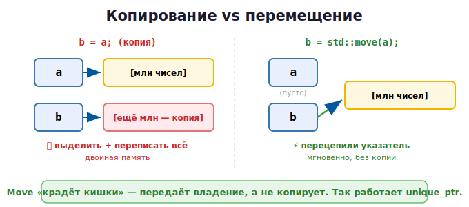

# 12 · Move-семантика и владение 🖼️⭐

> 🎯 **Цель блока:** понять перемещение (move) — как C++ передаёт владение ресурсом
> **без копирования**. Это объясняет `std::move` из прошлого модуля и делает код быстрым.

---

## 📖 Проблема: копирование — дорого

Представь большой объект — вектор на миллион чисел. Скопировать его = выделить новую
память и переписать миллион элементов. Дорого!

```cpp
std::vector<int> a(1'000'000, 7);
std::vector<int> b = a;     // КОПИЯ — выделяется новая память, копируется всё 🐢
```

🖼️
```
   a ──► [миллион чисел]
   b ──► [ещё миллион чисел — полная копия]   медленно, двойная память
```

Но часто копия не нужна — мы хотим **передать** данные из `a` в `b`, а `a` больше не
используется. Зачем копировать, если можно просто «отдать»?

---

## ⭐ Move — «украсть кишки», а не копировать

**Перемещение (move)** передаёт внутренние данные из одного объекта в другой **без
копирования** — просто переписывает указатели.

```cpp
std::vector<int> a(1'000'000, 7);
std::vector<int> b = std::move(a);   // ПЕРЕМЕЩЕНИЕ — мгновенно!
// теперь b владеет данными, a — пустой (валидный, но «выпотрошенный»)
```



💡 Move не копирует содержимое — он **перецепляет внутренний указатель** с `a` на `b`.
Вектор из миллиона элементов «перемещается» за наносекунды, независимо от размера.

---

## ⭐ std::move — «можно забрать»

`std::move(x)` не перемещает сам по себе — он **помечает** объект как «временный, из него
можно забрать данные». Это разрешает компилятору использовать перемещение вместо копии.

```cpp
std::string s = "большая строка...";
std::string s2 = std::move(s);   // забрать данные из s в s2
// s теперь в «пустом, но валидном» состоянии — использовать его значение не стоит
```

> ⚠️ После `std::move(s)` объект `s` **не разрушен**, но его содержимое «забрали». Можно
> присвоить ему новое значение, но читать старое — нельзя (там пусто). Не используй
> перемещённый объект, пока не присвоишь ему заново.

---

## 📖 lvalue и rvalue — кратко

- **lvalue** — у чего есть имя/адрес (переменная `x`).
- **rvalue** — временное значение (результат `a + b`, литерал `42`, `std::move(x)`).

```cpp
int x = 5;        // x — lvalue, 5 — rvalue
int y = x + 1;    // (x + 1) — rvalue (временное)
```

💡 Move-семантика автоматически срабатывает для **rvalue** (временных значений) — их и так
нельзя использовать дальше, поэтому безопасно «забрать кишки»:

```cpp
std::vector<int> make() { return std::vector<int>(1000, 0); }
std::vector<int> v = make();   // результат make() — временный (rvalue)
                               // → компилятор ПЕРЕМЕСТИТ, не скопирует. Автоматически!
```

---

## ⭐ Связь с умными указателями

Теперь понятно, почему `unique_ptr` нельзя копировать, только перемещать:

```cpp
auto p1 = std::make_unique<int>(42);
auto p2 = std::move(p1);   // передать ВЛАДЕНИЕ (move), p1 → nullptr
```

🖼️ Копировать `unique_ptr` нельзя (тогда два владельца → двойной delete). А **переместить**
— можно: владение переходит, старый указатель становится пустым. Move — это механизм
**передачи владения**.

---

## 📖 Где move работает само

Компилятор использует перемещение автоматически в типичных местах:

```cpp
// 1. Возврат локального объекта из функции
std::vector<int> create() {
    std::vector<int> result(1000);
    return result;          // перемещается (или вообще оптимизируется — RVO)
}

// 2. Передача временного объекта
void process(std::vector<int> data);
process(create());          // временный объект перемещается

// 3. Вставка в контейнер
std::vector<std::string> v;
std::string s = "привет";
v.push_back(std::move(s));  // переместить s в вектор (s станет пустым)
```

💡 В большинстве случаев move происходит **автоматически** — тебе не нужно писать
`std::move` везде. Явный `std::move` нужен, когда ты сам хочешь «отдать» именованный
объект (lvalue).

> ⚠️ Не злоупотребляй `std::move` при `return`: `return std::move(x)` обычно **мешает**
> оптимизации (RVO). Просто `return x;` — компилятор сам выберет лучшее.

---

## ✅ Задачи

1. **Move вектора.** Создай большой `vector`, перемести в другой через `std::move`,
   выведи размер исходного (станет 0).
2. **Move строки.** То же со `std::string` — покажи, что исходная опустела.
3. **Замер.** Сравни время копирования и перемещения вектора на миллион элементов
   (`<chrono>`). Во сколько раз move быстрее?
4. **unique_ptr.** Перемести `unique_ptr` в функцию (передача владения), покажи, что
   исходный стал `nullptr`.
5. **push_back с move.** Вставь несколько строк в вектор через `std::move`, заметь, что
   исходные строки опустели.
6. ⭐ **Свой класс с move.** (забегая в Senior) создай класс с `new`-буфером и реализуй
   перемещающий конструктор, который «крадёт» указатель.

---

## ❓ Проверь себя

1. Чем перемещение отличается от копирования?
2. Что делает `std::move` — перемещает или только помечает?
3. В каком состоянии объект после `std::move`?
4. Что такое lvalue и rvalue?
5. Почему `unique_ptr` можно перемещать, но не копировать?
6. Где move происходит автоматически?

---

## ✅ Чек-лист «Уровень 2 — ПАМЯТЬ — пройден» 🎉

- [ ] Понимаю ссылки как псевдонимы
- [ ] Знаю new/delete и почему их избегают
- [ ] **Понимаю RAII — фундамент C++**
- [ ] Использую умные указатели (unique/shared/weak)
- [ ] Понимаю move-семантику и передачу владения

> 🏆 Это был самый важный уровень. Ты понял, как C++ достигает безопасности памяти **без**
> сборщика мусора — через RAII, умные указатели и move. Это и есть «магия» C++.

➡️ ✅ [Задачи уровня 2](TASKS.md) → 🚀 [Пет-проект: свой умный указатель](PROJECT.md)
