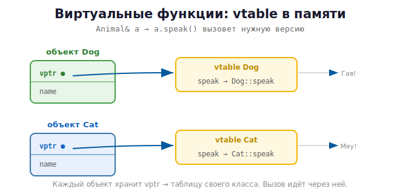

# 14 · Наследование, виртуальные функции, vtable 🖼️

> 🎯 **Цель блока:** освоить наследование и полиморфизм и понять, **как виртуальные
> функции устроены в памяти** (таблица виртуальных функций — vtable).

---

## 📖 Наследование

```cpp
class Animal {
public:
    std::string name;
    Animal(const std::string& n) : name(n) {}
    void eat() { std::cout << name << " ест\n"; }
};

class Dog : public Animal {       // Dog наследует Animal
public:
    Dog(const std::string& n) : Animal(n) {}   // вызов конструктора базы
    void bark() { std::cout << name << ": Гав!\n"; }
};

Dog rex("Рекс");
rex.eat();    // унаследовано от Animal
rex.bark();   // своё
```

🖼️
```
   Animal (базовый)
     ▲
     │ наследует
   Dog (производный) — получает поля и методы Animal + свои
```

---

## ⭐ Виртуальные функции и полиморфизм

**Полиморфизм** — когда через указатель/ссылку на базовый класс вызывается метод
**нужного производного** класса. Для этого метод помечают `virtual`.

```cpp
class Animal {
public:
    virtual void speak() const {        // virtual — можно переопределить
        std::cout << "Животное издаёт звук\n";
    }
    virtual ~Animal() = default;        // ⚠️ виртуальный деструктор — обязателен!
};

class Dog : public Animal {
public:
    void speak() const override {       // override — переопределяем
        std::cout << "Гав!\n";
    }
};

class Cat : public Animal {
public:
    void speak() const override { std::cout << "Мяу!\n"; }
};

void makeSound(const Animal& a) {
    a.speak();                          // вызовется НУЖНАЯ версия!
}

makeSound(Dog{});   // Гав!
makeSound(Cat{});   // Мяу!
```

💡 `override` — говорит компилятору «я переопределяю виртуальный метод» (поймает опечатки).
`= default` — компилятор сгенерирует тело сам.

---

## 🖼️ Как это работает в памяти: vtable

Когда в классе есть `virtual`-методы, компилятор создаёт **таблицу виртуальных функций
(vtable)** — массив указателей на функции. Каждый объект хранит скрытый указатель на
vtable своего класса.



При вызове `a.speak()` через ссылку программа смотрит в **vtable** объекта и вызывает ту
функцию, на которую он указывает. Поэтому `Dog` вызовет `Dog::speak`, а `Cat` —
`Cat::speak`, хотя тип параметра — `Animal&`.

💡 Цена полиморфизма: лишний указатель в объекте (`vptr`) и косвенный вызов через таблицу.
Поэтому `virtual` используют там, где нужен полиморфизм, а не везде.

---

## ⚠️ Виртуальный деструктор — критично для памяти

```cpp
Animal* a = new Dog("Рекс");
delete a;        // ⚠️ если ~Animal НЕ virtual — вызовется только ~Animal,
                 //    а ~Dog НЕ вызовется → утечка ресурсов Dog!
```

> ⚠️ **Правило:** если у класса есть хоть один `virtual`-метод (то есть он предназначен
> для наследования), деструктор **обязан** быть `virtual`. Иначе удаление через указатель
> на базу не вызовет деструктор производного — утечка. Это частая ошибка.

---

## ⭐ Абстрактные классы и интерфейсы

Чисто виртуальный метод (`= 0`) делает класс **абстрактным** — его нельзя создать, только
наследовать. Это «интерфейс» (контракт):

```cpp
class Shape {
public:
    virtual double area() const = 0;        // чисто виртуальный — нет реализации
    virtual ~Shape() = default;
};

class Circle : public Shape {
    double r;
public:
    Circle(double r_) : r(r_) {}
    double area() const override { return 3.14159 * r * r; }
};

// Shape s;          // ❌ нельзя — абстрактный
Circle c(5);         // ✅ можно — реализует area()
```

💡 Абстрактные классы задают «что должен уметь» потомок, не говоря «как». Полиморфизм
часто используют так: контейнер `vector<unique_ptr<Shape>>` с разными фигурами.

```cpp
std::vector<std::unique_ptr<Shape>> shapes;
shapes.push_back(std::make_unique<Circle>(5));
for (const auto& s : shapes)
    std::cout << s->area() << "\n";    // каждая фигура считает свою площадь
```

---

## ✅ Задачи

1. **Иерархия животных:** `Animal` → `Dog`/`Cat`/`Cow` с виртуальным `speak()`. Вызови
   через `Animal&`.
2. **Виртуальный деструктор.** Покажи утечку без него (ASan) и почини, добавив `virtual ~`.
3. **Фигуры:** абстрактный `Shape` с `area()`, потомки `Circle`/`Rectangle`/`Triangle`.
   Сложи в `vector<unique_ptr<Shape>>`, посчитай суммарную площадь.
4. **override.** Намеренно сделай опечатку в имени переопределяемого метода — посмотри,
   как `override` ловит ошибку.
5. ⭐ **Полиморфный список фигур** с методом `draw()`, рисующим ASCII-фигуру.

---

## ❓ Проверь себя

1. Что такое наследование? Как вызвать конструктор базы?
2. Что делает `virtual` и что такое полиморфизм?
3. Как виртуальные функции устроены в памяти (vtable, vptr)?
4. Почему деструктор базового класса должен быть `virtual`?
5. Что такое абстрактный класс (`= 0`)?
6. Зачем `override`?

---

## ✅ Чек-лист

- [ ] Использую наследование с вызовом конструктора базы
- [ ] Применяю `virtual`/`override` для полиморфизма
- [ ] Понимаю vtable/vptr
- [ ] Всегда делаю деструктор базы `virtual`
- [ ] Использую абстрактные классы как интерфейсы

> 🏛️ **Здесь — как наследование устроено в C++.** Когда наследовать, а когда нет (опасности,
> «композиция > наследования»), и полиморфизм как принцип — в треке 🏛️ ООП:
> [наследование](../../OOP/02-pillars/10-inheritance.md), [полиморфизм](../../OOP/02-pillars/11-polymorphism.md),
> [композиция > наследования](../../OOP/03-design/16-composition-over-inheritance.md).

➡️ Следующий: [15 · Шаблоны (templates)](15-templates.md)
