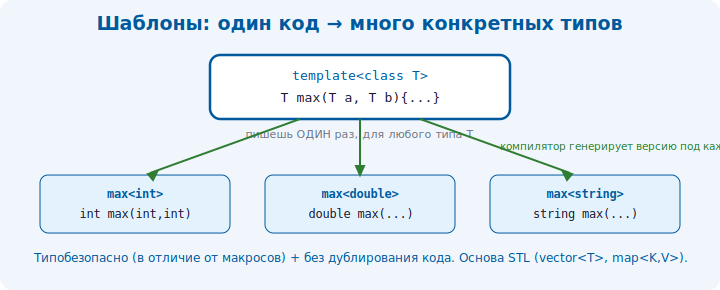

# 15 · Шаблоны (templates)

> 🎯 **Цель блока:** освоить шаблоны — способ писать код, работающий с **любым типом**.
> Это фундамент STL и обобщённого программирования.

---

## 📖 Проблема: одинаковый код для разных типов

```cpp
int maxInt(int a, int b)          { return a > b ? a : b; }
double maxDouble(double a, double b) { return a > b ? a : b; }
// ... писать для каждого типа? Это копипаста.
```

Шаблон пишет такую функцию **один раз** для всех типов.

---

## ⭐ Шаблон функции

```cpp
template<typename T>              // T — параметр-тип
T maxValue(T a, T b) {
    return a > b ? a : b;
}

maxValue(3, 5);          // T = int    → 5
maxValue(2.5, 1.5);      // T = double → 2.5
maxValue('a', 'z');      // T = char   → 'z'
maxValue(std::string{"a"}, std::string{"b"});  // T = string
```

🖼️ Компилятор **генерирует** отдельную версию функции под каждый использованный тип:
```
   maxValue(3, 5)      → компилятор создаёт maxValue<int>
   maxValue(2.5, 1.5)  → создаёт maxValue<double>
   один шаблон → много конкретных функций
```



💡 Это происходит **на этапе компиляции** (zero-cost): сгенерированный код такой же
быстрый, как написанный вручную. Никаких накладных расходов в рантайме.

---

## ⭐ Шаблон класса

```cpp
template<typename T>
class Box {
    T value;
public:
    Box(T v) : value(v) {}
    T get() const { return value; }
    void set(T v) { value = v; }
};

Box<int> bi(42);          // Box для int
Box<std::string> bs("привет");   // Box для string
std::cout << bi.get() << " " << bs.get() << "\n";
```

💡 Так устроены **все контейнеры STL**: `std::vector<T>`, `std::map<K,V>` — это шаблоны
классов. `vector<int>` и `vector<string>` — разные сгенерированные классы.

---

## 📖 Несколько параметров и значения по умолчанию

```cpp
template<typename K, typename V>
struct Pair {
    K key;
    V value;
};

Pair<std::string, int> p{"возраст", 30};

// параметр по умолчанию
template<typename T = int>
class Container { /* ... */ };
Container<> c;            // T = int
```

---

## ⭐ Шаблон с несколькими типами и выводом

```cpp
template<typename T>
void printAll(const std::vector<T>& v) {
    for (const auto& x : v) std::cout << x << " ";
    std::cout << "\n";
}

printAll(std::vector<int>{1, 2, 3});       // компилятор выведет T = int
printAll(std::vector<std::string>{"a", "b"});
```

Компилятор **сам выводит** тип `T` из аргументов — тебе не нужно писать `<int>`.

---

## 📖 Концепты (C++20) — ограничения на типы

В современном C++ можно ограничить, какие типы подходят:

```cpp
#include <concepts>

template<typename T>
requires std::integral<T>          // T должен быть целочисленным
T doubleIt(T x) { return x * 2; }

doubleIt(5);       // ✅ int подходит
// doubleIt(2.5);  // ❌ ошибка — double не integral
```

💡 Концепты делают ошибки шаблонов понятными (раньше они были громадными и нечитаемыми).
Подробнее — в [Senior, модуль 22](../04-senior/22-templates-meta.md).

---

## ⚠️ Особенность: шаблоны живут в заголовках

> ⚠️ Реализацию шаблона нельзя положить в отдельный `.cpp` (как обычную функцию) —
> компилятору нужен весь код шаблона в месте использования. Поэтому шаблоны пишут **целиком
> в заголовочных файлах** (`.h`/`.hpp`). Это отличает их от обычных функций.

---

## ✅ Задачи

1. **maxValue** — шаблон функции максимума для любого типа. Проверь на int, double, string.
2. **swap** — шаблон обмена двух значений любого типа.
3. **Box** — шаблон класса-контейнера для одного значения.
4. **printAll** — шаблон печати любого `vector<T>`.
5. **Pair** — шаблон пары ключ-значение с двумя типами.
6. ⭐ **Stack<T>** — шаблон стека на `std::vector<T>` (push/pop/top/empty).
7. ⭐ **Концепт** (C++20, `-std=c++20`) — функция, работающая только с числами.

---

## ❓ Проверь себя

1. Какую проблему решают шаблоны?
2. Чем шаблон функции отличается от шаблона класса?
3. Когда генерируется конкретная версия шаблона — в компиляции или рантайме?
4. Есть ли накладные расходы у шаблонов в рантайме?
5. Почему реализацию шаблонов держат в заголовках?
6. Что такое концепты и зачем они?

---

## ✅ Чек-лист

- [ ] Пишу шаблоны функций и классов
- [ ] Понимаю генерацию кода на этапе компиляции
- [ ] Знаю, что STL-контейнеры — это шаблоны
- [ ] Понимаю, почему шаблоны живут в заголовках
- [ ] Слышал про концепты

➡️ Следующий: [16 · STL-контейнеры](16-stl-containers.md)
