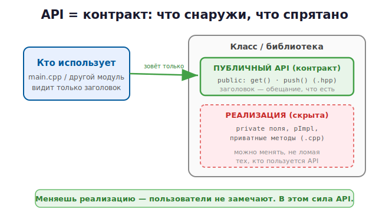

# 2 · Проектирование API (заголовки, pImpl) 🖼️⭐

> 🎯 **Цель блока:** научиться проектировать API класса/библиотеки — чистый интерфейс со
> скрытой реализацией. В C++ для полного сокрытия есть мощная идиома — **pImpl**.

---

## 📖 Что такое API в C++

**API** твоего модуля — это публичные классы и функции из его заголовка (`.hpp`), через
которые с ним работают. Это **контракт**: «вот что я умею, а как — моё дело».



💡 Заголовок `.hpp` — это твой API. `public:` — что видят другие, `private:` и `.cpp` —
скрытая реализация.

---

## ⭐ Принцип №1: инкапсуляция

```cpp
class Stack {
public:                          // интерфейс (API)
    void push(int value);
    int  pop();
    bool empty() const;
private:                         // детали — наружу не видны
    std::vector<int> data_;
};
```

Пользователь зовёт `push`/`pop`, но не трогает `data_` напрямую. Ты можешь сменить
`vector` на `list` — публичный API не изменится.

> 💡 Соглашение: приватные поля часто именуют с подчёркиванием в конце (`data_`) — видно,
> что это внутреннее состояние.

---

## ⭐ Принцип №2: используй RAII и владение в API

API должен ясно выражать **владение** через типы:

```cpp
// ✅ возвращаем владеющий тип — пользователь не думает про delete
std::unique_ptr<Widget> createWidget();

// ✅ принимаем по const& — не копируем, не меняем
void render(const Scene& scene);

// ✅ значение, которого может не быть
std::optional<User> findUser(int id);

// ❌ сырой владеющий указатель — непонятно, кто делает delete
Widget* createWidget();          // плохо: кто владеет?
```

💡 Хорошее правило (из C++ Core Guidelines): тип в сигнатуре сам говорит о владении.
`unique_ptr` — «забираешь владение», `const&` — «только смотрю», `optional` — «может не
быть». Это делает API безопасным и самодокументируемым.

---

## ⭐ Принцип №3: const correctness

```cpp
class Account {
public:
    double balance() const;          // const-метод: не меняет объект (можно звать у const)
    void deposit(double amount);     // не-const: меняет
};

void print(const Account& a) {
    std::cout << a.balance();        // ✅ можно — balance() const
    // a.deposit(10);                // ❌ нельзя — a константный
}
```

💡 Помечай `const` всё, что не меняет объект. Это часть культуры C++: const correctness
делает API понятным и ловит ошибки.

---

## ⭐⭐ pImpl — полное сокрытие реализации

Проблема: даже приватные поля в заголовке **видны** тем, кто его подключает. Если поля
меняются — нужно перекомпилировать весь зависящий код. Решение — **pImpl** (pointer to
implementation): спрятать всю реализацию за указателем.

```cpp
// widget.hpp — НИ ОДНОЙ детали реализации!
#pragma once
#include <memory>

class Widget {
public:
    Widget();
    ~Widget();
    void draw() const;
    void resize(int w, int h);
private:
    class Impl;                      // объявление, без определения
    std::unique_ptr<Impl> impl_;     // указатель на скрытую реализацию
};
```
```cpp
// widget.cpp — вся реализация здесь, снаружи невидима
#include "widget.hpp"

class Widget::Impl {                 // настоящие поля — только тут
public:
    int width = 0, height = 0;
    void draw() const { /* ... */ }
};

Widget::Widget() : impl_(std::make_unique<Impl>()) {}
Widget::~Widget() = default;         // в .cpp, где Impl уже полный тип
void Widget::draw() const { impl_->draw(); }
void Widget::resize(int w, int h) { impl_->width = w; impl_->height = h; }
```

🖼️
```
   widget.hpp:  Widget → [ unique_ptr<Impl> ]   ← наружу видно только указатель
                                  │
   widget.cpp:                    ▼
                       class Impl { поля, методы }  ← всё спрятано здесь
```

💡 pImpl — это C++ аналог **opaque-типа из [C-курса](../../C/03b-projects-api/02-designing-api.md)**,
только на `unique_ptr` (RAII!). Плюсы: реализация полностью скрыта, меняешь поля `Impl` —
пользователей перекомпилировать не нужно (ABI-стабильность). Минус: лишнее выделение и
косвенность. Используют в больших библиотеках.

---

## ⭐ Принцип №4: ошибки — исключения или типы

```cpp
// через исключения
int Stack::pop() {
    if (data_.empty()) throw std::out_of_range("стек пуст");
    ...
}

// через тип (без исключений)
std::optional<int> Stack::tryPop();         // nullopt, если пусто
// std::expected<int, Error> (C++23) — значение ИЛИ ошибка
```

> 💡 Выбери единый подход на всю библиотеку и документируй: что бросается, что
> возвращается. Не «глотай» ошибки молча.

---

## ⭐ Принцип №5: версионирование

Семантическое версионирование `MAJOR.MINOR.PATCH`:
- PATCH — починка, API не меняется;
- MINOR — добавили возможности, старое работает;
- MAJOR — сломали совместимость.

💡 Скрытая реализация (private/pImpl) позволяет свободно менять внутренности и выпускать
PATCH/MINOR, не ломая пользователей.

---

## 📋 Чек-лист хорошего C++ API

```
   ✅ Реализация скрыта (private, при необходимости pImpl)
   ✅ Владение выражено типами (unique_ptr / const& / optional)
   ✅ const correctness везде
   ✅ Ошибки — единым способом (исключения / optional / expected)
   ✅ Код в namespace, заголовок документирован
   ✅ Минимум публичных имён — «маленькая дверь, большой дом»
```

---

## ✅ Задачи

1. **Инкапсуляция.** Спроектируй класс с `public`-API и `private`-состоянием. Убедись,
   что снаружи нельзя залезть в поля.
2. **Владение в API.** Напиши функции, возвращающие `unique_ptr` и `optional`, принимающие
   `const&`. Объясни, что каждая сигнатура говорит о владении.
3. **const correctness.** Расставь `const` на всех методах, которые не меняют объект.
   Проверь, что их можно звать у `const`-объекта.
4. **pImpl.** Перепиши свой класс (например `Widget`) по идиоме pImpl — спрячь все поля в
   `Impl`. Убедись, что заголовок не содержит деталей.
5. **Документация.** Напиши над каждым публичным методом в `.hpp` комментарий: что делает,
   параметры, что возвращает/бросает.
6. ⭐ **API-ревью.** Дай заголовок другому: понятно ли пользоваться, не открывая `.cpp`?

---

## ❓ Проверь себя

1. Что такое API класса и где он «живёт»?
2. Почему даже приватные поля в заголовке — проблема? Как решает pImpl?
3. Как `unique_ptr`/`const&`/`optional` в сигнатуре выражают владение?
4. Что такое const correctness?
5. Как сообщать об ошибках в API?
6. Как связан pImpl с opaque-типом из C?

---

## ✅ Чек-лист

- [ ] Прячу реализацию через private (и pImpl при необходимости)
- [ ] Выражаю владение типами в сигнатурах
- [ ] Соблюдаю const correctness
- [ ] Обрабатываю ошибки единообразно
- [ ] Понимаю pImpl и версионирование

➡️ Следующий: [3 · Работа с веб-API (HTTP/JSON)](03-external-api.md)
