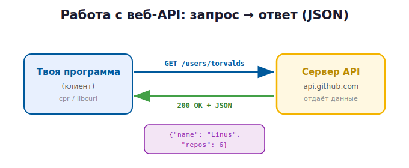

# 3 · Работа с веб-API (HTTP/JSON) 🖼️

> 🎯 **Цель блока:** понять, что такое веб-API, и обратиться к нему из C++ с помощью
> современных библиотек (cpr + nlohmann/json) — это куда приятнее, чем в чистом C.

---

## 📖 Что такое веб-API

Если раньше «API» был интерфейсом твоего класса, то **веб-API** — это интерфейс **чужого
сервиса в интернете**: ты шлёшь HTTP-запрос на URL, он отвечает данными (обычно JSON).



Примеры: погода, курсы валют, GitHub, карты, нейросети. Ты отправляешь запрос и получаешь
ответ.

---

## 📖 HTTP кратко

| Метод | Зачем |
|-------|-------|
| `GET` | получить данные |
| `POST` | отправить/создать |
| `PUT`/`PATCH` | изменить |
| `DELETE` | удалить |

**Коды ответа:** `200` OK · `201` создано · `404` не найдено · `401` нет доступа ·
`429` лимит · `500` ошибка сервера.

**JSON** — формат ответа: `{"name": "Linus", "public_repos": 6}`.

---

## ⭐ Запрос через cpr (C++ Requests)

В стандартной библиотеке C++ нет HTTP — берут внешние библиотеки. **cpr** — удобная
обёртка над libcurl, по духу близкая к `requests` из Python.

> 🛠️ Подключение через CMake (FetchContent скачает библиотеку):
> ```cmake
> include(FetchContent)
> FetchContent_Declare(cpr GIT_REPOSITORY https://github.com/libcpr/cpr.git GIT_TAG 1.10.5)
> FetchContent_MakeAvailable(cpr)
> target_link_libraries(myapp PRIVATE cpr::cpr)
> ```

```cpp
#include <cpr/cpr.h>
#include <iostream>

int main() {
    cpr::Response r = cpr::Get(
        cpr::Url{"https://api.github.com/users/torvalds"},
        cpr::Header{{"User-Agent", "cpp-course"}},
        cpr::Timeout{10000}                       // 10 сек
    );

    std::cout << "Статус: " << r.status_code << "\n";   // 200
    if (r.status_code == 200) {
        std::cout << r.text << "\n";                    // тело ответа (JSON-текст)
    }
    return 0;
}
```

💡 Сравни с C: там нужно вручную писать callback-буфер и `realloc`
([C-курс, модуль 3](../../C/03b-projects-api/03-external-api.md)). cpr делает это за тебя —
современный C++ ближе к удобству Python.

---

## ⭐ Парсинг JSON через nlohmann/json

Ответ — это **строка**. Чтобы достать поля, нужен JSON-парсер. **nlohmann/json** — самый
популярный, очень удобный:

> 🛠️ Через CMake: `FetchContent` для `nlohmann/json`, затем
> `target_link_libraries(myapp PRIVATE nlohmann_json::nlohmann_json)`.

```cpp
#include <nlohmann/json.hpp>
using json = nlohmann::json;

json data = json::parse(r.text);              // строка → объект
std::string name = data["name"];             // достать поле
int repos = data["public_repos"];

std::cout << name << " — " << repos << " репозиториев\n";

// безопасно (с значением по умолчанию)
std::string bio = data.value("bio", "нет описания");
```

🖼️
```
   "{\"name\":\"Linus\"}"  ──json::parse──►  объект json
                            data["name"]  →  "Linus"
```

💡 nlohmann/json работает почти как словарь Python: `data["ключ"]`. Можно и наоборот —
собрать JSON для отправки: `json body = {{"title", "Привет"}};`.

---

## ⚠️ Что всегда учитывать

```
   ✅ Проверяй код ответа (200? 404? 500?)
   ✅ Ставь таймаут (cpr::Timeout) — иначе зависнешь
   ✅ Обрабатывай ошибки сети и парсинга (try/catch вокруг json::parse)
   ✅ Не храни API-ключи в коде — бери из переменных окружения
   ✅ Уважай лимиты (rate limit), не шли тысячи запросов подряд
```

```cpp
try {
    json data = json::parse(r.text);
} catch (const json::parse_error& e) {
    std::cerr << "Битый JSON: " << e.what() << "\n";
}

const char* token = std::getenv("GITHUB_TOKEN");   // ключ из окружения
```

---

## ⭐ Хороший тон: оберни API в свой клиент

Не разбрасывай `cpr::Get` по коду — спрячь за своим классом-API (модуль 2!):

```cpp
class GitHubClient {
public:
    explicit GitHubClient(std::string token = "") : token_(std::move(token)) {}

    // чистый API — пользователь не знает про cpr/json
    User getUser(const std::string& login) const {
        auto r = cpr::Get(cpr::Url{base_ + "/users/" + login},
                          cpr::Header{{"User-Agent", "cpp-course"}},
                          cpr::Timeout{10000});
        if (r.status_code != 200)
            throw std::runtime_error("API вернул " + std::to_string(r.status_code));
        auto j = json::parse(r.text);
        return User{ j["login"], j["name"], j["public_repos"] };
    }
private:
    std::string base_ = "https://api.github.com";
    std::string token_;
};
```

💡 Это соединяет обе грани раздела: ты **используешь** чужой веб-API и **проектируешь
свой** чистый клиент поверх него — так устроены все нормальные SDK.

---

## 💡 C++ vs Python для веб-API

В Python то же самое короче (`requests.get(...).json()`). Но C++ выбирают, когда веб-запрос
— часть высокопроизводительной системы (игровой сервер, торговый бот, нативное приложение).
Современные библиотеки (cpr, nlohmann/json) делают это почти таким же удобным, как Python.

---

## ✅ Задачи

1. **Первый запрос.** Подключи cpr через CMake, сделай GET к
   `https://api.github.com/users/<логин>`, выведи статус и тело.
2. **Парсинг.** Подключи nlohmann/json, достань `name` и `public_repos`, выведи.
3. **Коды и ошибки.** Запроси несуществующего пользователя, обработай 404 и битый JSON.
4. **Погода.** Через открытый API (open-meteo, без ключа) выведи температуру по координатам.
5. **Ключ из окружения.** Используй API с ключом, храня его в переменной окружения.
6. ⭐ **Свой клиент.** Оберни выбранный API в класс `GitHubClient`/`WeatherClient` с чистым
   API: методы, исключения, таймауты, структуры-результаты (`struct User`).

---

## ❓ Проверь себя

1. Чем веб-API отличается от API твоего класса?
2. Зачем нужны cpr и nlohmann/json? Чего нет в стандартной библиотеке?
3. Как проверить код ответа и поставить таймаут?
4. Где хранить API-ключи и почему не в коде?
5. Зачем оборачивать `cpr` в свой класс-клиент?
6. Когда для веб-API выбирают C++, а когда Python?

---

## ✅ Чек-лист «раздел Проекты и API пройден» 🎉

- [ ] Раскладываю проект по файлам, собираю через CMake
- [ ] Проектирую чистый API со скрытой реализацией (private/pImpl)
- [ ] Понимаю веб-API, HTTP, JSON
- [ ] Делаю запросы через cpr, парсю nlohmann/json
- [ ] Обрабатываю ошибки/коды, храню ключи в окружении
- [ ] Оборачиваю чужой API в свой клиент

➡️ ✅ [Задачи раздела](TASKS.md) → 🚀 [Мини-проект: библиотека-клиент с чистым API](PROJECT.md)
