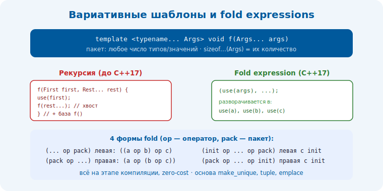

# 1 · Вариативные шаблоны и fold expressions 🖼️⭐⭐

> 🎯 **Цель блока:** освоить шаблоны с переменным числом параметров (variadic templates) и
> fold-выражения — основу `make_unique`, `tuple`, `printf`-подобных функций, `emplace`.

---

## 📖 Шаблон с произвольным числом аргументов

```cpp
// pack параметров: T... — «ноль или больше типов»
template <typename... Args>          // Args — параметр-пакет типов
void print_all(Args... args);        // args — пакет значений

print_all(1, "hello", 3.14, 'x');    // любое число аргументов любых типов
```

```
   ... после typename = «пакет типов» (typename... Args).
   ... после имени   = «пакет значений» (Args... args).
   sizeof...(Args)   = число элементов в пакете.
   пакет нельзя «индексировать» напрямую — его РАЗВОРАЧИВАЮТ (expansion) или рекурсивно обходят.
```



💡 ⭐⭐ Вариативные шаблоны — как функции `std::tuple`, `std::make_unique`, perfect-forwarding
обёртки работают с любым числом аргументов **на этапе компиляции** (никакого рантайм-оверхеда,
zero-cost). Это фундамент обобщённых библиотек.

---

## ⭐ Два способа обработать пакет

### Способ 1: рекурсия (классика до C++17)

```cpp
void print_all() {}                              // база рекурсии: пустой пакет

template <typename First, typename... Rest>
void print_all(First first, Rest... rest) {
    std::cout << first << " ";
    print_all(rest...);                          // развернуть «хвост», рекурсивно
}
```

```
   print_all(1, 2, 3) → печатает 1, зовёт print_all(2,3) → печатает 2, зовёт print_all(3) →
   печатает 3, зовёт print_all() → база. компилятор генерирует цепочку функций.
```

### Способ 2: fold expressions (C++17 — короче и яснее)

```cpp
template <typename... Args>
void print_all(Args... args) {
    ((std::cout << args << " "), ...);           // fold по запятой: разворачивает в выражение
}
```

💡 ⭐ Fold expression сворачивает пакет в одно выражение через оператор — без рекурсии и базы.
До C++17 всё делалось рекурсией (многословно); fold-выражения сделали это компактным.

---

## ⭐⭐ Fold expressions: 4 формы

```cpp
// pack = a, b, c, ...
(... op pack)        // ЛЕВАЯ:  ((a op b) op c)
(pack op ...)        // ПРАВАЯ: (a op (b op c))
(init op ... op pack)  // левая с начальным значением
(pack op ... op init)  // правая с начальным значением

// примеры:
template <typename... Args>
auto sum(Args... args) { return (args + ...); }           // a + b + c + ...

template <typename... Args>
bool all_true(Args... args) { return (args && ...); }     // a && b && c && ...

template <typename... Args>
void push_all(std::vector<int>& v, Args... args) {
    (v.push_back(args), ...);                              // вызвать push_back для каждого
}
```

💡 ⭐⭐ Fold по `,` (запятой) — самый частый приём: «сделать что-то для каждого элемента пакета».
`(действие(args), ...)` разворачивается в `действие(a), действие(b), действие(c)`. Это
компактная замена рекурсивному обходу. Запомни 4 формы — левая/правая × с/без начального значения.

---

## 📖 Perfect forwarding пакета

```cpp
// make_unique, emplace_back и т.п. ПРОБРАСЫВАЮТ аргументы в конструктор без копий:
template <typename T, typename... Args>
std::unique_ptr<T> my_make_unique(Args&&... args) {     // && + forward = perfect forwarding
    return std::unique_ptr<T>(new T(std::forward<Args>(args)...));  // развернуть с forward
}
```

```
   Args&&... + std::forward<Args>(args)... = сохранить lvalue/rvalue-категорию КАЖДОГО аргумента
   → передать в конструктор T без лишних копий/move. (связь: move-семантика, Senior).
```

💡 Так устроены `make_unique`, `emplace_back`, фабрики: вариативный пакет + perfect forwarding =
конструируют объект на месте из любых аргументов, без копирований.

---

## ⚠️ Ловушки

- ❌ Забыть базовый случай в рекурсивной версии → ошибка компиляции (нет перегрузки для пустого пакета).
- ❌ Путать `...` после типа (пакет типов) и после имени (разворачивание).
- ❌ Перепутать левую/правую форму fold (важно для не-ассоциативных операторов: вычитание, поток).
- ❌ Пустой пакет в fold без начального значения для операторов кроме `&&`/`||`/`,` → ошибка.
- ❌ Забыть `std::forward` при пробросе → лишние копии/потеря rvalue.

---

## ✅ Задачи

1. **sum/product.** Через fold напиши `sum(args...)` и `product(args...)` для любого числа чисел.
2. **print с разделителем.** `print_all` через fold по запятой; добавь разделитель между (не после) элементами.
3. ⭐ **Рекурсия vs fold.** Реализуй `max(args...)` двумя способами (рекурсия и fold). Сравни.
4. ⭐ **make_unique.** Напиши свой `make_unique` с perfect forwarding пакета. Проверь на типе с
   несколькими аргументами конструктора.
5. **sizeof...** Функция, печатающая число аргументов и их сумму.

---

## ❓ Проверь себя

1. Что такое параметр-пакет и `sizeof...`?
2. Два способа обработать пакет (рекурсия vs fold)?
3. Назови 4 формы fold expression.
4. Зачем `Args&&...` + `std::forward` при пробросе?

---

## ✅ Чек-лист

- [ ] Пишу вариативные шаблоны (typename... Args)
- [ ] Использую fold expressions (4 формы)
- [ ] Применяю fold по запятой для «действие на каждый»
- [ ] Делаю perfect forwarding пакета (Args&& + forward)

➡️ Следующий: [2 · Концепты и ограничения (C++20)](02-concepts.md)
