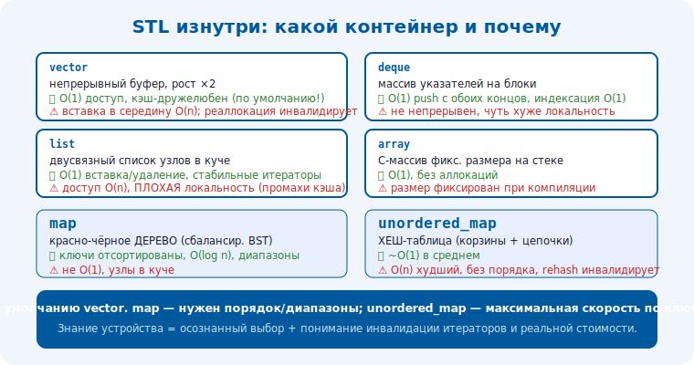

# 4 · STL изнутри: как реализованы контейнеры 🖼️⭐⭐

> 🎯 **Цель блока:** понять, как реализованы контейнеры STL внутри — чтобы выбирать их осознанно и
> знать реальную стоимость операций.

> 🧭 Прямая связь с [капстоуном](../../Capstone/01-data-structures/03-dynamic-array.md): там ты
> строишь свои версии; здесь — как устроены настоящие.

---

## 📖 Зачем знать внутренности

```
   «знаю, что vector быстрый» — мало. ЗНАЯ устройство, ты понимаешь:
   • реальную стоимость операций (push_back амортизированно O(1), но иногда O(n) при росте).
   • когда что выбрать (vector vs list vs deque — по паттерну доступа).
   • почему бывают подводные камни (инвалидация итераторов, реаллокация).
```

---

## ⭐ vector, deque, list, array

```
   std::vector — динамический массив: непрерывный буфер + size + capacity. рост ×~2 при заполнении.
      ✅ доступ O(1), кэш-дружелюбен, push_back амортизированно O(1).
      ⚠️ вставка/удаление в середину O(n); реаллокация ИНВАЛИДИРУЕТ указатели/итераторы/ссылки.

   std::deque — «двусторонняя очередь»: массив УКАЗАТЕЛЕЙ на блоки (chunks).
      ✅ O(1) push с обоих концов; индексация O(1); push_front не двигает всё (в отличие от vector).
      ⚠️ память не непрерывна; чуть хуже локальность; итераторы сложнее.

   std::list — двусвязный список узлов в куче.
      ✅ O(1) вставка/удаление в любом месте (при наличии итератора); итераторы стабильны.
      ⚠️ доступ по индексу O(n); ПЛОХАЯ локальность (узлы разбросаны → промахи кэша); накладные на узлы.

   std::array — обёртка над C-массивом фикс. размера на СТЕКЕ. O(1), без аллокаций.
```

💡 ⭐ Правило выбора: **по умолчанию `vector`** (кэш-дружелюбен, быстр на практике даже при O(n)
вставках на малых данных). `deque` — когда нужен push_front. `list` — редко, только при частых
вставках/удалениях в середину больших данных И стабильных итераторах. (Связь: [⚙️ локальность](../../ComputerScience/01-hardware/08-cache.md).)

---

## ⭐⭐ map vs unordered_map

```
   std::map — упорядоченное отображение, обычно КРАСНО-ЧЁРНОЕ ДЕРЕВО (сбалансированное BST):
      ✅ ключи ОТСОРТИРОВАНЫ; поиск/вставка/удаление O(log n); диапазонные запросы; стабильные итераторы.
      ⚠️ O(log n) (не O(1)); узлы в куче → промахи кэша; больше накладных.

   std::unordered_map — ХЕШ-ТАБЛИЦА (корзины + цепочки):
      ✅ поиск/вставка/удаление ~O(1) В СРЕДНЕМ.
      ⚠️ O(n) в худшем (плохие хеши/коллизии); НЕ упорядочен; rehash инвалидирует итераторы;
         накладные на хеш/корзины; чувствителен к качеству хеш-функции.
```

🖼️
```
   нужен ПОРЯДОК / диапазоны / гарантия O(log n)  → std::map (дерево).
   нужен МАКСИМАЛЬНО быстрый доступ по ключу, порядок не важен → std::unordered_map (хеш).
   на МАЛЫХ данных map иногда быстрее (кэш, нет хеширования) — измеряй!
```



💡 ⭐⭐ Главный выбор: **`map` (дерево) — порядок + O(log n) гарантированно; `unordered_map` (хеш) —
средний O(1), но без порядка и с худшим случаем**. Это [trade-off](../../Senior/02-decisions/08-tradeoffs.md):
гарантии и порядок против средней скорости. Зная, что внутри (дерево vs хеш), выбираешь осознанно.

---

## 📖 Аллокаторы и итераторы

```
   • КОНТЕЙНЕРЫ ПАРАМЕТРИЗОВАНЫ АЛЛОКАТОРОМ (template <class T, class Alloc>): можно подставить свой
     (твой pool из капстоуна!) для контроля памяти. по умолчанию std::allocator (≈ new/delete).
   • ИТЕРАТОРЫ — обобщённый интерфейс обхода; категории (input/forward/bidirectional/random-access)
     определяют, какие алгоритмы применимы и за какую стоимость (random-access у vector → O(1) сдвиг;
     bidirectional у list → только ++/--).
   • ИНВАЛИДАЦИЯ — ключевая ловушка: реаллокация vector / rehash unordered_map делают старые
     итераторы/указатели НЕВАЛИДНЫМИ. знай правила инвалидации каждого контейнера.
```

> 🧭 Аллокаторы — мост к [своему аллокатору (капстоун)](../../Capstone/01-data-structures/07-allocator.md);
> категории итераторов — к [алгоритмам STL].

---

## ⚠️ Ловушки

- ❌ Использовать `list` по умолчанию «потому что O(1) вставка» — на практике `vector` обычно быстрее (кэш).
- ❌ Держать указатели/итераторы в `vector` после возможной реаллокации (инвалидация).
- ❌ Выбирать `map`/`unordered_map` не думая о порядке/гарантиях/худшем случае.
- ❌ Игнорировать качество хеш-функции для `unordered_map`.
- ❌ Не знать правила инвалидации итераторов каждого контейнера.

---

## ✅ Задачи

1. **Бенчмарк.** Сравни вставку/обход `vector` vs `list` на 1млн элементов. Почему vector быстрее (кэш)?
2. **map vs unordered_map.** Сравни поиск на 1млн ключей. Когда что лучше? Проверь поведение порядка.
3. ⭐ **Инвалидация.** Воспроизведи баг: сохранил указатель в `vector`, сделал push_back с реаллокацией.
   Что произошло? Как избежать (reserve/индексы)?
4. ⭐ **Свой аллокатор.** Подставь свой pool-аллокатор (из капстоуна) в `std::vector`. Замерь.
5. **Выбор.** Для 5 сценариев выбери контейнер и обоснуй устройством.

---

## ❓ Проверь себя

1. Как устроены vector/deque/list внутри и каковы их trade-off?
2. Чем `map` (дерево) отличается от `unordered_map` (хеш)?
3. Что такое инвалидация итераторов и когда она происходит?
4. Зачем контейнеры параметризованы аллокатором?

---

## ✅ Чек-лист

- [ ] Знаю внутреннее устройство основных контейнеров
- [ ] Выбираю контейнер по устройству и паттерну доступа
- [ ] Понимаю map (дерево) vs unordered_map (хеш)
- [ ] Помню про инвалидацию итераторов
- [ ] Понимаю роль аллокаторов и категорий итераторов

➡️ Следующий: [5 · Корутины и ranges (C++20)](05-coroutines-ranges.md)
