# ➕ Дорожная карта по языку C++

Путь от «никогда не программировал» (или «знаю C») до «понимаю память C++ как Senior».

> 💡 **C++ — это золотая середина.** В [C](../C/README.md) ты управляешь памятью
> **вручную** (malloc/free) — мощно, но опасно. В [Python](../Python/README.md) — память
> **автоматическая** (сборщик мусора) — удобно, но без контроля. **C++ даёт и то, и
> другое**: полный ручной контроль над памятью **плюс инструменты** (RAII, умные
> указатели), которые делают её безопасной — без сборщика мусора. Это и есть суперсила C++.

---

## 🧠 Память: три мира

| | **C** | **C++** | **Python** |
|--|-------|---------|-----------|
| Кто управляет | ты вручную | ты + инструменты (RAII) | сборщик мусора |
| Освобождение | `free()` руками | **деструктор сам** (RAII) | автоматически |
| Указатели | сырые (`*`) | умные (`unique_ptr`…) + сырые | скрыты (ссылки) |
| Контроль | полный | полный | минимальный |
| Безопасность | низкая | **высокая** (если по правилам) | высокая |

🎯 Главная идея курса: **детерминированное разрушение** — в C++ объект уничтожается
**ровно тогда**, когда выходит из области видимости, и его деструктор автоматически
освобождает ресурсы. Это даёт безопасность Python с контролем C.

---

## 🗺️ Карта курса

```mermaid
flowchart TD
    Start([🥚 Старт]) --> S0

    subgraph LVL0 [🥚 Уровень 0 — Подготовка]
        S0[00 · Что такое C++ и память]
        S1[01 · Установка компилятора]
        S2[02 · Первая программа]
    end

    subgraph LVL1 [🐣 Уровень 1 — Junior]
        B1[03 · Типы, auto, const]
        B2[04 · Потоки ввода-вывода]
        B3[05 · Операторы и условия]
        B4[06 · Циклы и range-for]
        B5[07 · Функции и перегрузка]
    end

    subgraph LVL2 [🐥 Уровень 2 — ПАМЯТЬ ⭐ ядро]
        M1[08 · Модель памяти и ссылки]
        M2[09 · new / delete]
        M3[10 · RAII — главная идея C++]
        M4[11 · Умные указатели]
        M5[12 · Move-семантика и владение]
    end

    subgraph LVL3 [🐥 Уровень 3 — Middle]
        D1[13 · Классы, правило 3/5]
        D2[14 · Наследование и vtable]
        D3[15 · Шаблоны]
        D4[16 · STL-контейнеры]
        D5[17 · STL-алгоритмы и лямбды]
        D6[18 · Перегрузка операторов]
    end

    subgraph LVL4 [🦅 Уровень 4 — Senior]
        Z1[19 · Move глубоко, правило нуля]
        Z2[20 · Управление памятью, аллокаторы]
        Z3[21 · Многопоточность]
        Z4[22 · Шаблоны и метапрограммирование]
        Z5[23 · Производительность]
        Z6[24 · Современный C++ 17/20/23]
    end

    S0-->S1-->S2-->B1
    B1-->B2-->B3-->B4-->B5-->M1
    M1-->M2-->M3-->M4-->M5-->D1
    D1-->D2-->D3-->D4-->D5-->D6-->Z1
    Z1-->Z2-->Z3-->Z4-->Z5-->Z6-->Done
    Done([🦅 Senior C++ developer])
```

---

## 📂 Содержание

### 🥚 Уровень 0 — Подготовка
- [00 · Что такое C++ и его модель памяти](00-setup/00-what-is-cpp.md)
- [01 · Установка компилятора и редактора](00-setup/01-installation.md)
- [02 · Первая программа и компиляция](00-setup/02-first-program.md)

### 🐣 Уровень 1 — Junior (основы)
- [03 · Переменные, типы, auto, const](01-basics/03-variables-types.md)
- [04 · Потоки ввода-вывода](01-basics/04-io.md)
- [05 · Операторы и условия](01-basics/05-operators-conditions.md)
- [06 · Циклы и range-based for](01-basics/06-loops.md)
- [07 · Функции, перегрузка, ссылки](01-basics/07-functions.md)
- [07b · Разбиваем проект на файлы](01-basics/07b-multiple-files.md)
- ✅ [Задачи уровня 1](01-basics/TASKS.md)
- 🚀 [Пет-проект: калькулятор](01-basics/PROJECT.md)

### 🐥 Уровень 2 — ПАМЯТЬ ⭐
- [08 · Модель памяти и ссылки](02-memory/08-memory-references.md)
- [09 · new / delete и ручная память](02-memory/09-new-delete.md)
- [10 · RAII — главная идея C++](02-memory/10-raii.md)
- [11 · Умные указатели](02-memory/11-smart-pointers.md)
- [12 · Move-семантика и владение](02-memory/12-move-semantics.md)
- ✅ [Задачи уровня 2](02-memory/TASKS.md)
- 🚀 [Пет-проект: свой умный указатель](02-memory/PROJECT.md)

### 🐥 Уровень 3 — Middle
- [13 · Классы, конструкторы, правило 3/5](03-middle/13-classes.md)
- [14 · Наследование, виртуальные функции, vtable](03-middle/14-inheritance-polymorphism.md)
- [15 · Шаблоны (templates)](03-middle/15-templates.md)
- [16 · STL-контейнеры](03-middle/16-stl-containers.md)
- [17 · STL-алгоритмы, итераторы, лямбды](03-middle/17-stl-algorithms.md)
- [18 · Перегрузка операторов](03-middle/18-operator-overloading.md)
- ✅ [Задачи уровня 3](03-middle/TASKS.md)
- 🚀 [Пет-проект: ООП-приложение](03-middle/PROJECT.md)

> 🏛️ Модули 13–14, 18 — это **ООП на C++** (классы, наследование, полиморфизм, операторы).
> Как *проектировать* объектами язык-агностично (четыре столпа, SOLID, паттерны) — трек
> [🏛️ ООП](../OOP/README.md).

### 🧩 Раздел — Проекты и API
- [1 · Структура проекта и сборка (CMake)](03b-projects-api/01-project-structure.md)
- [2 · Проектирование API (заголовки, pImpl)](03b-projects-api/02-designing-api.md)
- [3 · Работа с веб-API (HTTP/JSON)](03b-projects-api/03-external-api.md)
- ✅ [Задачи раздела](03b-projects-api/TASKS.md)
- 🚀 [Мини-проект: библиотека-клиент с чистым API](03b-projects-api/PROJECT.md)

### 🦅 Уровень 4 — Senior
- [19 · Move глубоко, правило нуля/пяти](04-senior/19-move-deep.md)
- [20 · Управление памятью и аллокаторы](04-senior/20-memory-management.md)
- [21 · Многопоточность](04-senior/21-concurrency.md)
- [22 · Шаблоны и метапрограммирование](04-senior/22-templates-meta.md)
- [23 · Производительность](04-senior/23-performance.md)
- [24 · Современный C++ (17/20/23)](04-senior/24-modern-cpp.md)
- ✅ [Задачи уровня 4](04-senior/TASKS.md)
- 🚀 [Финальные пет-проекты](04-senior/PROJECT.md)

---

## 🧭 Легенда значков

📖 теория · 🖼️ схема памяти · 🛠️ практика · 💡 мысль · ⚠️ опасность · ✅ задача · 🚀 проект · ❓ самопроверка

> 💡 **Знаешь C?** Тебе будет легче — синтаксис похож, но обрати особое внимание на
> Уровень 2: RAII и умные указатели меняют всё. **Не знаешь C?** Ничего страшного, начнём
> с азов; но если совсем новичок — курс [C](../C/README.md) даст более плавный старт в
> тему памяти.

Начни здесь 👉 [00 · Что такое C++ и его модель памяти](00-setup/00-what-is-cpp.md)
