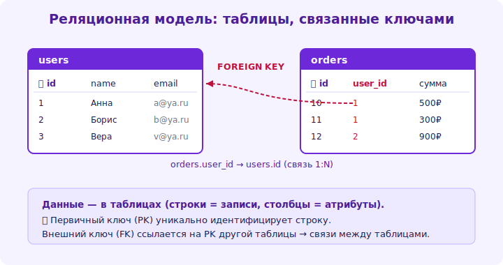

# 03 · Реляционная модель 🖼️⭐⭐

> 🎯 **Цель блока:** понять фундамент реляционных БД — данные как таблицы (отношения), строки,
> столбцы, и почему это так мощно.

---

## 📖 Данные = таблицы

```
   РЕЛЯЦИОННАЯ МОДЕЛЬ: все данные представлены ТАБЛИЦАМИ (отношениями).
   • ТАБЛИЦА (relation) — набор данных об одной сущности (clients, orders, products).
   • СТРОКА (row/tuple) — одна запись (один клиент).
   • СТОЛБЕЦ (column/attribute) — одно свойство с типом (name TEXT, age INT).
   • КАЖДАЯ строка УНИКАЛЬНА (отличается ключом); порядок строк не важен.

   clients:
   ┌────┬─────────┬──────────────────┐
   │ id │ name    │ email            │
   ├────┼─────────┼──────────────────┤
   │ 1  │ Анна    │ anna@mail.com    │  ← строка (одна запись)
   │ 2  │ Иван    │ ivan@mail.com    │
   └────┴─────────┴──────────────────┘
       ↑ столбцы (свойства с типами)
```



💡 ⭐⭐ Простота — сила: всё это **таблицы**. Сложные данные (клиенты, их заказы, товары в
заказах) выражаются несколькими таблицами + связями между ними (модуль 04). Эта простая, строгая
модель позволяет мощные запросы (SQL) и математически обоснована (реляционная алгебра).

---

## ⭐ Схема: строгая структура

```
   СХЕМА (schema) — описание структуры: какие таблицы, столбцы, типы, ограничения.
   реляционные БД имеют СТРОГУЮ схему (в отличие от гибких NoSQL):
   • каждый столбец имеет ТИП (INT, TEXT, DATE, BOOLEAN...) — нельзя положить текст в числовой столбец.
   • ОГРАНИЧЕНИЯ (constraints): NOT NULL (обязательно), UNIQUE (уникально), CHECK (проверка) и др.
   схема = «контракт» данных, который СУБД ПРИНУЖДАЕТ соблюдать.
```

```sql
CREATE TABLE clients (
    id    INTEGER PRIMARY KEY,
    name  TEXT NOT NULL,              -- обязательное поле
    email TEXT UNIQUE,                -- уникальное
    age   INTEGER CHECK (age >= 0)    -- проверка
);
```

💡 ⭐ Строгая схема — это плюс: СУБД гарантирует, что данные валидны (не вставишь клиента без
имени, дубликат email, отрицательный возраст). Это защита от «грязных» данных на уровне хранилища.
NoSQL жертвует этим ради гибкости (модуль 18) — trade-off.

---

## ⭐⭐ Почему таблицы, а не «всё в одном»

```
   ❌ ПЛОХО — всё в одной таблице (денормализовано):
   orders: id, client_name, client_email, product_name, product_price, qty
   проблемы: email клиента дублируется в КАЖДОМ его заказе; поменял email → правь везде;
             нет заказов у клиента → клиента «не существует»; опечатки в названии товара.

   ✅ ХОРОШО — разделено по сущностям + связи:
   clients (id, name, email)        — клиент ОДИН раз.
   products (id, name, price)       — товар ОДИН раз.
   orders (id, client_id, ...)      — заказ ссылается на клиента (client_id).
   order_items (order_id, product_id, qty)  — что в заказе.
```

💡 ⭐⭐ Ключевая идея реляционной модели: **каждый факт хранится ОДИН раз**, в своей таблице, а
связи выражаются ссылками (ключами). Это устраняет дублирование и аномалии (поменял email в одном
месте — он верен везде). Как ПРАВИЛЬНО разбивать на таблицы — это нормализация (модуль 05).

---

## 📖 NULL — особое значение

```
   NULL = «значение ОТСУТСТВУЕТ/неизвестно» (НЕ ноль, НЕ пустая строка).
   • email IS NULL — email не указан.
   • NULL в сравнениях «заразен»: NULL = NULL даёт НЕ true, а NULL (неизвестно). используй IS NULL.
   • аккуратно с NULL в условиях/агрегации (он часто «выпадает» из результатов).
   решай осознанно: какие столбцы могут быть NULL (необязательные), какие NOT NULL (обязательные).
```

---

## ⚠️ Ловушки

- ❌ Складывать всё в одну таблицу (дублирование, аномалии обновления).
- ❌ Дублировать данные вместо связей (email клиента в каждом заказе).
- ❌ Игнорировать типы/ограничения (грязные данные пролезут).
- ❌ Путать NULL с нулём/пустой строкой; сравнивать `= NULL` вместо `IS NULL`.
- ❌ Хранить «список» в одном поле (через запятую) вместо отдельной таблицы.

---

## ✅ Задачи

1. **Таблицы.** Для магазина выпиши, какие нужны таблицы (сущности) и их столбцы. Что повторялось
   бы при хранении «всё в одной»?
2. **CREATE TABLE.** Создай таблицу `clients` с типами и ограничениями (PK, NOT NULL, UNIQUE, CHECK).
3. **Дублирование.** Возьми «плоскую» таблицу заказов (с данными клиента в каждой строке). Найди
   аномалии. Разбей на таблицы.
4. **NULL.** Какие поля клиента обязательны (NOT NULL), какие могут отсутствовать (NULL)? Обоснуй.

---

## ❓ Проверь себя

1. Что такое таблица, строка, столбец в реляционной модели?
2. Что такое схема и ограничения, зачем строгая типизация?
3. Почему данные разбивают на таблицы, а не хранят «всё в одной»?
4. Что такое NULL и как с ним аккуратно работать?

---

## ✅ Чек-лист

- [ ] Понимаю данные как таблицы (строки/столбцы)
- [ ] Создаю таблицы со схемой, типами, ограничениями
- [ ] Разбиваю данные по сущностям (каждый факт один раз)
- [ ] Аккуратно работаю с NULL

➡️ Следующий: [04 · Ключи и связи](04-keys-relations.md)
