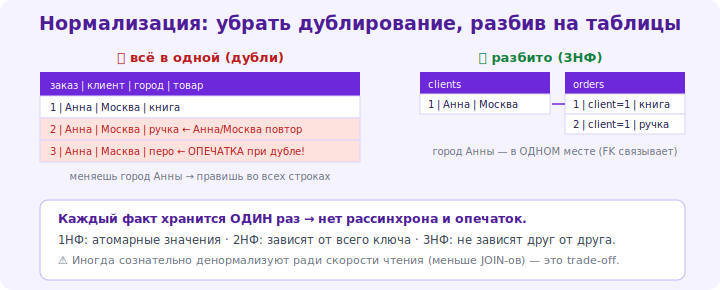

# 05 · Нормализация 🖼️⭐⭐

> 🎯 **Цель блока:** освоить нормализацию — правила разбиения данных по таблицам, устраняющие
> дублирование и аномалии. Фундамент хорошей схемы.

---

## 📖 Зачем нормализация

```
   НОРМАЛИЗАЦИЯ — процесс организации таблиц так, чтобы УСТРАНИТЬ ИЗБЫТОЧНОСТЬ (дублирование) и
   АНОМАЛИИ. цель: каждый факт хранится ОДИН раз, в правильном месте.

   аномалии денормализованной (плохой) схемы:
   • ОБНОВЛЕНИЯ — email клиента в каждом заказе → меняешь email → правь во ВСЕХ заказах (забыл один → неконсистентность).
   • ВСТАВКИ — нельзя добавить товар, не создав заказ (если они в одной таблице).
   • УДАЛЕНИЯ — удалил последний заказ клиента → потерял данные о клиенте.
   нормализация устраняет это, разнося данные по сущностям.
```



💡 ⭐ Нормализация — это формализация интуиции «каждый факт один раз». Идёшь по «нормальным
формам» (1NF→2NF→3NF), каждая убирает определённый вид избыточности. Для практики достаточно дойти
до **3NF** — она покрывает большинство случаев.

---

## ⭐ Нормальные формы (1NF → 2NF → 3NF)

```
   1NF (первая) — АТОМАРНЫЕ значения, нет повторяющихся групп.
       ❌ phone = "123, 456" (список в поле) → ✅ отдельная таблица телефонов или одно значение.
       каждая ячейка = одно значение; нет «массивов» в столбце.

   2NF — 1NF + каждый неключевой столбец зависит от ВСЕГО первичного ключа (актуально для составных ключей).
       ❌ в order_items(order_id, product_id, product_name) — product_name зависит только от product_id,
          не от всего ключа → вынести в products.

   3NF — 2NF + нет ТРАНЗИТИВНЫХ зависимостей (неключевой столбец зависит от другого неключевого).
       ❌ orders(id, client_id, client_city) — client_city зависит от client_id, не от заказа →
          вынести в clients. город принадлежит клиенту, не заказу.
```

🖼️
```
   правило 3NF простыми словами: «каждый столбец зависит от КЛЮЧА, всего ключа и НИЧЕГО кроме ключа».
   (the key, the whole key, and nothing but the key)
   если столбец описывает не «эту сущность», а другую → вынеси его в таблицу той сущности.
```

💡 ⭐⭐ Практический критерий 3NF: **«каждый неключевой столбец описывает САМУ сущность таблицы, а
не что-то связанное»**. Город клиента в таблице заказов? Нет — город описывает КЛИЕНТА → в clients.
Название товара в order_items? Нет — описывает ТОВАР → в products. Спрашивай: «этот атрибут про
ЭТУ строку или про связанную сущность?».

---

## ⭐⭐ Денормализация: осознанный обратный шаг

```
   нормализация = меньше дублирования, но БОЛЬШЕ JOIN-ов при чтении (данные разбросаны по таблицам).
   иногда ради СКОРОСТИ ЧТЕНИЯ намеренно ДЕНОРМАЛИЗУЮТ — дублируют данные, чтобы избежать join'ов.

   ✅ когда денормализация оправдана:
   • очень частые тяжёлые join'ы — узкое место (после ЗАМЕРОВ).
   • аналитика/отчёты (читают много, пишут редко).
   • кэширование агрегатов (хранить счётчик вместо COUNT каждый раз).
   ⚠️ цена: дублирование → риск рассинхронизации; сложнее обновление.

   правило: НАЧНИ С НОРМАЛИЗОВАННОЙ схемы (3NF), денормализуй ТОЧЕЧНО при доказанной нужде.
```

💡 ⭐⭐ Это [trade-off (Senior)](../../Senior/02-decisions/08-tradeoffs.md): нормализация —
целостность и нет дублирования, но больше join'ов (медленнее чтение). Денормализация — быстрее
чтение, но дублирование и риск рассинхронизации. Дефолт — нормализуй; денормализуй осознанно для
горячих путей. Не делай этого преждевременно.

---

## 📖 Как нормализовать (практика)

```
   1. выпиши все данные/атрибуты, которые надо хранить.
   2. сгруппируй по СУЩНОСТЯМ (клиент, заказ, товар) — каждая сущность = таблица.
   3. найди связи между сущностями (1:N, N:M) — расставь ключи (модуль 04).
   4. проверь 3NF: каждый столбец описывает свою сущность? транзитивных зависимостей нет?
   5. атрибут «не на своём месте» → перенеси в правильную таблицу.
```

---

## ⚠️ Ловушки

- ❌ Денормализованная схема «для простоты» → аномалии обновления, грязные данные.
- ❌ Повторяющиеся группы / списки в поле (нарушение 1NF).
- ❌ Атрибут связанной сущности в чужой таблице (город клиента в заказах — нарушение 3NF).
- ❌ Преждевременная денормализация ради «скорости» без замеров.
- ❌ Чрезмерная нормализация (слишком много таблиц/join'ов на простых данных) — баланс.

---

## ✅ Задачи

1. **Аномалии.** Возьми денормализованную таблицу заказов (с данными клиента и товара). Покажи
   3 аномалии (обновления/вставки/удаления).
2. **До 3NF.** Нормализуй эту таблицу до 3NF: раздели на сущности, расставь ключи. Объясни каждый шаг.
3. ⭐ **Проверка 3NF.** Для своей схемы проверь каждый столбец: описывает ли он СВОЮ сущность? Найди нарушения.
4. ⭐ **Денормализация.** Придумай сценарий, где денормализация оправдана. Какова цена? Как избежать рассинхронизации?
5. **С нуля.** Спроектируй нормализованную схему для блога (пользователи, посты, комментарии, теги).

---

## ❓ Проверь себя

1. Зачем нормализация (какие аномалии устраняет)?
2. Что требуют 1NF, 2NF, 3NF (на пальцах)?
3. Простое правило 3NF («ключ, весь ключ, ничего кроме ключа»)?
4. Когда оправдана денормализация и какова её цена?

---

## ✅ Чек-лист

- [ ] Понимаю аномалии денормализованных данных
- [ ] Нормализую до 3NF (каждый факт один раз)
- [ ] Применяю правило «столбец описывает свою сущность»
- [ ] Денормализую осознанно, только при доказанной нужде

➡️ Следующий: [06 · ER-моделирование](06-er-modeling.md)
