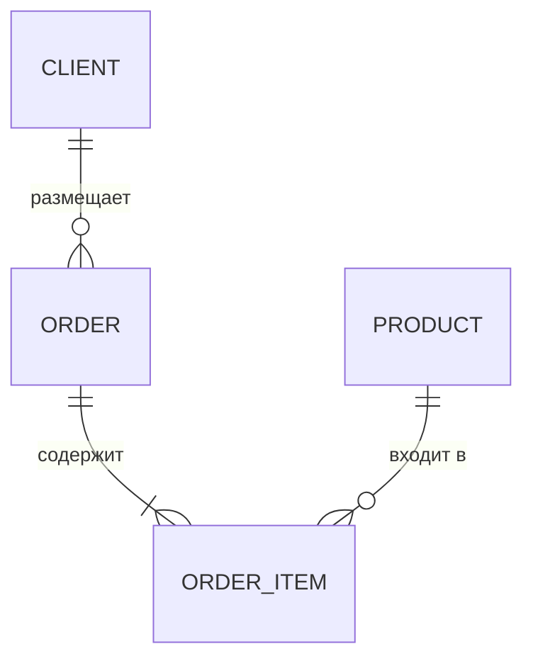

# 06 · ER-моделирование 🖼️⭐

> 🎯 **Цель блока:** научиться проектировать схему БД через ER-диаграммы (сущности-связи) — рисовать
> модель данных до того, как писать CREATE TABLE.

---

## 📖 Проектируй до кода

```
   ER-МОДЕЛЬ (Entity-Relationship) — визуальное проектирование данных: рисуешь СУЩНОСТИ и СВЯЗИ
   между ними, прежде чем создавать таблицы. это «чертёж» базы.
   зачем: увидеть структуру целиком, обсудить с командой, поймать ошибки до реализации (дешевле
   исправить на бумаге, чем в работающей БД с данными).
```

🖼️
```
   ER-диаграмма (упрощённо):
   [ Клиент ]──1───< размещает >───N──[ Заказ ]──M───< содержит >───N──[ Товар ]
       │ id, name, email           │ id, дата, сумма        │ id, название, цена
   читается: клиент размещает много заказов; заказ содержит много товаров (и наоборот) → N:M.
   из ER-диаграммы прямо выводятся таблицы и ключи.
```

---

## ⭐ Элементы ER

```
   СУЩНОСТЬ (entity) — объект, о котором храним данные (Клиент, Заказ, Товар) → станет ТАБЛИЦЕЙ.
   АТРИБУТ — свойство сущности (имя, email, цена) → СТОЛБЕЦ.
   СВЯЗЬ (relationship) — как сущности соотносятся (клиент «размещает» заказ).
   КАРДИНАЛЬНОСТЬ — тип связи (1:1, 1:N, N:M) — сколько строк одной связано со сколькими другой.

   из ER → схема:
   • сущность → таблица; атрибуты → столбцы.
   • 1:N → внешний ключ на стороне «многих».
   • N:M → связующая таблица.
```

💡 ⭐ ER — мост от «что нам надо хранить» (предметная область) к «таблицы и ключи» (схема). Сначала
определяешь сущности и связи на диаграмме, потом механически переводишь в таблицы. Это
[проектирование под изменения (Senior)](../../Senior/03-practices/15-design-for-change.md): хорошая
модель данных переживёт развитие приложения.

---

## ⭐⭐ Процесс проектирования схемы

```
   1. ПОЙМИ ПРЕДМЕТНУЮ ОБЛАСТЬ — что за система, какие данные, как используются (требования!).
   2. НАЙДИ СУЩНОСТИ — существительные предметной области (клиент, заказ, товар, категория).
   3. НАЙДИ АТРИБУТЫ — свойства каждой сущности.
   4. НАЙДИ СВЯЗИ И КАРДИНАЛЬНОСТЬ — как сущности соотносятся (1:N? N:M?).
   5. НАРИСУЙ ER-диаграмму — увидь целое, проверь.
   6. ПЕРЕВЕДИ в таблицы + ключи; проверь НОРМАЛИЗАЦИЮ (3NF, модуль 05).
   7. ОПРЕДЕЛИ типы, ограничения, индексы (Уровень 3).
```

💡 ⭐⭐ Главный навык — **извлечь сущности и связи из задачи**. «Магазин: клиенты делают заказы,
заказы содержат товары, товары в категориях» → сущности (Клиент, Заказ, Товар, Категория) + связи
(клиент-заказ 1:N, заказ-товар N:M, товар-категория N:1). Это превращается в схему почти
автоматически. Хорошая модель данных — фундамент всего приложения.

---

## 📖 Инструменты и нотации

```
   • БУМАГА/доска — для начала достаточно (быстро набросать).
   • инструменты: dbdiagram.io, draw.io, DBeaver (генерирует ER из существующей БД), Mermaid (er-диаграммы).
   • НОТАЦИИ: «вороньи лапки» (crow's foot — линии с «лапкой» для «многих») — самая популярная;
     Chen (ромбы для связей). не важна нотация — важна ясность.
```



---

## ⚠️ Ловушки

- ❌ Сразу писать CREATE TABLE, не спроектировав модель (потом дорого менять).
- ❌ Пропустить связь N:M (забыть связующую таблицу).
- ❌ Сделать сущностью то, что является атрибутом (или наоборот).
- ❌ Не уточнить требования → смоделировать не то (нужная сущность/связь упущена).
- ❌ Переусложнить модель (лишние сущности) или упростить (всё в одну таблицу).

---

## ✅ Задачи

1. **Сущности из задачи.** Для «библиотека» (книги, читатели, выдачи, авторы) выпиши сущности,
   атрибуты, связи и их кардинальность.
2. **ER-диаграмма.** Нарисуй ER (бумага/dbdiagram/Mermaid) для магазина или библиотеки.
3. ⭐ **ER → схема.** Переведи диаграмму в таблицы с ключами. Проверь 3NF.
4. ⭐ **N:M в ER.** Найди в своей модели связь N:M, покажи связующую таблицу на диаграмме.
5. **Сложнее.** Спроектируй ER для соцсети (пользователи, посты, лайки, подписки — подписка это N:M на ту же сущность!).

---

## ❓ Проверь себя

1. Что такое ER-модель и зачем проектировать до кода?
2. Что такое сущность, атрибут, связь, кардинальность?
3. Как перевести ER-диаграмму в таблицы?
4. Опиши процесс проектирования схемы по шагам.

---

## ✅ Чек-лист

- [ ] Извлекаю сущности и связи из предметной области
- [ ] Рисую ER-диаграммы (с кардинальностью)
- [ ] Перевожу ER в таблицы + ключи
- [ ] Проектирую модель ДО написания CREATE TABLE
- [ ] Проверяю нормализацию полученной схемы

➡️ Следующий: [07 · Типы данных и схема](07-data-types-schema.md)
