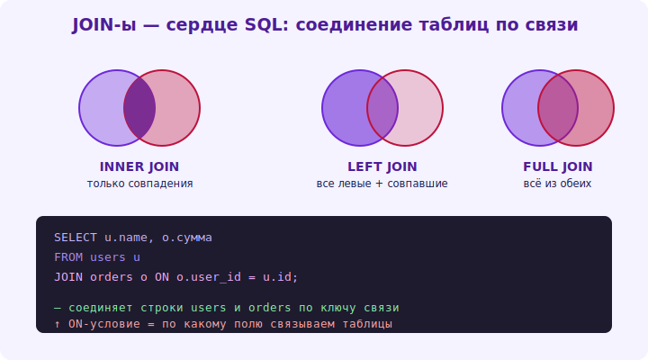

# 09 · JOIN-ы 🖼️⭐⭐

> 🎯 **Цель блока:** освоить JOIN — соединение данных из нескольких таблиц по связям. Сердце SQL и
> реляционной модели. Главный навык запросов.

---

## 📖 Зачем JOIN: данные разбросаны по таблицам

```
   данные нормализованы (модуль 05): клиенты в clients, заказы в orders (со ссылкой client_id).
   чтобы показать «заказы С ИМЕНЕМ КЛИЕНТА», надо СОЕДИНИТЬ таблицы по связи. это JOIN.

   SELECT orders.id, clients.name, orders.amount
   FROM orders
   JOIN clients ON orders.client_id = clients.id;   -- соединить по ключу связи
   ↑ для каждого заказа подтягивает данные его клиента (по client_id = clients.id).
```

🖼️
```
   orders                clients              результат JOIN:
   id│client_id│amount   id│name             id│name │amount
   10│   1     │ 500  ×  1 │Анна    →        10│Анна  │ 500
   11│   2     │ 300     2 │Иван             11│Иван  │ 300
            └─── ON orders.client_id = clients.id ───┘
   JOIN «склеивает» строки таблиц по условию (обычно FK = PK).
```



💡 ⭐⭐ JOIN — это **то, ради чего существует реляционная модель**: данные хранятся раздельно (без
дублирования), а запросы соединяют их по связям. Кто свободно пишет join'ы — владеет SQL.
Условие `ON` обычно соединяет внешний ключ одной таблицы с первичным ключом другой.

---

## ⭐⭐ Типы JOIN

```
   INNER JOIN — только СОВПАДАЮЩИЕ строки (есть в ОБЕИХ таблицах). самый частый.
       заказы, у которых ЕСТЬ клиент. (заказ без клиента / клиент без заказов — не попадут.)

   LEFT JOIN — ВСЕ строки ЛЕВОЙ таблицы + совпадения из правой (нет совпадения → NULL справа).
       ВСЕ клиенты + их заказы; клиент без заказов → попадёт, заказы = NULL.
       частый для «найти тех, у кого НЕТ связанных»: LEFT JOIN ... WHERE orders.id IS NULL.

   RIGHT JOIN — зеркало LEFT (все из правой). редко используется (меняют местами таблицы → LEFT).

   FULL JOIN — все строки обеих (совпадения соединены, остальные с NULL). редко.

   CROSS JOIN — все комбинации (декартово произведение) — осторожно (взрыв строк).
```

🖼️
```
   INNER:  только пересечение (есть в обеих)        [ A ∩ B ]
   LEFT:   все из A + совпадения B (иначе NULL)     [ ВСЯ A + B где есть ]
   RIGHT:  все из B + совпадения A                  [ ВСЯ B + A где есть ]
   FULL:   все из обеих                             [ A ∪ B ]
```

💡 ⭐⭐ Главное различие: **INNER** = только совпадения (большинство задач); **LEFT** = все левые,
даже без пары (для «клиенты И ТЕ, У КОГО НЕТ заказов», и для поиска отсутствующих связей через
`WHERE правая.id IS NULL`). Выбор INNER vs LEFT — частый вопрос: «нужны ли строки без пары?».

---

## ⭐ Множественные JOIN-ы

```sql
-- соединить три+ таблицы (заказ → клиент + товары через order_items):
SELECT orders.id, clients.name, products.name AS product, order_items.qty
FROM orders
JOIN clients ON orders.client_id = clients.id
JOIN order_items ON order_items.order_id = orders.id
JOIN products ON products.id = order_items.product_id
WHERE orders.created_at > '2024-01-01';
-- цепочка join'ов проходит по связям; так разворачивают N:M (через связующую таблицу).
```

💡 ⭐ Реальные запросы соединяют несколько таблиц по цепочке связей. Для **N:M** (заказы↔товары)
join идёт ЧЕРЕЗ связующую таблицу (order_items): orders → order_items → products. Используй
**алиасы таблиц** (`FROM orders o JOIN clients c ON o.client_id = c.id`) для краткости.

---

## 📖 Self-join и частые паттерны

```sql
-- SELF JOIN — таблица соединяется сама с собой (иерархии: сотрудник → менеджер):
SELECT e.name AS employee, m.name AS manager
FROM employees e LEFT JOIN employees m ON e.manager_id = m.id;

-- частые задачи:
-- «клиенты без заказов»: clients LEFT JOIN orders ... WHERE orders.id IS NULL.
-- «топ клиентов по сумме»: JOIN + агрегация (модуль 10).
```

---

## ⚠️ Ловушки

- ❌ Забыть условие ON → CROSS JOIN (декартово произведение, взрыв строк).
- ❌ Использовать INNER, когда нужны строки без пары (теряешь данные) — нужен LEFT.
- ❌ Дубликаты строк из-за join по не-уникальному столбцу (1 строка ×много пар).
- ❌ Путать, какая таблица «левая» в LEFT JOIN.
- ❌ Неоднозначность столбцов (одинаковые имена в таблицах) — указывай таблицу/алиас.
- ❌ Много join'ов без индексов на ключах → медленно (Уровень 3).

---

## ✅ Задачи (на учебной базе)

1. **INNER JOIN.** Покажи заказы с именем клиента (соедини orders и clients).
2. **LEFT JOIN.** Покажи ВСЕХ клиентов и их заказы (включая клиентов без заказов).
3. ⭐ **Без пары.** Найди клиентов БЕЗ заказов (LEFT JOIN + WHERE IS NULL).
4. ⭐ **N:M.** Покажи, какие товары в каждом заказе (orders → order_items → products).
5. ⭐ **Множественный + self.** Соедини 3+ таблиц; сделай self-join (сотрудник→менеджер или категория→родитель).

---

## ❓ Проверь себя

1. Зачем нужен JOIN (что соединяет и по чему)?
2. Чем INNER отличается от LEFT JOIN?
3. Как соединить таблицы через связь N:M?
4. Как найти строки без связанных (LEFT JOIN + IS NULL)?

---

## ✅ Чек-лист

- [ ] Соединяю таблицы через INNER JOIN по ключам
- [ ] Использую LEFT JOIN (включая поиск отсутствующих связей)
- [ ] Соединяю несколько таблиц (включая N:M через связующую)
- [ ] Применяю алиасы и self-join
- [ ] Избегаю случайного CROSS JOIN и дубликатов

➡️ Следующий: [10 · Агрегация и GROUP BY](10-aggregation.md)
