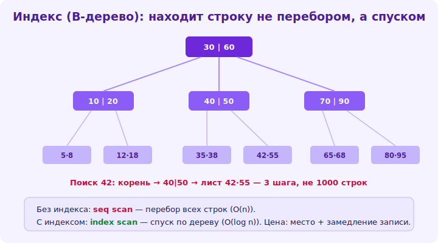

# 13 · Индексы 🖼️⭐⭐

> 🎯 **Цель блока:** понять индексы — главный инструмент ускорения запросов. Без них большие
> таблицы тормозят; с ними — поиск за O(log n).

---

## 📖 Без индекса — полный перебор

```
   запрос WHERE email = 'anna@mail.com' на таблице без индекса → СУБД читает ВСЕ строки (full scan),
   проверяя каждую. на миллионе строк = миллион проверок = медленно.
   ИНДЕКС — отдельная структура (обычно B-tree), хранящая отсортированные значения столбца +
   ссылки на строки. поиск по индексу = O(log n) (как бинарный поиск), а не O(n).
```

🖼️
```
   БЕЗ индекса: WHERE email=X → [читать всю таблицу, проверять каждую] → O(n), медленно.
   С индексом:  WHERE email=X → [спуск по B-tree индекса] → нашёл за O(log n) → строка. БЫСТРО.
   индекс — как алфавитный указатель в книге: не листаешь всю книгу, идёшь по указателю.
```



💡 ⭐⭐ Индекс — это [B-tree из ⚙️/капстоуна](../../Capstone/03-storage/16-storage-engine.md) над
столбцом: отсортированные значения для быстрого поиска. Запрос по индексированному столбцу —
мгновенный даже на миллионах строк. Это **главный рычаг производительности БД**: правильные
индексы превращают медленный запрос в быстрый.

---

## ⭐ Когда и какие индексы создавать

```sql
CREATE INDEX idx_clients_email ON clients(email);              -- индекс по столбцу
CREATE INDEX idx_orders_client ON orders(client_id);          -- по внешнему ключу (для join'ов!)
CREATE UNIQUE INDEX idx_email_uniq ON clients(email);         -- уникальный
CREATE INDEX idx_orders_client_date ON orders(client_id, created_at);  -- СОСТАВНОЙ (несколько столбцов)
```

```
   ИНДЕКСИРУЙ столбцы, по которым ЧАСТО ищут/соединяют/сортируют:
   • в WHERE (поиск по email, статусу, дате).
   • во FOREIGN KEY (для JOIN — почти всегда нужен!).
   • в ORDER BY (сортировка по индексу — бесплатна).
   • UNIQUE-ограничения (создают индекс автоматически).
   первичный ключ индексируется автоматически.
```

💡 ⭐ Правило: индексируй то, по чему **фильтруешь, соединяешь, сортируешь** часто. Внешние ключи —
почти всегда (join'ы по ним без индекса медленны!). Составной индекс `(a, b)` помогает запросам по
`a` и по `a, b` (но не по одному `b` — порядок столбцов важен, «левый префикс»).

---

## ⭐⭐ Цена индексов: trade-off

```
   индексы НЕ бесплатны:
   ✅ УСКОРЯЮТ ЧТЕНИЕ (SELECT с фильтром/join/sort).
   ❌ ЗАМЕДЛЯЮТ ЗАПИСЬ (INSERT/UPDATE/DELETE — надо обновить и индексы).
   ❌ ЗАНИМАЮТ МЕСТО (отдельная структура на диске).

   → НЕ индексируй всё подряд! каждый индекс — налог на запись.
   индексируй то, что реально ускоряет ЧАСТЫЕ запросы (после анализа, EXPLAIN — модуль 14).
   таблица с 20 индексами = быстрое чтение, но медленная запись и много места.
```

💡 ⭐⭐ Классический [trade-off (Senior)](../../Senior/02-decisions/08-tradeoffs.md): индексы ускоряют
чтение ценой замедления записи и места. Поэтому **не индексируй всё** — только столбцы частых
запросов. На таблицах с интенсивной записью лишние индексы вредят. Баланс: достаточно индексов для
быстрых чтений, не больше. Анализируй реальные запросы (EXPLAIN), а не «на всякий случай».

---

## 📖 Виды индексов и нюансы

```
   • B-TREE (по умолчанию) — для =, <, >, BETWEEN, ORDER BY, LIKE 'prefix%'. большинство случаев.
   • HASH — только для = (точное равенство), не для диапазонов.
   • GIN/GiST (Postgres) — для полнотекстового поиска, JSONB, массивов, геоданных.
   • ЧАСТИЧНЫЙ индекс — CREATE INDEX ... WHERE status='active' (индекс только нужного подмножества).
   • ПОКРЫВАЮЩИЙ — индекс содержит все нужные запросу столбцы → не читать таблицу (index-only scan).

   ⚠️ индекс НЕ используется, если: функция над столбцом (WHERE UPPER(email)=...), LIKE '%suffix',
      приведение типов, столбец не первый в составном индексе. → запрос медленный, хотя индекс есть.
```

> 🧭 Индекс изнутри — [B-tree из капстоуна](../../Capstone/03-storage/16-storage-engine.md); почему
> важна локальность/мало обращений к диску — [⚙️ иерархия памяти](../../ComputerScience/01-hardware/07-ram-hierarchy.md).

---

## ⚠️ Ловушки

- ❌ Индексировать всё подряд (налог на запись и место).
- ❌ Не индексировать внешние ключи (join'ы тормозят).
- ❌ Функция над столбцом в WHERE (`UPPER(email)`) → индекс не используется.
- ❌ `LIKE '%text'` (ведущий %) → индекс не помогает (нужен полнотекстовый).
- ❌ Неверный порядок столбцов в составном индексе (поиск по «не-левому» префиксу не ускорится).
- ❌ Создавать индексы «на всякий случай» без анализа реальных запросов.

---

## ✅ Задачи (на большой таблице)

1. **До/после.** Замерь запрос WHERE по неиндексированному столбцу на большой таблице. Создай индекс.
   Замерь снова. Разница?
2. **FK-индекс.** JOIN по внешнему ключу без индекса и с индексом. Сравни скорость.
3. ⭐ **Составной индекс.** Создай индекс `(a, b)`. Проверь, ускоряет ли он запрос по `a`, по `a,b`,
   по одному `b`. Объясни.
4. ⭐ **Когда не работает.** Покажи запрос, где индекс есть, но НЕ используется (функция над столбцом /
   LIKE '%x'). Исправь.
5. **Цена записи.** Замерь INSERT множества строк в таблицу с индексами и без. Разница?

---

## ❓ Проверь себя

1. Что такое индекс и почему ускоряет поиск (O(log n))?
2. Какие столбцы стоит индексировать?
3. Какова цена индексов (trade-off)?
4. Когда индекс НЕ используется, хотя существует?

---

## ✅ Чек-лист

- [ ] Понимаю индекс как B-tree для быстрого поиска
- [ ] Индексирую столбцы частых запросов (WHERE/JOIN/ORDER BY, FK)
- [ ] Не индексирую всё подряд (помню цену записи)
- [ ] Знаю составные индексы и «левый префикс»
- [ ] Знаю случаи, когда индекс не используется

➡️ Следующий: [14 · План запроса (EXPLAIN)](14-explain.md)
