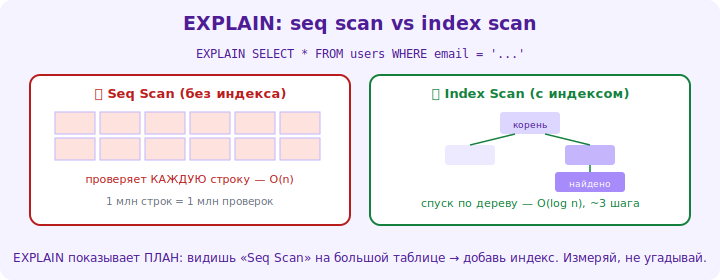

# 14 · План запроса (EXPLAIN) 🖼️⭐⭐

> 🎯 **Цель блока:** научиться читать план выполнения запроса (EXPLAIN) — увидеть, КАК СУБД
> выполняет запрос, и почему он быстрый или медленный.

---

## 📖 Оптимизатор выбирает план — посмотри какой

```
   ты пишешь декларативный SQL («что хочу»), оптимизатор строит ПЛАН («как искать»): какие индексы,
   в каком порядке join'ы, full scan или index scan. EXPLAIN ПОКАЗЫВАЕТ этот план.
   это главный инструмент диагностики «почему запрос медленный».

   EXPLAIN SELECT ...;              -- показать план (оценка)
   EXPLAIN ANALYZE SELECT ...;      -- ВЫПОЛНИТЬ и показать РЕАЛЬНОЕ время + план (точнее)
```



💡 ⭐⭐ EXPLAIN — это «рентген» запроса: не гадай, почему медленно, **посмотри план**. Он покажет,
использовался ли индекс (Index Scan) или СУБД читала всю таблицу (Seq Scan), как соединялись
таблицы, сколько строк обработано. Это [«измеряй, не угадывай» (Senior)](../../Senior/03-practices/17-performance-mindset.md)
применительно к БД.

---

## ⭐ Что искать в плане

```
   КЛЮЧЕВЫЕ операции (читаешь снизу вверх / изнутри наружу):
   • Seq Scan (sequential scan) — ПОЛНЫЙ перебор таблицы. ⚠️ на большой таблице = медленно (нет индекса?).
   • Index Scan — поиск ПО ИНДЕКСУ. ✅ быстро.
   • Index Only Scan — данные взяты прямо из индекса (покрывающий) — ещё быстрее.
   • Bitmap Scan — гибрид для многих совпадений.

   JOIN-стратегии:
   • Nested Loop — для каждой строки одной ищем в другой (хорошо при индексе и малых данных).
   • Hash Join — строит хеш-таблицу (хорошо для больших несортированных).
   • Merge Join — слияние отсортированных.

   МЕТРИКИ:
   • cost — оценка стоимости (относительная).
   • rows — оценка/факт числа строк.
   • actual time (в ANALYZE) — реальное время. ⚠️ большое время / много строк = узкое место.
```

🖼️
```
   плохой план:  Seq Scan on orders (читает 1млн строк) → 2000ms  ← нет индекса на условие!
   хороший план: Index Scan using idx_orders_client → 2ms        ← индекс работает.
   видишь Seq Scan на большой таблице с фильтром → кандидат на индекс.
```

---

## ⭐⭐ Типичная диагностика

```
   1. запрос медленный → EXPLAIN ANALYZE.
   2. ищи Seq Scan на больших таблицах (где должен быть индекс).
   3. ищи большое actual time на каком-то узле (узкое место).
   4. ищи расхождение rows (оценка vs факт) — устаревшая статистика (ANALYZE table).
   5. проверь: используется ли индекс? правильный порядок join'ов? не тянется ли лишнее?
   6. исправь: добавь индекс / перепиши запрос (модуль 15) / обнови статистику.
   7. EXPLAIN снова → план улучшился? время упало?
```

💡 ⭐⭐ Главный паттерн диагностики: **Seq Scan на большой таблице с фильтром = нужен индекс**.
EXPLAIN ANALYZE показывает реальное время на каждом шаге — находишь, где запрос «застревает».
Это превращает оптимизацию из гадания в анализ: видишь план → понимаешь причину → чинишь
прицельно. Senior читает планы запросов как код.

---

## 📖 Статистика и оптимизатор

```
   оптимизатор выбирает план на основе СТАТИСТИКИ о данных (сколько строк, распределение значений).
   • устаревшая статистика → плохой план (СУБД «думает», что строк мало, а их миллионы).
   • ANALYZE table — обновить статистику (Postgres делает автоматически, но иногда нужно вручную).
   • оптимизатор СТОИМОСТНОЙ: оценивает стоимость планов, выбирает дешёвый. иногда ошибается на
     перекошенных данных / сложных запросах → помогаешь (индекс, переписать, подсказки).
```

---

## ⚠️ Ловушки

- ❌ Оптимизировать запрос, не посмотрев EXPLAIN (гадание).
- ❌ Игнорировать Seq Scan на больших таблицах.
- ❌ EXPLAIN на маленьких тестовых данных (на них и Seq Scan быстр — тестируй на реалистичном объёме).
- ❌ Не обновлять статистику (ANALYZE) → оптимизатор ошибается.
- ❌ Смотреть только cost, не actual time (EXPLAIN ANALYZE точнее).
- ❌ Считать, что «индекс есть → он используется» (проверь по плану!).

---

## ✅ Задачи (на большой таблице)

1. **Seq vs Index.** EXPLAIN ANALYZE запроса с фильтром БЕЗ индекса (увидь Seq Scan и время). Создай
   индекс. EXPLAIN снова — Index Scan? время упало?
2. **JOIN-план.** Посмотри план запроса с JOIN. Какая стратегия (Nested Loop/Hash/Merge)? Используются индексы?
3. ⭐ **Узкое место.** Возьми медленный запрос, по EXPLAIN ANALYZE найди самый дорогой шаг. Что его замедляет?
4. ⭐ **Статистика.** Покажи расхождение rows (оценка vs факт). Сделай ANALYZE, посмотри, улучшился ли план.
5. **Индекс не работает.** Запрос с функцией над столбцом — по плану индекс не используется? Перепиши.

---

## ❓ Проверь себя

1. Что показывает EXPLAIN (и чем ANALYZE точнее)?
2. Что такое Seq Scan vs Index Scan и о чём говорит каждый?
3. Как диагностировать медленный запрос по плану?
4. Зачем статистика для оптимизатора?

---

## ✅ Чек-лист

- [ ] Читаю план запроса (EXPLAIN ANALYZE)
- [ ] Различаю Seq Scan (полный перебор) и Index Scan
- [ ] Нахожу узкое место по actual time
- [ ] Диагностирую «нет индекса» по Seq Scan на большой таблице
- [ ] Обновляю статистику, понимаю роль оптимизатора

➡️ Следующий: [15 · Оптимизация запросов](15-query-optimization.md)
