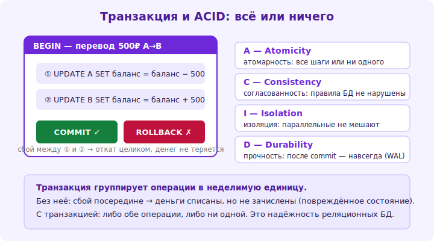

# 16 · Транзакции и ACID 🖼️⭐⭐

> 🎯 **Цель блока:** освоить транзакции — группу операций как единое целое, и гарантии ACID,
> делающие БД надёжной.

---

## 📖 Транзакция: всё или ничего

```sql
BEGIN;                                                    -- начать транзакцию
   UPDATE accounts SET balance = balance - 100 WHERE id = 1;   -- списать у A
   UPDATE accounts SET balance = balance + 100 WHERE id = 2;   -- зачислить B
COMMIT;                                                   -- зафиксировать ОБЕ
-- ROLLBACK вместо COMMIT — отменить ОБЕ (как будто ничего не было)
```

```
   ТРАНЗАКЦИЯ — группа операций, выполняемых как ЕДИНОЕ ЦЕЛОЕ.
   • COMMIT — все изменения фиксируются (становятся постоянными).
   • ROLLBACK — все изменения отменяются.
   • сбой посреди транзакции → автоматический откат → данные консистентны.
   перевод денег: списание И зачисление вместе, или ни одного. иначе деньги «испарятся».
```



💡 ⭐⭐ Транзакции решают проблему «частичных изменений»: без них сбой между списанием и зачислением
= потерянные деньги. С транзакцией — обе операции атомарны (всё или ничего). Это фундамент
надёжности БД для любых связанных изменений (заказ + товары + оплата, перевод, и т.д.).

---

## ⭐⭐ ACID — гарантии транзакций

```
   A — ATOMICITY (атомарность): транзакция выполняется ПОЛНОСТЬЮ или НИКАК.
       сбой на середине → откат всех изменений. (перевод: оба шага или ни одного.)

   C — CONSISTENCY (согласованность): транзакция переводит БД из одного ВАЛИДНОГО состояния в
       другое (ограничения соблюдены: FK, CHECK, балансы сходятся).

   I — ISOLATION (изоляция): параллельные транзакции не мешают друг другу — как будто выполнялись
       по очереди (подробно — модуль 17). другие не видят «промежуточных» состояний твоей транзакции.

   D — DURABILITY (долговечность): после COMMIT изменения ПЕРЕЖИВУТ сбой (записаны в журнал/на диск).
       (это WAL + fsync — как в [капстоуне].)
```

🖼️
```
   ACID — «контракт надёжности» БД:
   Atomicity → не будет половины операции.   Consistency → данные всегда валидны.
   Isolation → параллельные не портят друг друга.   Durability → подтверждённое не потеряется.
   реляционные БД дают ACID из коробки — поэтому им доверяют деньги/критичные данные.
```

💡 ⭐⭐ ACID — причина, почему реляционным БД доверяют критичные данные (банки, заказы). Каждая
буква — гарантия: атомарность (через журнал/откат), согласованность (ограничения), изоляция
(блокировки/версии — модуль 17), долговечность (WAL+fsync). NoSQL часто жертвует частью ACID ради
масштаба/скорости (модуль 18, 20) — trade-off.

---

## ⭐ Транзакции в приложении

```
   ✅ оборачивай СВЯЗАННЫЕ изменения в транзакцию (создать заказ + списать товары + записать оплату).
   ✅ держи транзакции КОРОТКИМИ (долгая транзакция держит блокировки → тормозит других).
   ✅ обрабатывай ошибки → ROLLBACK при сбое.
   ✅ не делай в транзакции медленных внешних вызовов (сеть, API) — держит блокировки/соединение.
   ⚠️ авто-commit: вне явного BEGIN каждая команда — отдельная транзакция (сразу фиксируется).
```

> 🧭 Это [капстоун-транзакции изнутри](../../Capstone/03-storage/17-transactions.md): там ты
> реализуешь ACID; здесь — используешь как пользователь БД. Durability = [WAL/fsync](../../Capstone/03-storage/15-persistence.md).

---

## ⚠️ Ловушки

- ❌ Не оборачивать связанные изменения в транзакцию (риск частичных изменений при сбое).
- ❌ Долгие транзакции (держат блокировки, тормозят систему).
- ❌ Внешние вызовы (API/сеть) внутри транзакции (держит ресурсы).
- ❌ Забыть ROLLBACK при ошибке (транзакция «висит», держит блокировки).
- ❌ Полагаться на авто-commit для многошаговых операций.
- ❌ Думать, что NoSQL всегда даёт ACID (часто нет — проверяй гарантии).

---

## ✅ Задачи

1. **Перевод.** Реализуй перевод между «счетами» в транзакции (BEGIN, два UPDATE, COMMIT). Попробуй
   ROLLBACK — изменения отменились?
2. **Атомарность.** Симулируй ошибку в середине транзакции (нарушь CHECK). Откатилось всё?
3. ⭐ **ACID-разбор.** Для сценария «оформление заказа» (создать заказ + списать остатки + запись оплаты)
   опиши, что гарантирует каждая буква ACID.
4. ⭐ **Долгая транзакция.** Покажи, как долгая транзакция (с паузой) блокирует другую. Почему держать коротко?
5. **Durability.** Объясни, как COMMIT гарантирует, что данные переживут сбой (WAL).

---

## ❓ Проверь себя

1. Что такое транзакция (COMMIT/ROLLBACK)?
2. Что означает каждая буква ACID?
3. Зачем держать транзакции короткими?
4. Как ACID обеспечивает надёжность для критичных данных?

---

## ✅ Чек-лист

- [ ] Оборачиваю связанные изменения в транзакции
- [ ] Понимаю каждую гарантию ACID
- [ ] Держу транзакции короткими, обрабатываю ROLLBACK
- [ ] Не делаю внешних вызовов в транзакции
- [ ] Знаю, что NoSQL может не давать полного ACID

➡️ Следующий: [17 · Изоляция и блокировки](17-isolation-locks.md)
