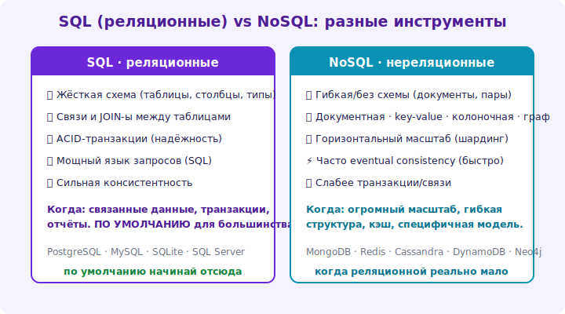

# 18 · NoSQL: типы и когда применять 🖼️⭐⭐

> 🎯 **Цель блока:** разобраться в типах NoSQL баз и понять, КОГДА они уместны вместо реляционных
> (а когда — нет). Это вопрос осознанного выбора, а не моды.

---

## 📖 NoSQL — «не только SQL», разные модели под задачи

```
   NoSQL — семейство БД с НЕреляционными моделями данных. возникли для задач, где реляционная модель
   неудобна: гибкая схема, экстремальный масштаб, специфичная структура (графы, документы).
   ⚠️ NoSQL — НЕ «лучше SQL», а ДРУГОЕ под другие задачи. часто жертвуют связями/транзакциями/SQL
   ради гибкости/масштаба. выбор — это trade-off, не мода.
```

---

## ⭐ Четыре типа NoSQL

```
   📄 ДОКУМЕНТНЫЕ (MongoDB, CouchDB) — хранят JSON-документы, гибкая/без схемы.
      ✅ гибкая структура (поля разные у документов), вложенность, быстрая разработка.
      когда: данные документо-подобны, схема меняется, агрегаты целиком (профиль, каталог).
      ❌ слабее по связям между коллекциями, транзакциям (улучшается, но не как у SQL).

   🔑 KEY-VALUE (Redis, DynamoDB) — простые пары ключ→значение, очень быстро.
      ✅ максимальная скорость, простота, масштаб.
      когда: кэш (модуль 21), сессии, счётчики, очереди. (это твой [капстоун-KV]!)
      ❌ нет сложных запросов (только по ключу).

   📊 КОЛОНОЧНЫЕ (Cassandra, HBase) — хранят по столбцам, для огромных объёмов.
      ✅ запись/чтение гигантских объёмов, горизонтальный масштаб, аналитика.
      когда: временные ряды, логи, метрики, big data.

   🕸️ ГРАФОВЫЕ (Neo4j) — узлы и связи как первоклассные объекты.
      ✅ запросы по СВЯЗЯМ (друзья друзей, рекомендации, кратчайший путь).
      когда: соцграфы, рекомендации, графы знаний, маршруты.
```

🖼️
```
   документы → гибкая структура (каталоги, профили)
   key-value → скорость по ключу (кэш, сессии)
   колоночные → огромные объёмы (метрики, логи)
   графовые → связи (соцсети, рекомендации)
   каждый тип = своя модель под свой класс задач.
```

💡 ⭐⭐ Главное — **под какую задачу какой тип**. NoSQL не заменяет реляционную, а дополняет под
специфику. Часто в одном приложении: PostgreSQL (основные данные) + Redis (кэш) + что-то ещё под
нишу. «Polyglot persistence» — разные БД под разные задачи.

---

## ⭐⭐ Реляционная vs NoSQL: как выбрать

```
   ВЫБИРАЙ РЕЛЯЦИОННУЮ (PostgreSQL), если:
   ✅ данные структурированы, есть связи (большинство приложений!).
   ✅ нужны транзакции/ACID (финансы, заказы).
   ✅ нужны сложные запросы (join'ы, агрегация, аналитика).
   ✅ не знаешь точно — НАЧНИ С РЕЛЯЦИОННОЙ (она универсальна, Postgres даже умеет JSONB).

   ВЫБИРАЙ NoSQL, если ЕСТЬ КОНКРЕТНАЯ ПРИЧИНА:
   ✅ кэш/сессии/скорость по ключу → key-value (Redis).
   ✅ гибкая/меняющаяся схема, документо-подобные данные → документная.
   ✅ экстремальный масштаб записи / big data → колоночная.
   ✅ данные ПРО СВЯЗИ (граф) → графовая.
```



💡 ⭐⭐ Дефолтное правило: **по умолчанию реляционная** (она покрывает 90%, даёт связи/транзакции/SQL,
а Postgres ещё и JSONB для гибкости). NoSQL — когда есть ДОКАЗАННАЯ причина (конкретный паттерн
данных/нагрузки). «Возьмём MongoDB, потому что модно» без причины — частая дорогая ошибка (теряешь
связи/транзакции/мощь SQL). Это [trade-off под контекст (Senior)](../../Senior/02-decisions/08-tradeoffs.md).

---

## 📖 Гибридный подход

```
   реальные системы часто КОМБИНИРУЮТ:
   • PostgreSQL — основные данные (пользователи, заказы) с транзакциями/связями.
   • Redis — кэш частых запросов, сессии, счётчики (скорость).
   • поисковый движок (Elasticsearch) — полнотекстовый поиск.
   • колоночная/аналитическая — для отчётов/метрик (отдельно от боевой OLTP).
   каждая БД делает то, в чём сильна. + Postgres JSONB даёт гибкость документов внутри реляционной.
```

---

## ⚠️ Ловушки

- ❌ Брать NoSQL «потому что модно/масштабируется» без конкретной причины.
- ❌ Терять связи/транзакции/мощь SQL, выбрав NoSQL для реляционных данных.
- ❌ Считать NoSQL «современнее/лучше» — это другой инструмент под другие задачи.
- ❌ Игнорировать, что многие NoSQL жертвуют ACID/консистентностью (модуль 20).
- ❌ Не рассматривать Postgres JSONB (гибкость документов внутри реляционной).
- ❌ Использовать одну БД для всего, когда гибрид лучше (или наоборот — зоопарк без нужды).

---

## ✅ Задачи на размышление

1. **Выбор.** Для 5 задач (заказы магазина, кэш сессий, соцграф, логи-метрики, каталог с гибкими
   атрибутами) выбери тип БД и обоснуй.
2. **Реляционная vs Mongo.** Возьми задачу с связями. Что потеряешь, выбрав документную БД?
3. ⭐ **Redis.** Подними Redis (Docker), попробуй key-value операции, TTL. Где бы применил в приложении?
4. ⭐ **JSONB.** В Postgres сохрани гибкие данные в JSONB. Сравни с документной БД — когда хватает Postgres?
5. **Гибрид.** Спроектируй стек БД для крупного приложения (что под что).

---

## ❓ Проверь себя

1. Какие четыре типа NoSQL и под какие задачи каждый?
2. Когда выбирать реляционную, когда NoSQL?
3. Почему «по умолчанию реляционная»?
4. Что такое polyglot persistence (гибрид)?

---

## ✅ Чек-лист

- [ ] Знаю типы NoSQL (документные/key-value/колоночные/графовые)
- [ ] Выбираю БД под задачу, а не по моде
- [ ] По умолчанию беру реляционную, NoSQL — по причине
- [ ] Знаю про гибридный подход и Postgres JSONB

➡️ Следующий: [19 · Репликация и шардинг](19-replication-sharding.md)
