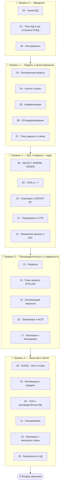

# 🗄️ Трек · Базы данных

> **Почти каждое приложение хранит данные в БД.** Этот трек — про то, как данные моделируют,
> запрашивают, делают быстрыми и надёжными: реляционная модель, SQL, индексы, транзакции, NoSQL и
> масштабирование. Один из самых востребованных навыков и тем собеседований.

> 🧭 Дополняет [⚙️ как устроены БД изнутри](../ComputerScience/01-hardware/07-ram-hierarchy.md) и
> [капстоун-БД](../Capstone/03-storage/16-storage-engine.md) (там ты строишь свою; здесь —
> используешь и проектируешь настоящие).

---

## 🗺️ Дорожная карта

---

## 🎯 Ядро трека — SQL и запросы

> **SQL — язык работы с данными, и сердце его — JOIN-ы:** соединение таблиц по связям. Кто
> свободно пишет и читает запросы с join'ами, агрегацией и подзапросами — владеет реляционными БД.

Поэтому центр трека (Уровень 2) — от простого SELECT до сложных запросов с соединениями и группировкой.

---

## 📂 Содержание

### 🥚 Уровень 0 — Введение
- [00 · Зачем нужны базы данных](00-intro/00-why-databases.md)
- [01 · Типы БД и как устроена СУБД](00-intro/01-types-and-dbms.md)
- [02 · Инструменты: psql, клиенты, песочницы](00-intro/02-tools.md)

### 🐣 Уровень 1 — Модель и проектирование
- [03 · Реляционная модель](01-modeling/03-relational-model.md)
- [04 · Ключи и связи](01-modeling/04-keys-relations.md)
- [05 · Нормализация](01-modeling/05-normalization.md)
- [06 · ER-моделирование](01-modeling/06-er-modeling.md)
- [07 · Типы данных и схема](01-modeling/07-data-types-schema.md)
- ✅ [Задачи уровня 1](01-modeling/TASKS.md) · 🚀 [Проект](01-modeling/PROJECT.md)

### 🐥 Уровень 2 — SQL и запросы ⭐ ядро
- [08 · SELECT, WHERE, ORDER, LIMIT](02-sql/08-select-basics.md)
- [09 · JOIN-ы ⭐⭐](02-sql/09-joins.md)
- [10 · Агрегация и GROUP BY](02-sql/10-aggregation.md)
- [11 · Подзапросы и CTE](02-sql/11-subqueries-cte.md)
- [12 · Изменение данных и DDL](02-sql/12-modification-ddl.md)
- ✅ [Задачи уровня 2](02-sql/TASKS.md) · 🚀 [Проект](02-sql/PROJECT.md)

### 🦅 Уровень 3 — Производительность и надёжность
- [13 · Индексы](03-performance/13-indexes.md)
- [14 · План запроса (EXPLAIN)](03-performance/14-explain.md)
- [15 · Оптимизация запросов](03-performance/15-query-optimization.md)
- [16 · Транзакции и ACID](03-performance/16-transactions-acid.md)
- [17 · Изоляция и блокировки](03-performance/17-isolation-locks.md)
- ✅ [Задачи уровня 3](03-performance/TASKS.md) · 🚀 [Проект](03-performance/PROJECT.md)

### 🚀 Уровень 4 — Масштаб и Senior
- [18 · NoSQL: типы и когда применять](04-scale/18-nosql.md)
- [19 · Репликация и шардинг](04-scale/19-replication-sharding.md)
- [20 · CAP и распределённые БД](04-scale/20-cap.md)
- [21 · Кэширование](04-scale/21-caching.md)
- [22 · Миграции и эволюция схемы](04-scale/22-migrations.md)
- [23 · Безопасность БД](04-scale/23-security.md)
- ✅ [Задачи уровня 4](04-scale/TASKS.md) · 🚀 [Проект](04-scale/PROJECT.md)

---

## 🧭 Как проходить

Учись на практике — подними **PostgreSQL** (или SQLite для начала), пиши **реальные запросы** к
учебной базе. SQL осваивается только за клавиатурой. Используй песочницы (db-fiddle, SQL-тренажёры)
и реальную СУБД.

➡️ Начни с [00 · Зачем нужны базы данных](00-intro/00-why-databases.md)
