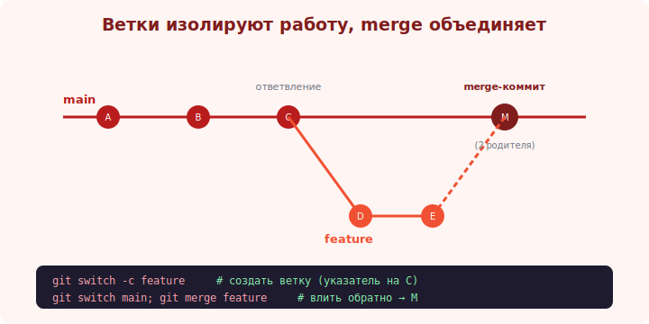

# 08 · Ветки ⭐⭐ 🖼️

> 🎯 **Цель блока:** понять ветки — главную силу Git. Изолированные линии работы, которые создаются
> мгновенно. Это ядро трека: на ветках строится вся командная разработка.

---

## ⭐⭐ Что такое ветка

```
   ВЕТКА — это просто ПОДВИЖНЫЙ УКАЗАТЕЛЬ на коммит (41 байт текста, не копия файлов!).
   когда делаешь коммит на ветке — указатель сдвигается на новый коммит.

   зачем: ИЗОЛЯЦИЯ работы. делаешь фичу в своей ветке, не трогая стабильный main.
   эксперимент провалился — удалил ветку, main чист. готово — слил в main (merge, модуль 09).
```

🖼️
```
   main:     A ── B ── C
                       │
   feature:            └── D ── E      ← ветка feature: своя линия от C
                            ▲
                           HEAD (ты здесь, на feature)

   main по-прежнему на C. feature ушла вперёд на D, E. Они независимы.
```



💡 ⭐⭐ Ветки в Git **дёшевы и мгновенны** (создать = записать один указатель). Это перевернуло
разработку: раньше «ветка» означала дорогое копирование. В Git норма — заводить ветку на каждую
задачу. Понять «ветка = указатель на коммит» = понять Git.

---

## ⭐⭐ Команды веток

```
   git branch                      # список веток (* — текущая)
   git branch feature              # создать ветку feature (от текущего коммита)
   git switch feature              # перейти на ветку feature
   git switch -c feature           # создать И перейти (частый случай)
   git checkout feature            # старый способ перейти (switch новее и понятнее)
   git checkout -b feature         # старый способ создать+перейти

   git branch -d feature           # удалить ветку (если слита)
   git branch -D feature           # удалить принудительно (даже не слитую) ⚠️
   git branch -m new-name          # переименовать текущую ветку
```

💡 ⭐⭐ `git switch -c имя` — заводи ветку под каждую задачу/фичу/баг. Имя осмысленное:
`feature/login`, `fix/date-parsing`, `experiment/new-cache`. Переключение веток меняет файлы в
рабочей папке на снимок той ветки (закоммить или `stash` перед переключением — модуль 19).

---

## 📖 HEAD и переключение

```
   HEAD — указатель на «где ты сейчас». Обычно HEAD → текущая ветка → её последний коммит.
   git switch feature  →  HEAD теперь указывает на feature, рабочая папка = снимок feature.

   detached HEAD — если перейти на КОММИТ напрямую (git switch <хеш>), HEAD не на ветке.
   коммиты тут «висят в воздухе» (потеряются без ветки). нормально для осмотра; для работы — заведи ветку.
```

---

## 📖 Зачем так много веток

```
   типичный поток:
   1. main — всегда стабильный, рабочий код.
   2. на задачу → git switch -c feature/X → работаешь, коммитишь.
   3. готово → сливаешь в main (через merge / pull request, модули 09, 15).
   4. удаляешь ветку feature/X.

   параллельно можно держать несколько веток (разные задачи), переключаясь между ними.
```

💡 Дешёвые ветки = можно экспериментировать без страха: всё в ветке, main не затронут. Не вышло —
удалил ветку. Это снимает страх «сломать рабочий код».

---

## ⚠️ Ловушки

- ❌ Работать прямо в `main` (нет изоляции; ломаешь стабильную ветку).
- ❌ Переключать ветку с незакоммиченными правками без понимания (закоммить или `stash`).
- ❌ Застрять в detached HEAD и потерять коммиты (заведи ветку, если работаешь).
- ❌ Безымянные ветки (`test`, `new`, `tmp`) вместо осмысленных (`feature/login`).
- ❌ Копить долгоживущие ветки (расходятся с main → ад слияния; сливай часто).

---

## ✅ Задачи

1. Создай ветку `feature/hello`, перейди в неё, сделай 2 коммита. Вернись в `main` — где твои изменения?
2. Посмотри `git log --oneline --graph --all` — увидь обе ветки.
3. Создай ветку, сделай коммит, удали ветку через `-d`. Что говорит Git?
4. ⭐ Войди в detached HEAD (`git switch <хеш>`), сделай коммит, выйди — как не потерять его?
5. Заведи две ветки от main, в каждой свой коммит. Переключайся — наблюдай смену файлов.

---

## ❓ Проверь себя

1. Что такое ветка в Git (физически)?
2. Почему ветки дёшевы и зачем заводить их часто?
3. Что такое HEAD и detached HEAD?
4. В чём разница `git switch` и `git checkout`?

---

## ✅ Чек-лист

- [ ] Понимаю «ветка = указатель на коммит»
- [ ] Создаю/переключаю/удаляю ветки (`switch -c`, `-d`)
- [ ] Завожу ветку под каждую задачу с осмысленным именем
- [ ] Понимаю HEAD и опасность detached HEAD

➡️ Следующий: [09 · Слияние (merge) ⭐⭐](09-merge.md)
