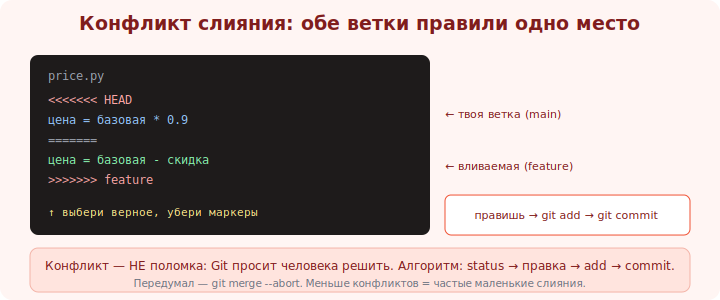

# 10 · Конфликты слияния 🖼️⭐⭐

> 🎯 **Цель блока:** перестать бояться конфликтов. Конфликт — это нормально: Git просит человека
> решить, какой вариант верный, когда две ветки правили одно место.

---

## 📖 Откуда берётся конфликт

```
   КОНФЛИКТ возникает, когда обе ветки изменили ОДНУ И ТУ ЖЕ часть файла по-разному, и Git не
   может решить автоматически, какой вариант оставить. Тогда он просит ТЕБЯ.

   когда конфликта НЕТ: правки в разных файлах / в разных местах одного файла → Git сливает сам.
   когда ЕСТЬ: обе ветки переписали строку 10 файла X по-разному.
```



💡 Конфликт — не ошибка и не поломка. Это Git честно говорит: «здесь два варианта, я не знаю, какой
правильный — реши сам». Бояться нечего: ничего не потеряно, слияние можно отменить (`--abort`).

---

## ⭐⭐ Как выглядит и как решать

```
   при конфликте Git вставляет МАРКЕРЫ в файл:

   <<<<<<< HEAD
   цена = базовая * 0.9          ← вариант ТЕКУЩЕЙ ветки (main)
   =======
   цена = базовая - скидка       ← вариант ВЛИВАЕМОЙ ветки (feature)
   >>>>>>> feature

   решение РУКАМИ:
   1. открой файл, найди маркеры <<<<<<< ======= >>>>>>>.
   2. оставь ПРАВИЛЬНЫЙ код (один вариант / комбинацию обоих / новый). УБЕРИ все маркеры.
   3. git add file        # отметить «конфликт решён»
   4. git commit          # завершить слияние (сообщение Git предложит сам)
```

🖼️
```
   git merge feature
   → CONFLICT in price.py
   git status                 # покажет «both modified: price.py»
   ...правишь файл, убираешь маркеры, выбираешь верный код...
   git add price.py           # решено
   git commit                 # слияние завершено

   передумал? git merge --abort   → вернуться к состоянию до merge.
```

💡 ⭐⭐ Алгоритм: **status** (что конфликтует) → открыть файл → решить (убрать маркеры, оставить
верное) → **add** (отметить решённым) → **commit**. Не существует «магической» кнопки — конфликт
решает человек, потому что только человек знает, какой код верный. `git status` ведёт за руку.

---

## ⭐ Инструменты помощи

```
   git status                 # какие файлы конфликтуют
   git diff                   # показать конфликтующие участки
   git merge --abort          # отменить слияние целиком, вернуться как было
   git mergetool              # запустить визуальный инструмент (VSCode и IDE удобны)

   в VSCode/IDE: конфликт показывается с кнопками
   «Accept Current» / «Accept Incoming» / «Accept Both» / редактировать вручную.
```

💡 ⭐ IDE сильно упрощают: показывают оба варианта рядом с кнопками выбора. Но понимай, что под ними —
ты выбираешь, какой код останется. После решения всё равно `add` + `commit`.

---

## 📖 Как меньше конфликтов

```
   • СЛИВАЙ/ОБНОВЛЯЙ ЧАСТО — короткоживущие ветки расходятся меньше (главный приём).
   • небольшие, сфокусированные изменения (не переписывай пол-файла в фиче).
   • договоритесь в команде о форматировании (массовый авто-формат → конфликты везде).
   • communicate: если двое правят один модуль — координируйтесь.
```

> 🧭 Конфликты — неизбежная часть [командной работы](../03-collaboration/17-workflows.md). Частые
> маленькие слияния (trunk-based) уменьшают их; редкие большие — увеличивают.

---

## ⚠️ Ловушки

- ❌ Бояться конфликта/паниковать (есть `--abort`, ничего не потеряно).
- ❌ Оставить маркеры `<<<<<<<`/`=======`/`>>>>>>>` в коде (сломанный, не собирается).
- ❌ Слепо выбрать «свой» вариант, не разобравшись (можно затереть нужную чужую правду).
- ❌ Решить конфликт, но забыть `git add` (слияние не завершится).
- ❌ Копить расходящиеся ветки → гигантский конфликт.

---

## ✅ Задачи

1. Спровоцируй конфликт: две ветки правят одну строку по-разному. Слей — увидь маркеры.
2. Реши конфликт руками (убери маркеры, выбери верное), заверши `add` + `commit`.
3. Спровоцируй конфликт и отмени слияние через `git merge --abort`.
4. ⭐ Реши конфликт через `git mergetool` или встроенный UI IDE. Удобнее?
5. ⭐ Создай ситуацию, где конфликта НЕТ (правки в разных местах) — убедись, что Git слил сам.

---

## ❓ Проверь себя

1. Когда возникает конфликт, а когда Git сливает сам?
2. Что означают маркеры `<<<<<<<`, `=======`, `>>>>>>>`?
3. Каков алгоритм решения (status → ... → commit)?
4. Как отменить слияние и как уменьшить число конфликтов?

---

## ✅ Чек-лист

- [ ] Не боюсь конфликтов, понимаю их природу
- [ ] Решаю конфликт: правлю файл, убираю маркеры, `add` + `commit`
- [ ] Знаю `git merge --abort` и инструменты (mergetool/IDE)
- [ ] Уменьшаю конфликты частыми маленькими слияниями

➡️ Следующий: [11 · Rebase](11-rebase.md)
