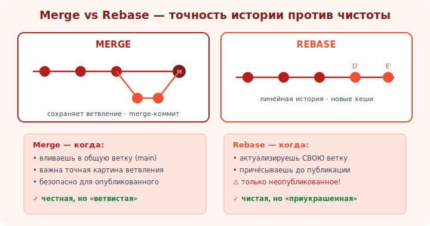

# 12 · Merge vs rebase 🖼️⭐⭐

> 🎯 **Цель блока:** осознанно выбирать между merge и rebase. Это не «что лучше», а «что когда» —
> классический инженерный trade-off (точность истории против её чистоты).

---

## ⭐⭐ Суть выбора

```
   обе команды объединяют работу веток, но по-разному обходятся с ИСТОРИЕЙ:

   MERGE                                  REBASE
   ─────                                  ──────
   сохраняет историю КАК БЫЛО             переписывает в ЛИНЕЙНУЮ
   (видны ветвления и слияния)            (прямая цепочка, «как будто последовательно»)
   merge-коммиты («пузыри»)               нет merge-коммитов, чисто
   хеши не меняются                       коммиты переписываются (новые хеши)
   безопасен для ОБЩИХ веток              ТОЛЬКО для локального/неопубликованного
   история честная, но «ветвистая»        история красивая, но «приукрашенная»
```

🖼️
```
   MERGE — видно, что велась параллельная работа:
   main:  A ── B ── C ────── M
                    \       /
   feat:             D ── E

   REBASE — линейно, как будто всё подряд:
   main:  A ── B ── C ── D' ── E'
```



💡 ⭐⭐ Это **trade-off**, не «правильно/неправильно»: merge сохраняет точную картину (когда что
ветвилось — полезно для аудита), rebase даёт чистую линейную историю (легче читать `git log`).
Многие команды комбинируют: rebase для актуализации своей ветки + merge (часто `--no-ff`) для вливания
в main. Это та же [инженерная развилка](../../Senior/02-decisions/08-tradeoffs.md), что и везде.

---

## ⭐ Практические рецепты

```
   ✅ MERGE используй, когда:
   • вливаешь фичу в общую ветку (main/develop) — безопасно, фиксирует факт интеграции.
   • история ветвления важна (релизы, аудит, «когда влилась эта фича»).
   • работаешь с публичной/командной веткой.

   ✅ REBASE используй, когда:
   • актуализируешь СВОЮ незапушенную ветку под свежий main (git rebase main).
   • причёсываешь свои локальные коммиты перед PR (git rebase -i — модуль 18).
   • хочешь линейную историю и коммиты ещё не расшарены.

   ⚠️ НИКОГДА: rebase общих/опубликованных коммитов (золотое правило, модуль 11).
```

---

## 📖 Распространённый командный поток

```
   1. git switch -c feature/x            # своя ветка
   2. ...коммиты...
   3. git fetch; git rebase origin/main  # подтянуть и пересесть на свежий main (своя ветка, ок)
   4. git push                           # опубликовать (первый раз)
   5. открыть Pull Request → ревью → слить (часто squash или merge-commit, модуль 15)

   политика слияния PR (настройка репозитория):
   • Merge commit — сохраняет все коммиты + merge-коммит.
   • Squash and merge — все коммиты фичи в ОДИН (чистый main, популярно).
   • Rebase and merge — линейно без merge-коммита.
```

💡 На уровне PR хостинг (GitHub) даёт три кнопки слияния — это тот же выбор merge/rebase/squash, но
для интеграции фичи. **Squash and merge** очень популярен: вся фича = один аккуратный коммит в main.

---

## ⚠️ Ловушки

- ❌ Спорить «merge или rebase лучше» вместо «что для этой ситуации».
- ❌ Rebase общих веток ради «красоты» (ломает историю команды).
- ❌ Merge-коммиты на каждый чих в личной ветке (замусоривают; причеши rebase перед PR).
- ❌ Игнорировать политику команды (договоритесь об одном подходе и держитесь).

---

## ✅ Задачи

1. Один и тот же сценарий (расхождение веток) разреши дважды: через merge и через rebase. Сравни
   `git log --graph`.
2. Для трёх ситуаций реши, что уместнее (merge/rebase), и обоснуй:
   а) влить готовую фичу в main; б) подтянуть свежий main в свою локальную ветку; в) причесать 5
   своих черновых коммитов.
3. ⭐ На GitHub изучи три опции слияния PR (merge/squash/rebase). Какую и почему выбрал бы для своей команды?
4. Сформулируй политику истории для воображаемой команды (1 абзац).

---

## ❓ Проверь себя

1. Чем отличается результат merge и rebase для истории?
2. Какой trade-off они представляют?
3. Когда уместен merge, когда rebase?
4. Что такое «squash and merge» и зачем он популярен?

---

## ✅ Чек-лист

- [ ] Понимаю merge/rebase как trade-off (точность vs чистота)
- [ ] Выбираю merge для общих веток, rebase для локального
- [ ] Знаю комбинированный поток (rebase своей ветки + merge/squash в main)
- [ ] Соблюдаю золотое правило и политику команды

➡️ Следующий: [✅ Задачи уровня 2](TASKS.md) · 🚀 [Проект](PROJECT.md)
