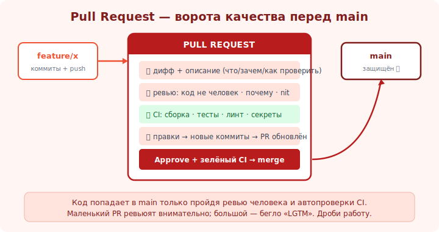

# 15 · Pull request / merge request 🖼️⭐⭐

> 🎯 **Цель блока:** понять pull request (PR) — центральный механизм командной разработки: предложить
> изменения, обсудить, отревьюить и влить. Это «ворота» в основной код.

---

## ⭐⭐ Что такое pull request

```
   PULL REQUEST (GitHub) / MERGE REQUEST (GitLab) — предложение влить твою ветку в целевую (main),
   обёрнутое в обсуждение: дифф изменений + описание + ревью + проверки CI + история комментариев.

   PR — это НЕ команда Git, а функция ХОСТИНГА (GitHub/GitLab) поверх веток. Идея: изменения не
   попадают в main напрямую — сначала их СМОТРЯТ люди и автотесты.
```

🖼️
```
   feature/x ──► [ PULL REQUEST ] ──► main
                  ├─ дифф (что меняется)
                  ├─ описание (зачем, как тестировать)
                  ├─ ревьюеры (одобрить / запросить правки)
                  ├─ CI-проверки (тесты/линт ✓/✗)
                  └─ обсуждение (комментарии к строкам)
                       ▼
                  merge только после одобрения + зелёного CI
```



💡 ⭐⭐ PR — это **точка контроля качества**: код не вливается в main, пока его не одобрили и не
прошли тесты. Так команда ловит баги ДО попадания в основную ветку, делится знанием и держит планку.
PR — главный артефакт совместной разработки (и то, что смотрят на собеседовании в твоём GitHub).

---

## ⭐ Жизненный цикл PR

```
   1. ветка + коммиты, git push -u origin feature/x.
   2. на GitHub: «Compare & pull request» → выбрать base (main) и compare (feature/x).
   3. ЗАПОЛНИТЬ: понятный заголовок + описание (что/зачем/как проверить/скриншоты/ссылка на issue).
   4. назначить ревьюеров; дождаться CI (тесты, линт).
   5. ревью: комментарии → ты правишь → новые коммиты в ту же ветку → PR обновляется автоматически.
   6. одобрено + CI зелёный → MERGE (merge-commit / squash / rebase — модуль 12).
   7. удалить ветку (GitHub предложит кнопкой).
```

💡 ⭐ Хорошее ОПИСАНИЕ PR экономит часы ревьюеру: что меняется, зачем, как проверить, на что обратить
внимание, скриншоты для UI. PR без описания («fix») — неуважение к ревьюеру и медленное ревью.

---

## ⭐ Что делает PR хорошим

```
   ✅ МАЛЕНЬКИЙ — один смысл, ~200-400 строк диффа. Большой PR ревьюят плохо и долго.
   ✅ ОПИСАН — заголовок + контекст + как тестировать + ссылка на задачу.
   ✅ ЗЕЛЁНЫЙ CI — тесты/линт проходят (не зови ревьюера на красное).
   ✅ САМОПРОВЕРЕН — сам прочитай свой дифф перед запросом ревью (часто видишь свои огрехи).
   ✅ АТОМАРЕН — не мешай рефакторинг + фичу + форматирование в одном PR.
```

💡 ⭐ Размер PR — главный фактор качества ревью: маленький PR ревьюят внимательно и быстро, большой —
бегло «LGTM». Дроби работу на серию маленьких PR. Это уважение к времени команды и качеству.

> 🧭 Сам процесс ревью (как автор и как ревьюер) — следующий [модуль 16](16-code-review.md). PR — это
> «контейнер», ревью — «содержимое».

---

## 📖 Draft и связь с задачами

```
   • Draft PR — черновик «работа идёт, ещё не для ревью» (рано показать направление/CI).
   • «Fixes #42» / «Closes #42» в описании → при merge автоматически закроет issue №42.
   • CODEOWNERS — файл, авто-назначающий ревьюеров по затронутым путям.
   • Required reviews / required checks — настройки, блокирующие merge без одобрения/зелёного CI.
```

---

## ⚠️ Ловушки

- ❌ Гигантские PR (тысячи строк) — ревьюятся плохо, баги пролетают.
- ❌ PR без описания/контекста (ревьюер тратит время на разбор «что это»).
- ❌ Звать на ревью с красным CI / непрочитанным своим диффом.
- ❌ Мешать в одном PR несвязанные изменения.
- ❌ Пушить прямо в main в обход PR (теряешь контроль качества; защити ветку настройкой).

---

## ✅ Задачи

1. Сделай ветку, запушь, открой PR на GitHub. Заполни заголовок и описание (что/зачем/как проверить).
2. Попроси кого-нибудь (или второй аккаунт) оставить комментарий. Ответь правкой — увидь обновление PR.
3. Слей PR тремя способами в разных учебных PR: merge / squash / rebase. Сравни историю main.
4. ⭐ Сделай Draft PR, потом переведи в готовый.
5. ⭐ Настрой защиту ветки main (require PR, require review) в учебном репо.

---

## ❓ Проверь себя

1. Что такое pull request и почему это не команда Git?
2. Каков жизненный цикл PR (от ветки до merge)?
3. Что делает PR хорошим (размер, описание, CI)?
4. Зачем защищать ветку main?

---

## ✅ Чек-лист

- [ ] Открываю PR с понятным описанием
- [ ] Держу PR маленькими и атомарными
- [ ] Не зову ревью на красный CI, читаю свой дифф сам
- [ ] Понимаю опции merge и защиту веток

➡️ Следующий: [16 · Код-ревью: автор и ревьюер](16-code-review.md)
