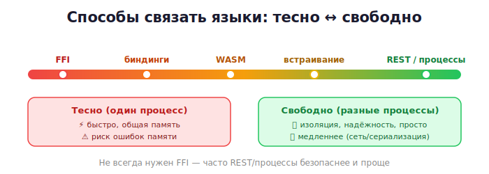

# 02 · Способы интеграции — обзор 🖼️

> 🎯 **Цель блока:** увидеть карту всех способов связать языки и понять, когда какой
> выбирать. Это компас для всего трека.

---

## 🖼️ Пять способов связать языки

```
   1. FFI / нативные расширения  ──  прямой вызов в одном процессе (быстро, тесно)
   2. Биндинги / обёртки         ──  готовые «мосты» поверх FFI
   3. WebAssembly                ──  переносимый бинарь (браузер и не только)
   4. Встраивание (embedding)    ──  интерпретатор внутри нативного приложения
   5. Через процессы / сеть      ──  разные программы общаются (свободно, медленнее)
```

Разберём каждый — от самого «тесного» к самому «свободному».

---

## ⭐ 1. FFI и нативные расширения — в одном процессе

Один язык **напрямую вызывает** функции другого внутри **одного процесса**. Самый быстрый
и тесный способ.

🖼️
```
   ┌──────── один процесс ────────┐
   │  Python  ──вызов──►  C-функция │   данные передаются напрямую в памяти
   └───────────────────────────────┘
```

```
✅ максимальная скорость (нет копирования через сеть)
✅ прямой доступ к памяти и данным
⚠️ сложнее: общая память → ошибки памяти на границе (Уровень 2)
⚠️ оба языка должны собраться в один бинарь
```

Примеры: Python ctypes/C-расширения, Node N-API, Rust FFI. **Ядро трека** (Уровни 1–2).

---

## ⭐ 2. Биндинги и обёртки — FFI с удобствами

**Биндинг** — это готовый «мост», который прячет грязные детали FFI за удобным интерфейсом.

🖼️
```
   Python  ──►  [PyO3 / биндинг]  ──►  Rust
                 удобный слой, который сам разбирается с ABI, типами, памятью
```

```
✅ удобно: пишешь почти как в родном языке
✅ инструмент берёт на себя преобразование типов и памяти
⚠️ нужно изучить конкретный инструмент
```

Примеры: **PyO3/maturin** (Rust↔Python), **pybind11** (C++↔Python), **N-API/neon**
(C++/Rust↔JS), **SWIG**. Уровень 3.

---

## ⭐ 3. WebAssembly — переносимый бинарь

**WASM** компилирует C/C++/Rust в портативный бинарь, который запускается в **браузере**,
Node, и других средах — безопасно и быстро.

🖼️
```
   Rust / C / C++  ──компиляция──►  .wasm  ──запуск──►  браузер / Node / серверы
```

```
✅ запускает нативную скорость в вебе (браузер!)
✅ песочница (безопасно), переносимость
⚠️ ограничения песочницы (нет прямого доступа к ОС)
```

Примеры: Figma (C++→WASM), игры в браузере, Pyodide (Python в браузере). Уровень 3.

---

## ⭐ 4. Встраивание (embedding) — интерпретатор внутри

Наоборот: **нативное приложение** (C/C++) встраивает **интерпретатор** (Python/Lua/JS) для
скриптов и расширяемости.

🖼️
```
   ┌──── C/C++ приложение ────┐
   │   встроенный Python/Lua   │  ← пользователи пишут скрипты-плагины
   └───────────────────────────┘
```

```
✅ даёт пользователям скриптовать твою программу
✅ логику можно менять без перекомпиляции
```

Примеры: игры (Lua-скрипты в движке), Blender (Python внутри), Vim/Neovim. Уровень 3.

---

## ⭐ 5. Через процессы и сеть — «свободная связь»

Языки работают как **отдельные программы** и общаются через процессы, файлы, сокеты,
HTTP/gRPC.

🖼️
```
   [Python-сервис] ◄──REST / gRPC / IPC──► [Rust-сервис]
   разные процессы, возможно разные машины
```

```
✅ полная изоляция (краш одного не валит другой)
✅ языки совсем независимы, легко масштабировать
⚠️ медленнее (сериализация + сеть), сложнее инфраструктура
```

Примеры: микросервисы, `subprocess`, очереди сообщений. Уровень 3.

---

## 📋 Как выбрать способ

```
   Нужна максимальная скорость, тесная связь   →  FFI / нативное расширение
   То же, но удобно                            →  биндинги (PyO3, pybind11…)
   Запустить нативный код в браузере           →  WebAssembly
   Дать пользователям скриптовать приложение   →  встраивание
   Изоляция, независимость, разные машины      →  процессы / сеть (REST/gRPC)
```

🖼️ Шкала «тесно ↔ свободно»:



💡 Часто в одном проекте сочетают несколько: тяжёлое ядро через FFI, внешние сервисы через
REST.

---

## ❓ Проверь себя

1. Назови пять способов связать языки.
2. Чем FFI отличается от связи через сеть (скорость, изоляция, риск)?
3. Что такое биндинг и чем он удобнее «голого» FFI?
4. Зачем нужен WebAssembly?
5. Что такое встраивание и где применяется?
6. Когда выбрать связь через процессы/сеть?

---

## ✅ Чек-лист «Уровень 0 пройден»

- [ ] Знаю 5 способов интеграции
- [ ] Понимаю шкалу «тесно ↔ свободно»
- [ ] Умею выбрать способ под задачу
- [ ] Понимаю, что FFI быстрее, но рискованнее (память)

🎉 Уровень 0 позади! Дальше — основа всего: FFI.

➡️ Следующий: [03 · FFI — главная идея](../01-basics/03-ffi-idea.md)
