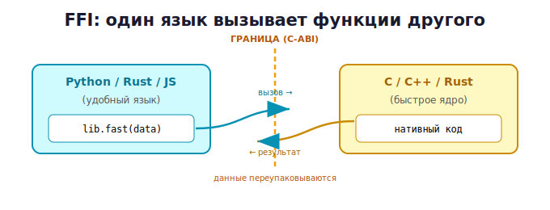

# 03 · FFI — главная идея 🖼️⭐

> 🎯 **Цель блока:** понять FFI — механизм, которым один язык вызывает функции другого.
> Это фундамент всей интеграции.

---

## 📖 Что такое FFI

**FFI** (Foreign Function Interface, «интерфейс к чужим функциям») — это способ из одного
языка **вызывать функции, написанные на другом** (обычно на C).



💡 FFI позволяет писать `c_library.fast(...)` почти как родную функцию, а под капотом
вызывается скомпилированный C-код. Скорость C — из удобства Python.

---

## ⭐ Из чего состоит FFI-вызов

```
1. Есть скомпилированная библиотека (.so на Linux, .dll на Windows, .dylib на macOS)
   с C-ABI функциями.
2. Язык-вызыватель ЗАГРУЖАЕТ эту библиотеку.
3. ОБЪЯВЛЯЕТ сигнатуру функции (какие типы принимает/возвращает).
4. ВЫЗЫВАЕТ функцию, передавая данные через границу.
```

🖼️
```
   исходник.c  ──компилятор──►  library.so  ──FFI загружает──►  вызов из Python
   (нативный код)               (бинарь с C-ABI)
```

---

## ⭐ Минимальный пример: C-функция

Файл `mathlib.c`:
```c
// простая C-функция, которую вызовем из Python
int add(int a, int b) {
    return a + b;
}

double circle_area(double r) {
    return 3.14159265 * r * r;
}
```

Компилируем в разделяемую библиотеку:
```bash
# Linux
gcc -shared -fPIC mathlib.c -o mathlib.so
# Windows (MinGW)
gcc -shared mathlib.c -o mathlib.dll
# macOS
gcc -shared -fPIC mathlib.c -o mathlib.dylib
```

| Флаг | Что значит |
|------|-----------|
| `-shared` | собрать **разделяемую библиотеку**, а не программу |
| `-fPIC` | позиционно-независимый код (нужен для библиотек) |

💡 Получился `mathlib.so` — бинарь без `main`, который **загружают другие программы**.

---

## ⭐ Вызываем из Python (ctypes)

Python умеет FFI «из коробки» через модуль `ctypes`:

```python
import ctypes

# 1. Загрузить библиотеку
lib = ctypes.CDLL("./mathlib.so")   # .dll на Windows, .dylib на macOS

# 2. Объявить сигнатуру (типы аргументов и результата)
lib.add.argtypes = [ctypes.c_int, ctypes.c_int]
lib.add.restype = ctypes.c_int

lib.circle_area.argtypes = [ctypes.c_double]
lib.circle_area.restype = ctypes.c_double

# 3. Вызвать!
print(lib.add(2, 3))            # 5 — выполнился C-код
print(lib.circle_area(5.0))     # 78.539...
```

🖼️
```
   lib.add.argtypes = [c_int, c_int]   ← говорим Python, КАК упаковать аргументы
   lib.add.restype  = c_int            ← и как трактовать результат
   lib.add(2, 3)                       ← Python упаковывает 2,3 по C-ABI, зовёт C, читает ответ
```

> ⚠️ **Сигнатуру объявлять обязательно!** Без `argtypes`/`restype` Python не знает, как
> упаковать данные, и передаст мусор → краш или неверный результат. Это первая ловушка
> FFI.

---

## 📖 Почему это работает

Помнишь ABI (модуль 01)? `ctypes`:
1. знает C-ABI платформы;
2. по `argtypes` упаковывает Python-числа в C-формат (в нужные регистры/стек);
3. вызывает машинный код функции;
4. по `restype` читает результат обратно в Python.

💡 FFI — это «переводчик», который превращает данные одного языка в C-ABI и обратно.
Граница между языками = граница, где данные переупаковываются.

---

## 📖 FFI есть почти везде

```
   Python:  ctypes (встроен), cffi
   Rust:    extern "C" + блок unsafe
   JS/Node: ffi-napi, N-API
   C++:     просто линкует C напрямую
   Go:      cgo
   Java:    JNI, Panama/FFM
```

💡 Идея одна для всех: загрузить библиотеку с C-ABI, объявить сигнатуры, вызвать. Освоив
концепцию на Python, ты поймёшь FFI в любом языке.

---

## ✅ Задачи

1. **Первая связка.** Напиши C-функцию `multiply(int, int)`, собери в библиотеку, вызови
   из Python через ctypes. Не забудь `argtypes`/`restype`.
2. **Без сигнатуры.** Намеренно убери `argtypes`/`restype` для функции с `double`, посмотри,
   что вернётся (мусор) — пойми, зачем сигнатура.
3. **Несколько функций.** Собери библиотеку с 3 математическими функциями, вызови все.
4. **Замер.** Напиши тяжёлый цикл (сумма до 100 млн) на Python и на C, вызови C через FFI,
   сравни время.
5. ⭐ **Своя мини-библиотека.** Перенеси одну функцию из своих Python-проектов в C, ускорь
   через FFI.

---

## ❓ Проверь себя

1. Что такое FFI?
2. Из каких шагов состоит FFI-вызов?
3. Что такое разделяемая библиотека (.so/.dll)? Чем флаги `-shared`/`-fPIC`?
4. Зачем объявлять `argtypes`/`restype` в ctypes?
5. Как FFI связан с ABI из модуля 01?
6. Есть ли FFI в других языках?

---

## ✅ Чек-лист

- [ ] Понимаю FFI как вызов чужих функций
- [ ] Знаю шаги: собрать библиотеку → загрузить → объявить → вызвать
- [ ] Собрал .so/.dll и вызвал из Python
- [ ] Понимаю важность сигнатуры
- [ ] Вижу, что FFI универсален для языков

➡️ Следующий: [04 · Python вызывает C](04-python-c.md)
