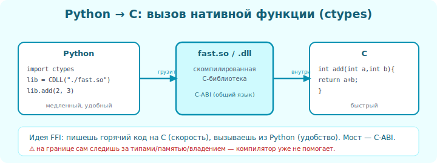

# 04 · Python вызывает C 🛠️

> 🎯 **Цель блока:** освоить на практике главную связку — Python + C. Разберём оба
> популярных подхода: ctypes (без сборки) и C-расширения (быстрее, теснее).

---

## 📖 Два подхода: ctypes и C-расширения

| | **ctypes** | **C-расширение (Python API)** |
|--|-----------|-------------------------------|
| Сложность | проще (чистый Python) | сложнее (пишешь на C) |
| Сборка Python-кода | не нужна | нужна |
| Скорость вызова | чуть медленнее | максимальная |
| Интеграция с Python | через объявления | глубокая (работа с Python-объектами) |
| Когда | прототип, готовая C-библиотека | производительный модуль |



💡 Начни с **ctypes** (модуль 03). Для серьёзных библиотек используют C-расширения или
удобные обёртки (Cython, pybind11 — Уровень 3).

---

## ⭐ ctypes: полный практический пример

`stats.c`:
```c
#include <stddef.h>

// сумма массива чисел
double sum_array(double* arr, size_t n) {
    double total = 0;
    for (size_t i = 0; i < n; i++) total += arr[i];
    return total;
}

// среднее
double mean_array(double* arr, size_t n) {
    if (n == 0) return 0;
    return sum_array(arr, n) / n;
}
```
```bash
gcc -shared -fPIC -O2 stats.c -o stats.so
```

`main.py`:
```python
import ctypes

lib = ctypes.CDLL("./stats.so")

# массив double* + размер
lib.sum_array.argtypes = [ctypes.POINTER(ctypes.c_double), ctypes.c_size_t]
lib.sum_array.restype = ctypes.c_double

data = [1.0, 2.0, 3.0, 4.0, 5.0]
n = len(data)

# превратить Python-список в C-массив
arr = (ctypes.c_double * n)(*data)   # тип "массив из n double"

result = lib.sum_array(arr, n)       # передаём массив и размер
print(result)                         # 15.0
```

🖼️
```
   Python-список [1.0, 2.0, ...]
        │ (ctypes.c_double * n)(*data)
        ▼
   C-массив в памяти: [1.0][2.0][3.0]...   ← непрерывный блок (как в C)
        │ передаём указатель + длину
        ▼
   C-функция бежит по массиву нативно (быстро)
```

> ⚠️ В C массив — это **указатель + длина** (помнишь [C-курс](../../C/02-memory/10-arrays-strings.md)).
> Поэтому передаём и `arr`, и `n`. C не знает размер сам!

---

## 📖 Таблица соответствия типов (ctypes ↔ C)

| Python (ctypes) | C |
|-----------------|---|
| `c_int` | `int` |
| `c_double` | `double` |
| `c_float` | `float` |
| `c_char` | `char` |
| `c_char_p` | `char*` (строка) |
| `c_void_p` | `void*` |
| `POINTER(c_double)` | `double*` |
| `c_size_t` | `size_t` |

💡 Точное соответствие типов — критично. Объявил `c_int`, а функция ждёт `double` →
данные исказятся. Сверяйся с этой таблицей.

---

## ⭐ C-расширение (кратко, для понимания)

Настоящие библиотеки (NumPy и т.п.) пишут как **C-расширения** — C-код, который напрямую
работает с Python-объектами через Python C API:

```c
#include <Python.h>

static PyObject* fast_add(PyObject* self, PyObject* args) {
    int a, b;
    if (!PyArg_ParseTuple(args, "ii", &a, &b))   // разобрать аргументы Python
        return NULL;
    return PyLong_FromLong(a + b);                // вернуть как Python-объект
}
// + таблица методов + инициализация модуля
```

💡 Это мощнее (глубокая интеграция, максимальная скорость), но многословно. Поэтому чаще
берут **Cython** (пишешь почти на Python, он генерирует C-расширение) или **pybind11**
(для C++). Подробнее об инструментах — в Уровне 3.

---

## 📖 Когда что выбирать

```
   Готовая C/C++-библиотека, надо вызвать      →  ctypes / cffi
   Прототип, разовое ускорение                 →  ctypes
   Свой производительный модуль на Python-вкус →  Cython
   Связка с C++                                →  pybind11
   Связка с Rust                               →  PyO3 (Уровень 3)
   Максимальный контроль                       →  C-расширение вручную
```

---

## ✅ Задачи

1. **Массив в C.** Реализуй `sum_array`/`max_array` на C, вызови из Python через ctypes,
   передав список как C-массив.
2. **Типы.** Сделай функцию с `int`, `double`, `float` аргументами — правильно объяви
   все `argtypes`.
3. **Ошибка типа.** Объяви `c_int` там, где функция ждёт `c_double` — посмотри на
   искажение результата.
4. **Замер на массиве.** Сравни суммирование большого массива чистым Python и через C-FFI.
5. ⭐ **Cython** (если установишь) — перепиши тяжёлую Python-функцию на Cython, сравни
   скорость с ctypes-подходом.

---

## ❓ Проверь себя

1. Чем ctypes отличается от C-расширения?
2. Как передать Python-список в C-функцию?
3. Почему нужно передавать и массив, и его длину?
4. Что произойдёт при неверном соответствии типов?
5. Что такое Cython и зачем он?
6. Когда выбрать ctypes, а когда C-расширение?

---

## ✅ Чек-лист

- [ ] Вызываю C-функции из Python через ctypes
- [ ] Передаю массивы (указатель + длина)
- [ ] Правильно сопоставляю типы
- [ ] Понимаю идею C-расширений
- [ ] Знаю про Cython/pybind11 как удобные инструменты

➡️ Следующий: [05 · Передача данных через границу](05-passing-data.md)
