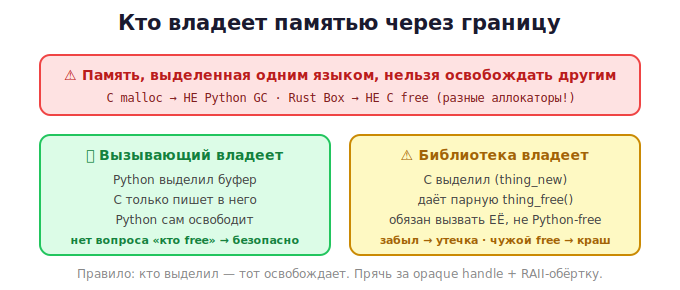

# 09 · Владение памятью через границу 🖼️⭐⭐

> 🎯 **Цель блока:** глубоко разобрать владение памятью между языками — самую частую
> причину крашей в интеграции. Это кульминация всей темы памяти курса.

---

## 📖 Каждый язык управляет памятью по-своему

Вспомни все треки — у каждого своя модель:

| Язык | Как управляет памятью |
|------|----------------------|
| **C** | вручную: malloc/free |
| **C++** | RAII: деструкторы |
| **Rust** | владение: освобождение в конце владения |
| **Python** | сборщик мусора: подсчёт ссылок |
| **JS** | сборщик мусора |



💡 Граница языков — это место, где встречаются **разные системы управления памятью**.
Согласовать их — главная задача безопасной интеграции.

---

## ⚠️ Три смертных греха владения на границе

### 1. 💧 Утечка — никто не освободил
```python
ptr = lib.create_buffer()    # C выделил
# ... забыли освободить ...   → утечка (Python GC не знает про C-память)
```

### 2. ☠️ Двойное освобождение
```python
lib.free_buffer(ptr)
lib.free_buffer(ptr)         # double-free → порча кучи, краш
```

### 3. 💀 Чужой аллокатор
```python
ptr = lib.create_buffer()    # выделено C-аллокатором (malloc)
# попытка освободить средствами другого аллокатора → ☠️ краш
```

💡 Это те же ошибки из [C](../../C/02-memory/11-dynamic-memory.md), но **усиленные**:
причина в одном языке, краш в другом, отладка — ад.

---

## ⭐⭐ Модели владения — выбери одну явно

### Модель A: «Вызывающий владеет» (рекомендуется)
Тот, кто **вызывает**, выделяет и освобождает память. Библиотека только заполняет.

🖼️
```
   Python выделил буфер ──► передал C ──► C записал ──► Python прочитал и освободил
   Владение НЕ покидает Python. Никакой путаницы.
```
```python
buf = ctypes.create_string_buffer(1024)   # Python владеет
lib.fill(buf, 1024)                        # C только пишет
# Python сам освободит — конец истории
```
✅ Самая безопасная. Применяй по умолчанию.

### Модель B: «Библиотека владеет»
Библиотека выделяет и **сама** даёт функцию освобождения.
```python
h = lib.obj_new()        # C выделил, вернул "ручку"
lib.obj_use(h)
lib.obj_free(h)          # освобождаем ФУНКЦИЕЙ БИБЛИОТЕКИ
```
⚠️ Нужна дисциплина: на каждый `*_new` ровно один `*_free`. Заворачивай в обёртку, чтобы не
забыть (см. ниже).

### Модель C: «Передача владения»
Один язык отдаёт владение другому. Сложно: принимающий должен знать, **как** правильно
освободить (каким аллокатором). Часто избегают или строго документируют.

---

## ⭐ Opaque handle — безопасный приём

Не давай другому языку «голый» указатель на внутренности. Дай **непрозрачную ручку**
(opaque handle) — как opaque-тип из [C](../../C/03b-projects-api/02-designing-api.md):

```c
// C: пользователь видит только указатель, не внутренности
typedef struct Database Database;        // неполный тип
Database* db_open(const char* path);     // создать
int       db_query(Database* db, ...);   // использовать
void      db_close(Database* db);        // освободить
```

💡 Другой язык держит `Database*` как «чёрный ящик», не зная его устройства. Создаёт через
`db_open`, освобождает через `db_close`. Внутреннее устройство (и его память) полностью
скрыто и под контролем C. Это снижает риск ошибок.

---

## ⭐ RAII-обёртка в управляемом языке

Свяжи жизнь C-ресурса с объектом Python — пусть Python освобождает автоматически:

```python
class Database:
    def __init__(self, path):
        self._handle = lib.db_open(path.encode())
        if not self._handle:
            raise RuntimeError("не удалось открыть БД")

    def __del__(self):                  # вызовется при сборке мусора
        if self._handle:
            lib.db_close(self._handle)  # освобождаем C-ресурс автоматически
            self._handle = None

    def __enter__(self): return self
    def __exit__(self, *a): self.__del__()   # поддержка with

# использование — освобождение автоматическое:
with Database("data.db") as db:
    ...
# здесь db_close вызван сам
```

💡 Это переносит идею [RAII из C++](../../Cpp/02-memory/10-raii.md) / контекст-менеджеров
Python на C-ресурсы. Объект Python становится «владельцем» C-ресурса и освобождает его в
деструкторе/`__exit__`. Так делают все хорошие обёртки.

---

## 📖 Чек-лист владения на границе

```
   ✅ Реши ЯВНО, кто владеет каждым куском памяти.
   ✅ По умолчанию — «вызывающий владеет» (caller-allocated).
   ✅ Если библиотека выделяет — используй ТОЛЬКО её free-функцию.
   ✅ Прячь указатели за opaque handle.
   ✅ Привязывай C-ресурс к объекту-обёртке (RAII / __del__ / with).
   ✅ На каждый create — ровно один destroy.
   ✅ Документируй владение в комментариях/типах.
```

---

## ✅ Задачи

1. **Модель A.** Реализуй обмен данными по схеме «вызывающий владеет» — Python выделяет, C
   заполняет.
2. **Модель B + обёртка.** Сделай C с `obj_new`/`obj_free`, оберни в Python-класс с `__del__`.
3. **Opaque handle.** Спроектируй C-«объект» (например счётчик или стек) с непрозрачной
   ручкой и набором функций.
4. **with-обёртка.** Добавь поддержку `with` (контекст-менеджер) к C-ресурсу.
5. **Поймай double-free.** Намеренно освободи дважды, увидь краш (ASan).
6. ⭐ **Полная безопасная обёртка.** Возьми C-библиотеку с ресурсами, оберни так, чтобы
   пользователь Python вообще не думал про память.

---

## ❓ Проверь себя

1. Почему модели управления памятью языков несовместимы?
2. Назови три греха владения на границе.
3. Опиши три модели владения. Какая безопаснее?
4. Что такое opaque handle и зачем он?
5. Как привязать освобождение C-ресурса к объекту Python?
6. Что входит в чек-лист владения на границе?

---

## ✅ Чек-лист

- [ ] Понимаю несовместимость аллокаторов разных языков
- [ ] Выбираю явную модель владения
- [ ] Предпочитаю «вызывающий владеет»
- [ ] Использую opaque handle
- [ ] Оборачиваю C-ресурсы в RAII-объекты (`__del__`/`with`)

➡️ Следующий: [10 · Строки и кодировки между языками](10-strings.md)
