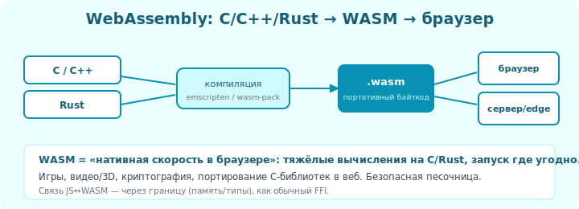

# 16 · C/C++ + Web (WebAssembly) 🖼️⭐

> 🎯 **Цель блока:** понять WebAssembly — способ запустить быстрый код C/C++/Rust **в
> браузере** (и не только). Это один из самых важных трендов в интеграции.

---

## 📖 Что такое WebAssembly

**WebAssembly (WASM)** — это переносимый бинарный формат, который выполняется с почти
нативной скоростью в **браузере**, Node, и многих других средах. Языки C/C++/Rust
компилируются в `.wasm`, и этот бинарь запускается где угодно.

🖼️
```
   C / C++ / Rust  ──компиляция──►  module.wasm  ──запуск──►  браузер / Node / серверы / edge
                                    (переносимый бинарь)        (почти нативная скорость)
```



💡 Раньше в браузере был только JavaScript (медленный для тяжёлых задач). WASM позволил
запускать **нативно-быстрый** код в вебе. Так работают: Figma (C++ графика), игры,
видеоредакторы, AutoCAD Web, Photoshop Web.

---

## ⭐ Зачем WASM

```
   ⚡ Скорость:      тяжёлые вычисления в браузере на скорости C (а не медленного JS).
   ♻️ Переиспользование: запустить существующий C/C++/Rust код в вебе без переписывания.
   🔒 Безопасность:  WASM работает в песочнице (не может навредить системе).
   🌍 Переносимость: один .wasm работает в любом браузере и среде с WASM-рантаймом.
   🚀 За пределами веба: серверы (edge-функции), плагины, блокчейн.
```

---

## ⭐ Rust → WASM (самый удобный путь)

Rust имеет первоклассную поддержку WASM:

```rust
use wasm_bindgen::prelude::*;

#[wasm_bindgen]                  // экспортировать в JS
pub fn fibonacci(n: u32) -> u64 {
    let (mut a, mut b) = (0u64, 1u64);
    for _ in 0..n { let t = a; a = b; b = t + b; }
    a
}
```
```bash
wasm-pack build --target web    # собрать в WASM + JS-обёртку
```
```javascript
// JS вызывает Rust-функцию из WASM
import init, { fibonacci } from './pkg/my_module.js';
await init();
console.log(fibonacci(50));     // быстрый Rust в браузере!
```

🖼️
```
   Rust функция  ──wasm-pack──►  .wasm + JS-обёртка  ──►  import в браузере  ──►  вызов из JS
   wasm-bindgen генерирует «мост» JS ↔ WASM (типы, память)
```

💡 **wasm-bindgen** — как PyO3, но для JS↔WASM: автоматически связывает типы и память между
JS и Rust. Пишешь обычный Rust, получаешь функцию, вызываемую из JS.

---

## ⭐ C/C++ → WASM (Emscripten)

Для C/C++ есть **Emscripten** — компилятор C/C++ в WASM:

```bash
emcc hello.c -o hello.js -s EXPORTED_FUNCTIONS='["_my_func"]'
```

💡 Emscripten эмулирует целую среду (файловую систему, OpenGL→WebGL), поэтому даже большие
C/C++ программы (игры, движки) компилируются в браузер почти без изменений. Так Unity и
Unreal экспортируют игры в веб.

---

## 📖 Память в WASM

> ⚠️ У WASM **линейная память** — большой массив байт. C/C++/Rust работают с ней как с
> обычной памятью (указатели = смещения в этом массиве). JS видит её как `ArrayBuffer`.
> Передача сложных данных (строки, массивы) между JS и WASM требует копирования в эту память
> — те же вопросы границы, что в Уровне 2 (раскладка, владение). Инструменты
> (wasm-bindgen) это автоматизируют.

🖼️
```
   ┌──── WASM линейная память (один большой массив байт) ────┐
   │  здесь живут все данные C/Rust кода                      │
   └──────────────────────────────────────────────────────────┘
        ▲ JS читает/пишет как ArrayBuffer (общая память — граница)
```

---

## 📖 WASM за пределами браузера

```
   - Edge-функции (Cloudflare Workers, Fastly) — WASM на серверах у пользователя.
   - Плагины (Envoy, базы данных) — безопасные расширения через WASM.
   - WASI — стандарт «WASM + доступ к системе» для запуска вне браузера.
   - Блокчейн — смарт-контракты компилируют в WASM.
```

💡 WASM становится универсальным «безопасным переносимым бинарём» далеко за пределами веба.

---

## ✅ Задачи

1. **Rust → WASM.** Напиши Rust-функцию, собери через wasm-pack, вызови из JS в браузере.
2. **Замер.** Сравни тяжёлое вычисление на чистом JS и на Rust/WASM.
3. **Передача данных.** Передай массив из JS в WASM и обратно (через wasm-bindgen).
4. **C → WASM** (по желанию) — скомпилируй простую C-программу через Emscripten.
5. ⭐ **Мини-демо.** Сделай веб-страницу, где тяжёлую работу делает WASM-модуль (Rust/C), а
   интерфейс — JS.

---

## ❓ Проверь себя

1. Что такое WebAssembly и зачем он?
2. Какие языки компилируются в WASM?
3. Что делает wasm-bindgen / wasm-pack?
4. Что такое Emscripten?
5. Как устроена память в WASM (линейная память)?
6. Где WASM применяют за пределами браузера?

---

## ✅ Чек-лист

- [ ] Понимаю WASM как переносимый быстрый бинарь
- [ ] Знаю путь Rust → WASM (wasm-pack/wasm-bindgen)
- [ ] Знаю про Emscripten для C/C++
- [ ] Понимаю линейную память WASM и границу с JS
- [ ] Вижу применение WASM шире браузера

➡️ Следующий: [17 · Встраивание интерпретатора](17-embedding.md)
