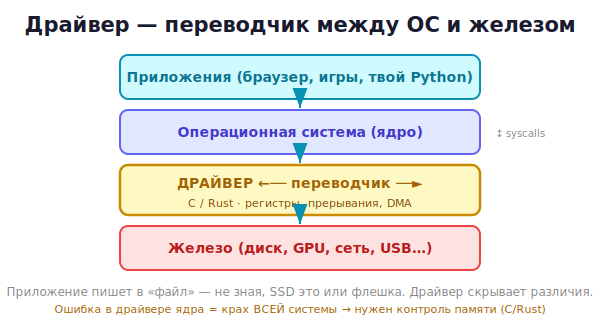

# 19 · Что такое драйвер 🖼️⭐

> 🎯 **Цель блока:** понять, что такое драйвер и как программы говорят с железом через ОС.
> Это вход в системное программирование.

---

## 📖 Драйвер — переводчик между ОС и устройством

**Драйвер** — это программа, которая позволяет операционной системе управлять конкретным
устройством (клавиатура, диск, видеокарта, сетевая карта, USB-гаджет).



💡 Каждое устройство «говорит» по-своему (свои регистры, команды, протокол). Драйвер
**переводит** общие запросы ОС («прочитай файл», «нарисуй пиксель») в конкретные команды
устройства. Без драйвера ОС не знает, как с устройством работать.

---

## 📖 Зачем драйверы вообще нужны

```
   Без драйверов: каждое приложение должно знать ВСЕ модели всех устройств — невозможно.
   С драйверами:  приложение говорит ОС «прочитай файл», ОС зовёт нужный драйвер,
                  драйвер общается с конкретным железом. Приложению всё равно, какой диск.
```

💡 Драйвер даёт **единый интерфейс** к разным устройствам. Приложение пишет в «файл», не
зная, SSD это, HDD или флешка — драйвер скрывает различия. Это абстракция, как API между
языками, но на уровне железа.

---

## ⭐ Почти всегда драйверы пишут на C (и теперь на Rust)

```
   - Драйверы работают на самом низком уровне → нужен контроль над памятью и железом.
   - Сборщик мусора и тяжёлый рантайм там недопустимы.
   - Поэтому: C (исторически) и Rust (новое — за безопасность памяти, см. модуль 23).
```

💡 Вот почему этот трек — про C/Rust и память: драйвер напрямую работает с памятью железа,
без защит высокоуровневых языков. Знание [памяти из C-трека](../../C/README.md) здесь
обязательно.

---

## ⭐ Как устройства общаются с процессором

🖼️ Три основных механизма:

```
   1. Регистры устройства (memory-mapped I/O):
      устройство «появляется» как адреса в памяти. Запись по адресу → команда устройству.

   2. Прерывания (interrupts):
      устройство «дёргает» процессор: «я готово!» (пришли данные, нажата клавиша).

   3. DMA (Direct Memory Access):
      устройство само пишет данные в память, минуя процессор (для скорости).
```

💡 Драйвер использует всё это: настраивает устройство через регистры, реагирует на
прерывания, организует передачу данных. Подробнее о регистрах — в [модуле 22](22-devices.md).

---

## 📖 Виды драйверов

```
   - Символьные (character): поток байт — клавиатура, последовательный порт, /dev/random.
   - Блочные (block): блоки данных — диски, флешки.
   - Сетевые (network): сетевые карты, пакеты.
   - Специальные: GPU, USB, звук и т.д.
```

💡 Начинают обычно с **символьного** драйвера — он простейший (читать/писать поток байт). С
него начнём и мы (модуль 21).

---

## 📖 Где живёт драйвер: ядро vs userspace

```
   Kernel-драйверы:   внутри ядра ОС. Полный доступ к железу, но ошибка = крах ВСЕЙ системы.
   Userspace-драйверы: в обычном процессе. Безопаснее (краш не валит систему), но медленнее.
```

Это важнейшее разделение — ему посвящён [следующий модуль](20-userspace-kernel.md).

---

## ✅ Задачи

1. **Объясни** своими словами, что такое драйвер и зачем он.
2. **Цепочка.** Опиши путь от «приложение читает файл» до «диск отдал данные» через ОС и
   драйвер.
3. **Механизмы.** Опиши три способа общения устройства с процессором (регистры, прерывания,
   DMA).
4. **Виды.** Приведи примеры символьного, блочного и сетевого устройства.
5. **Почему C/Rust.** Объясни, почему драйверы не пишут на Python.
6. ⭐ **Исследование.** Найди (на Linux) список загруженных драйверов: `lsmod`. Изучи, что
   делает один из них.

---

## ❓ Проверь себя

1. Что такое драйвер? Какую роль играет?
2. Зачем нужны драйверы (единый интерфейс)?
3. Почему драйверы пишут на C/Rust, а не на Python?
4. Назови три механизма общения устройства с процессором.
5. Назови виды драйверов.
6. В чём разница kernel- и userspace-драйверов (превью)?

---

## ✅ Чек-лист

- [ ] Понимаю драйвер как переводчик ОС ↔ устройство
- [ ] Понимаю, зачем единый интерфейс к разным устройствам
- [ ] Знаю, почему нужен низкоуровневый язык
- [ ] Знаю механизмы: регистры, прерывания, DMA
- [ ] Различаю виды драйверов

➡️ Следующий: [20 · Userspace vs kernel space](20-userspace-kernel.md)
