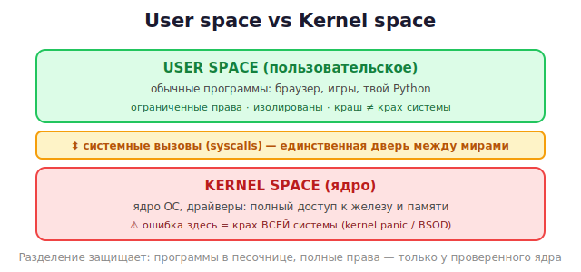

# 20 · Userspace vs kernel space 🖼️⭐

> 🎯 **Цель блока:** понять фундаментальное разделение ОС на пользовательское и ядерное
> пространство. Это определяет, где и как пишут системный код и драйверы.

---

## 📖 Два мира: userspace и kernel space

ОС делит выполнение на два уровня привилегий:



💡 **User space** — песочница для программ: ограниченные права, изоляция. **Kernel space** —
«всемогущий» уровень: прямой доступ к железу и всей памяти. Между ними — строгая граница.

---

## ⭐ Почему два уровня: безопасность и стабильность

```
   Если бы любая программа имела полный доступ к железу:
   - один баг → крах всей системы;
   - вирус → полный контроль над машиной;
   - программы мешали бы друг другу.

   Разделение защищает: программы изолированы в user space,
   только проверенный код ядра имеет полные права.
```

💡 Помнишь защиту памяти из [C-курса](../../C/02-memory/08-memory-model.md) (segfault при
доступе к чужой памяти)? Это и есть граница user space — ОС не даёт программе лезть, куда
нельзя. Ядро эту защиту обеспечивает.

---

## ⭐ Системные вызовы — дверь из user в kernel

Программа из user space не может сама трогать железо. Она **просит** ядро через **системный
вызов** (syscall) — единственный легальный переход вниз.

🖼️
```
   Python: open("file")  →  ОС-обёртка  →  syscall "open"  →  ЯДРО  →  драйвер диска  →  железо
                                            ▲ граница user/kernel
```

💡 Любое действие с железом (файлы, сеть, память) идёт через syscalls (вспомни
[C-курс, системное программирование](../../C/04-senior/23-systems.md)). Переход user↔kernel
имеет цену — поэтому частые мелкие syscalls медленнее, чем работа в одном пространстве.

---

## ⭐⭐ Два места для драйвера

### Kernel-драйвер (классический)
Живёт внутри ядра. Полный доступ, максимальная скорость.
```
✅ прямой доступ к железу, прерываниям, скорость
⚠️ ошибка = крах всей системы (kernel panic)
⚠️ сложная разработка и отладка
⚠️ нет защит: сырая память, ручное управление
```

### Userspace-драйвер (современный подход)
Драйвер — обычная программа, работает с устройством через специальные интерфейсы ядра.
```
✅ безопаснее: краш драйвера НЕ валит систему
✅ проще писать и отлаживать (обычные инструменты)
✅ можно на разных языках
⚠️ медленнее (переходы user↔kernel)
```

🖼️
```
   Kernel-драйвер:   код В ядре  →  быстро, но опасно
   Userspace-драйвер: код в процессе → безопасно, но через границу ядра
```

💡 Современный тренд — выносить драйверы в userspace, где можно (USB через libusb, FUSE для
файловых систем, DPDK для сети, графика через mesa). Безопасность важнее небольшой потери
скорости. Но низкоуровневые/критичные драйверы остаются в ядре.

---

## 📖 Userspace-драйверы: фреймворки

```
   - libusb     — драйверы USB-устройств из обычной программы (даже на Python!).
   - FUSE       — файловые системы в userspace.
   - UIO / VFIO — доступ к устройству из userspace (Linux).
   - DPDK / SPDK — высокопроизводительные сетевые/дисковые драйверы в userspace.
```

💡 Например, через **libusb** можно написать драйвер USB-гаджета на C, Rust **или даже
Python** — без единой строчки в ядре. Это безопасный вход в драйверы.

---

## ✅ Задачи

1. **Объясни** разницу user space и kernel space своими словами.
2. **Почему два уровня** — приведи 3 причины разделения.
3. **Путь syscall.** Опиши, как `open("file")` проходит из user в kernel и к железу.
4. **Kernel vs userspace драйвер** — составь таблицу плюсов/минусов.
5. **libusb** — изучи, как работать с USB из userspace (концептуально).
6. ⭐ **Userspace-эксперимент.** На Linux прочитай данные устройства через `/dev` или
   `/sys` из обычной программы (например `/dev/random`, датчики в `/sys`).

---

## ❓ Проверь себя

1. Что такое user space и kernel space?
2. Зачем ОС разделяет их (безопасность)?
3. Что такое системный вызов и зачем он?
4. Где может жить драйвер? Плюсы и минусы каждого варианта.
5. Почему userspace-драйверы безопаснее?
6. Назови фреймворки для userspace-драйверов.

---

## ✅ Чек-лист

- [ ] Понимаю разделение user/kernel space
- [ ] Понимаю, зачем оно (безопасность, стабильность)
- [ ] Знаю роль системных вызовов
- [ ] Различаю kernel- и userspace-драйверы
- [ ] Знаю про userspace-фреймворки (libusb, FUSE…)

➡️ Следующий: [21 · Модуль ядра Linux](21-kernel-module.md)
