# 🔗 Дорожная карта: интеграция языков и системное программирование

Путь от «знаю один язык» до «связываю любые языки вместе и пишу системный код» — FFI,
биндинги, WebAssembly, встраивание, и даже свои драйверы.

> 💡 **Это вершина курса.** Ты освоил C, C++, Python, Rust по отдельности. Теперь —
> как заставить их **работать вместе** (C + Python, Rust + Python, Python + JS, C + Rust…)
> и как **говорить с системой и железом** (драйверы). Реальные проекты почти всегда
> **полиглотные**: быстрое ядро на C/Rust + удобный Python/JS сверху.

> 📌 Нужен опыт хотя бы одного языка курса. Для отдельных модулей пригодятся знания из
> треков [C](../C/README.md) (память, указатели), [Rust](../Rust/README.md) (владение) и
> разделов «Проекты и API».

---

## 🧠 Главная идея: всё упирается в ГРАНИЦУ ПАМЯТИ

Когда два языка обмениваются данными, ключевые вопросы — про память:

| Вопрос | Почему критичен |
|--------|-----------------|
| Как уложены байты? (ABI, выравнивание) | иначе языки прочитают данные по-разному |
| Кто **выделил** память? | C-malloc нельзя освобождать Python-сборщиком |
| Кто **освобождает**? | двойное освобождение или утечка на границе |
| Как передаются строки? | нуль-терминатор, кодировка, длина |
| Владение пересекает границу? | use-after-free между языками |

🎯 Это прямое продолжение всего курса: интеграция языков — это **управление памятью на
стыке**. Кто понял память в C/C++/Rust — освоит interop глубоко.

И **C — лингва-франка**: почти все языки умеют звать C-функции, поэтому C-ABI стал
universal-«переходником» между языками.

---

## 🗺️ Карта трека

```mermaid
flowchart TD
    Start([🥚 Знаю один язык]) --> S0

    subgraph LVL0 [🥚 Уровень 0 — Введение]
        S0[00 · Зачем связывать языки]
        S1[01 · Как языки понимают друг друга: ABI]
        S2[02 · Способы интеграции — обзор]
    end

    subgraph LVL1 [🐣 Уровень 1 — FFI: основы]
        B1[03 · FFI — главная идея]
        B2[04 · Python вызывает C]
        B3[05 · Передача данных через границу]
        B4[06 · Кто владеет памятью]
        B5[07 · Ошибки и безопасность]
    end

    subgraph LVL2 [🐥 Уровень 2 — ГРАНИЦА ПАМЯТИ ⭐ ядро]
        M1[08 · ABI и раскладка данных]
        M2[09 · Владение памятью через границу]
        M3[10 · Строки и кодировки]
        M4[11 · Структуры, выравнивание, указатели]
        M5[12 · Утечки и UB на границе]
    end

    subgraph LVL3 [🐥 Уровень 3 — Конкретные связки]
        D1[13 · C + Rust]
        D2[14 · Rust + Python]
        D3[15 · Python + JavaScript]
        D4[16 · C/C++ + Web WebAssembly]
        D5[17 · Встраивание интерпретатора]
        D6[18 · Клей: процессы, IPC, REST]
    end

    subgraph LVL4 [🦅 Уровень 4 — Системное и драйверы]
        Z1[19 · Что такое драйвер]
        Z2[20 · Userspace vs kernel]
        Z3[21 · Модуль ядра Linux]
        Z4[22 · Работа с устройствами]
        Z5[23 · Драйверы на Rust и embedded]
        Z6[24 · Отладка и безопасность]
    end

    S0-->S1-->S2-->B1
    B1-->B2-->B3-->B4-->B5-->M1
    M1-->M2-->M3-->M4-->M5-->D1
    D1-->D2-->D3-->D4-->D5-->D6-->Z1
    Z1-->Z2-->Z3-->Z4-->Z5-->Z6-->Done
    Done([🦅 Системный полиглот-инженер])
```

---

## 📂 Содержание

### 🥚 Уровень 0 — Введение
- [00 · Зачем связывать языки](00-setup/00-why-interop.md)
- [01 · Как языки понимают друг друга: ABI](00-setup/01-abi.md)
- [02 · Способы интеграции — обзор](00-setup/02-approaches.md)

### 🐣 Уровень 1 — FFI: основы
- [03 · FFI — главная идея](01-basics/03-ffi-idea.md)
- [04 · Python вызывает C](01-basics/04-python-c.md)
- [05 · Передача данных через границу](01-basics/05-passing-data.md)
- [06 · Кто владеет памятью](01-basics/06-ownership.md)
- [07 · Ошибки и безопасность на границе](01-basics/07-errors-safety.md)
- ✅ [Задачи уровня 1](01-basics/TASKS.md)
- 🚀 [Пет-проект: ускоряем Python через C](01-basics/PROJECT.md)

### 🐥 Уровень 2 — ГРАНИЦА ПАМЯТИ ⭐
- [08 · ABI и раскладка данных в памяти](02-boundary/08-abi-layout.md)
- [09 · Владение памятью через границу](02-boundary/09-memory-ownership.md)
- [10 · Строки и кодировки между языками](02-boundary/10-strings.md)
- [11 · Структуры, выравнивание, указатели](02-boundary/11-structs.md)
- [12 · Утечки и UB на границе](02-boundary/12-leaks-ub.md)
- ✅ [Задачи уровня 2](02-boundary/TASKS.md)
- 🚀 [Пет-проект: безопасная C-обёртка](02-boundary/PROJECT.md)

### 🐥 Уровень 3 — Конкретные связки
- [13 · C + Rust](03-bindings/13-c-rust.md)
- [14 · Rust + Python](03-bindings/14-rust-python.md)
- [15 · Python + JavaScript](03-bindings/15-python-js.md)
- [16 · C/C++ + Web (WebAssembly)](03-bindings/16-wasm.md)
- [17 · Встраивание интерпретатора](03-bindings/17-embedding.md)
- [18 · Клей: процессы, IPC, REST/gRPC](03-bindings/18-glue.md)
- ✅ [Задачи уровня 3](03-bindings/TASKS.md)
- 🚀 [Пет-проект: полиглотное приложение](03-bindings/PROJECT.md)

### 🦅 Уровень 4 — Системное и драйверы
- [19 · Что такое драйвер](04-drivers/19-what-is-driver.md)
- [20 · Userspace vs kernel space](04-drivers/20-userspace-kernel.md)
- [21 · Модуль ядра Linux](04-drivers/21-kernel-module.md)
- [22 · Работа с устройствами](04-drivers/22-devices.md)
- [23 · Драйверы на Rust и embedded](04-drivers/23-rust-embedded.md)
- [24 · Отладка и безопасность системного кода](04-drivers/24-debugging-safety.md)
- ✅ [Задачи уровня 4](04-drivers/TASKS.md)
- 🚀 [Финальные пет-проекты](04-drivers/PROJECT.md)

---

## 🧭 Легенда значков

📖 теория · 🖼️ схема · 🛠️ практика · 💡 мысль · ⚠️ опасность · ✅ задача · 🚀 проект · ❓ самопроверка

> ⚠️ Этот трек **самый технически глубокий**. Многое (драйверы, kernel-модули) удобнее
> делать на **Linux/WSL**. Не пугайся — идеи важнее, чем заставить всё собраться с
> первого раза. Каждый модуль объясняет «зачем» и «как» с минимальным примером.

Начни здесь 👉 [00 · Зачем связывать языки](00-setup/00-why-interop.md)
