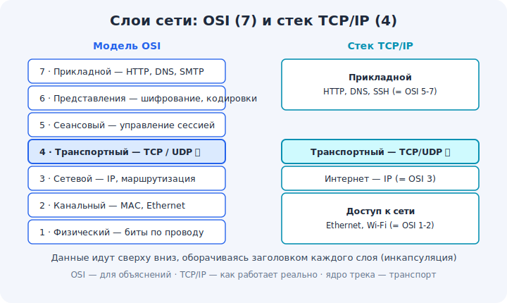

# 01 · Модель OSI и стек TCP/IP 🖼️⭐

> 🎯 **Цель блока:** понять, что сеть устроена **слоями**, и познакомиться с двумя картами этих
> слоёв — моделью OSI (7 слоёв) и стеком TCP/IP (как оно реально работает).

---

## 📖 Зачем слои

Передать данные через весь мир — слишком сложно, чтобы решать «одним куском». Поэтому задачу
**разбили на слои**, каждый отвечает за своё и опирается на нижний:

```
   приложение  — «что» передаём (веб-страница, письмо)
        ▼
   транспорт   — надёжно/быстро доставить между программами (TCP/UDP)
        ▼
   сеть        — найти путь между компьютерами по миру (IP, роутинг)
        ▼
   канал/физика — реально передать биты по проводу/радио
```

💡 Это как почта: тебе не важно, на каком самолёте летит посылка (нижние слои) — ты просто
пишешь адрес и отдаёшь. Каждый слой **скрывает** сложность от верхнего. Это и есть главная
идея — **абстракция через слои**.

---

## ⭐ Модель OSI (7 слоёв) — учебная карта

🖼️


```
   7. Прикладной (Application)   — HTTP, DNS, SMTP — то, чем пользуется программа
   6. Представления (Presentation) — кодировки, шифрование, сжатие
   5. Сеансовый (Session)        — управление сессией диалога
   4. Транспортный (Transport)   — TCP / UDP — порты, надёжность ⭐ (ядро трека)
   3. Сетевой (Network)          — IP — адресация и маршрутизация
   2. Канальный (Data Link)      — MAC, Ethernet, Wi-Fi — внутри одного сегмента
   1. Физический (Physical)      — биты по проводу/радио/оптике
```

💡 OSI — **эталонная** модель для обучения и разговора. На практике слои 5–7 часто сливают.
Запомни «семь слоёв» как общий язык: когда говорят «это проблема 3-го уровня» — имеют в виду IP.

---

## ⭐ Стек TCP/IP (4 слоя) — как работает реально

Реальный интернет построен на **стеке TCP/IP** — он проще, 4 слоя:

```
   Прикладной (Application)   ← HTTP, DNS, SSH...   (= OSI 5-7)
   Транспортный (Transport)   ← TCP, UDP            (= OSI 4) ⭐
   Сетевой/Интернет (Internet)← IP                  (= OSI 3)
   Канальный/доступ к сети    ← Ethernet, Wi-Fi     (= OSI 1-2)
```

💡 Когда говорят «стек TCP/IP» — это и есть «как устроен интернет». OSI используют для
объяснений, TCP/IP — для дела. Они сопоставимы (см. соответствие выше).

---

## 📖 Инкапсуляция — данные в «матрёшке»

Проходя слои сверху вниз, данные **оборачиваются** заголовком каждого слоя:

```
   [данные приложения]
   [TCP-заголовок | данные]               ← сегмент
   [IP-заголовок | TCP | данные]          ← пакет
   [Ethernet | IP | TCP | данные | хвост] ← кадр  → в провод
```

💡 Каждый слой добавляет свой «конверт» с адресами/служебной информацией. На приёмнике всё
разворачивается в обратном порядке. Подробно — модуль 07.

---

## ⚠️ Ловушки

- ❌ Зубрить 7 слоёв без понимания «зачем». Главное — **идея слоёв** и где живёт TCP/IP.
- ❌ Путать OSI и TCP/IP как «разные интернеты». Это две **карты одного** процесса.
- ❌ Думать, что данные идут «сразу в провод». Сначала — обёртки каждого слоя.

---

## 🛠️ Практика

1. Нарисуй по памяти 4 слоя TCP/IP и подпиши пример протокола к каждому.
2. Сопоставь: HTTP, IP, Ethernet, TCP — какой слой?
3. Открой `curl -v https://example.com` и найди в выводе признаки разных слоёв (DNS→IP,
   TCP-соединение, TLS, HTTP-ответ).

---

## ✅ Задачи

1. **Объясни**, зачем сеть разбили на слои (абстракция).
2. **Перечисли** слои OSI и TCP/IP и сопоставь их.
3. **Опиши** инкапсуляцию своими словами (матрёшка конвертов).
4. **Определи** слой для: HTTP, TCP, IP, Wi-Fi.

---

## ❓ Проверь себя

1. Зачем нужны слои в сети?
2. Сколько слоёв в OSI и в TCP/IP, как они соответствуют?
3. На каком слое работает TCP? А IP?
4. Что такое инкапсуляция?

---

## ✅ Чек-лист

- [ ] Понимаю идею слоёв (абстракция)
- [ ] Знаю слои OSI и стек TCP/IP и их соответствие
- [ ] Понимаю, где живёт транспорт (TCP/UDP) и сеть (IP)
- [ ] Понимаю инкапсуляцию

➡️ Следующий: [02 · Инструменты сетевика](02-tools.md)
