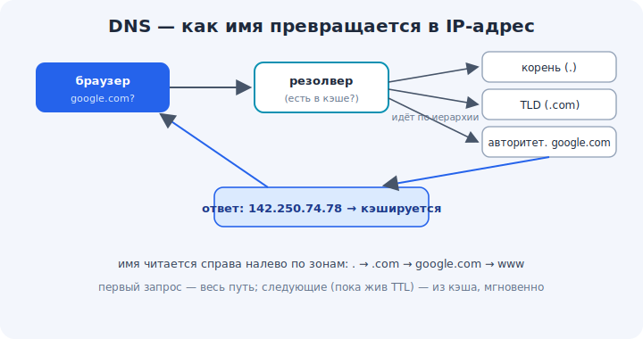

# 06 · DNS — как имена превращаются в адреса 🖼️⭐

> 🎯 **Цель блока:** понять систему доменных имён (DNS) — как `google.com` превращается в
> IP-адрес, кто такие DNS-серверы и зачем нужно кэширование.

---

## 📖 Зачем DNS

Компьютеры общаются по IP-адресам (`142.250.....`), а люди помнят **имена** (`google.com`).
**DNS** (Domain Name System) — это «телефонная книга интернета»: переводит имена в адреса.

🖼️


```
   ты: открыть google.com
   браузер: «а какой у него IP?» → спрашивает DNS
   DNS: «142.250.74.78»
   браузер: подключается по этому IP
```

💡 Без DNS пришлось бы помнить числовые адреса всех сайтов. DNS делает интернет «человеческим».

---

## ⭐ Как происходит резолвинг (иерархия)

DNS — **распределённая иерархия**. Запрос идёт по уровням, пока не найдётся ответ:

```
   1. резолвер (обычно DNS провайдера или 8.8.8.8): «есть в кэше? нет — спрошу»
   2. корневой сервер (.): «за .com отвечают вот эти серверы»
   3. TLD-сервер (.com): «за google.com отвечает вот этот сервер»
   4. авторитетный сервер google.com: «IP = 142.250.74.78»
   5. ответ возвращается тебе и КЭШИРУЕТСЯ на будущее
```

💡 Имя читается **справа налево** по зонам ответственности: `www.google.com.` →
корень `.` → `.com` → `google.com` → `www`. Каждая зона знает, к кому идти за следующей.

---

## 📖 Типы записей DNS

```
   A      — имя → IPv4-адрес
   AAAA   — имя → IPv6-адрес
   CNAME  — имя → другое имя (псевдоним)
   MX     — почтовый сервер домена
   TXT    — произвольный текст (часто для проверок/настроек)
   NS     — какие серверы отвечают за зону
```

💡 Самые частые — `A`/`AAAA` (адрес сайта) и `MX` (куда слать почту). Посмотреть можно
командой `dig google.com A` / `nslookup -type=MX google.com`.

---

## ⭐ Кэширование и TTL

Каждый ответ DNS живёт ограниченное время — **TTL** записи (не путать с TTL пакета!). Пока он
не истёк, ответ берут из кэша, не беспокоя серверы.

```
   первый запрос google.com  → полный путь по иерархии (медленнее)
   следующие (пока TTL жив)   → из кэша резолвера/ОС/браузера (мгновенно)
```

💡 Кэш — на разных уровнях (браузер, ОС, резолвер). Поэтому смена IP сайта «расходится» по
миру не мгновенно, а по мере истечения TTL. Это важно понимать при переезде сайтов.

---

## ⚠️ Ловушки

- ❌ Думать, что DNS «и есть интернет». DNS лишь переводит имена; данные потом идут по IP.
- ❌ Путать TTL записи DNS и TTL пакета (модуль 05) — это разные вещи с одним названием.
- ❌ Удивляться, что после смены IP сайт «ещё старый» — это кэш DNS с не истёкшим TTL.
- ❌ Считать DNS безопасным по умолчанию: обычный DNS не шифрован (есть DoH/DoT — модуль 14/19).

---

## 🛠️ Практика

1. `dig google.com` / `nslookup google.com` → найди IP и какой сервер ответил.
2. Запроси разные типы: `dig google.com MX`, `dig google.com AAAA`.
3. Сравни задержку первого и повторного запроса (кэш).
4. Открой Wireshark, сделай DNS-запрос — увидь запрос и ответ «вживую».

---

## ✅ Задачи

1. **Объясни**, зачем нужен DNS и что он переводит.
2. **Опиши** иерархию резолвинга (корень → TLD → авторитетный).
3. **Назови** типы записей A/AAAA/CNAME/MX и для чего они.
4. **Объясни** роль кэша и TTL записи.

---

## ❓ Проверь себя

1. Что делает DNS?
2. Как имя резолвится по иерархии серверов?
3. Чем A отличается от MX?
4. Почему смена IP сайта «расходится» не мгновенно?

---

## ✅ Чек-лист

- [ ] Понимаю DNS как «телефонную книгу» имя→IP
- [ ] Знаю иерархию резолвинга
- [ ] Знаю основные типы записей
- [ ] Понимаю кэширование и TTL записи

➡️ Следующий: [07 · Пакеты и инкапсуляция](07-packets.md)
