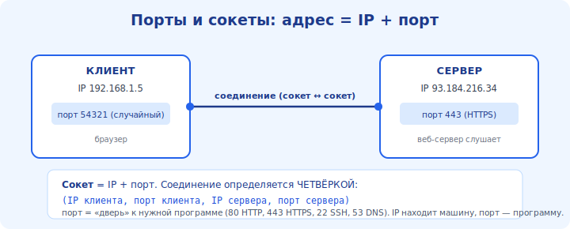

# 08 · Транспортный уровень: порты и сокеты 🖼️⭐

> 🎯 **Цель блока:** понять, зачем нужен транспортный уровень, что такое порт и сокет, и как
> данные находят не просто компьютер, а **конкретную программу** на нём.

---

## 📖 Проблема: IP доводит до компьютера, но не до программы

IP-адрес приводит пакет к нужному **компьютеру**. Но на компьютере одновременно работают
десятки программ (браузер, мессенджер, почта, игры). Кому отдать данные? Эту задачу решает
**транспортный уровень** (4-й слой) с помощью **портов**.

🖼️
```
   IP-адрес    →  «какой компьютер»     (сетевой слой)
   ПОРТ        →  «какая программа на нём» (транспортный слой)

   142.250.74.78 : 443
   └── адрес сервера ─┘ └ порт (443 = HTTPS, т.е. веб-сервер)
```



💡 Порт — это «номер квартиры» в доме (IP — адрес дома). Связка **IP + порт** однозначно
указывает на конкретную программу-собеседника.

---

## ⭐ Порты: известные и динамические

```
   0 – 1023     — well-known (системные): 80 HTTP, 443 HTTPS, 22 SSH, 53 DNS, 25 SMTP
   1024 – 49151 — registered (для приложений)
   49152+       — динамические/временные (их берёт твой клиент на время соединения)
```

💡 Сервер **слушает** известный порт (веб-сервер — 443). Клиент при подключении берёт себе
**временный** порт. Поэтому соединение определяется **четвёркой**:

```
   (IP клиента, порт клиента) ↔ (IP сервера, порт сервера)
   192.168.1.10:51514        ↔  142.250.74.78:443
```

⭐ Эта четвёрка уникальна — поэтому браузер может держать **много** соединений к одному сайту
(разные клиентские порты) и не путать их.

---

## ⭐ Сокет — «розетка» для данных

**Сокет** (socket) — это программная «конечная точка» соединения: связка IP+порт, через
которую программа шлёт и принимает данные. Для программиста сокет — как файл: открыл, пишешь,
читаешь, закрыл.

🖼️
```
   программа A                          программа B
   [память/буфер] ──► сокет ──► сеть ──► сокет ──► [память/буфер]
```

💡 ⭐ Вот прямая связь с темой памяти курса: **сокет соединяет буферы памяти двух программ
через сеть**. Данные лежат в памяти у отправителя → едут пакетами → попадают в память
получателя. Сокет — «труба» между двумя областями памяти на разных машинах. Писать в сокеты
мы будем в модуле 17.

---

## 📖 Два транспорта: TCP и UDP

Транспортный уровень предлагает **два** способа доставки — это сердце трека:

```
   TCP  — надёжно, по порядку, с подтверждениями (модуль 09). «Телефонный звонок».
   UDP  — быстро, без гарантий, без соединения (модуль 10). «Открытка по почте».
```

💡 Оба используют порты и сокеты, но дают **разные гарантии**. Выбор между ними (модуль 11) —
одно из главных решений в сетевом программировании.

---

## ⚠️ Ловушки

- ❌ Путать IP и порт: IP — компьютер, порт — программа на нём.
- ❌ Думать, что «порт 80 занят» глобально. Порт принадлежит **программе на конкретном хосте**.
- ❌ Считать, что одно приложение = одно соединение. Браузер держит много соединений (разные
  клиентские порты).

---

## 🛠️ Практика

1. `ss -tunap` / `netstat -ano` — посмотри, какие программы какие порты слушают и куда подключены.
2. Открой сайт и найди соединение на порт 443 от своего браузера; посмотри клиентский порт.
3. Объясни на одном соединении его «четвёрку» (IP+порт клиента ↔ IP+порт сервера).

---

## ✅ Задачи

1. **Объясни**, зачем нужен порт, если уже есть IP.
2. **Назови** 5 известных портов и их службы.
3. **Опиши** «четвёрку», определяющую соединение, и почему она уникальна.
4. **Объясни** сокет как точку соединения и его связь с памятью программ.

---

## ❓ Проверь себя

1. Что определяет IP, а что — порт?
2. Что такое сокет?
3. Из чего состоит уникальная «четвёрка» соединения?
4. Какие два транспорта предлагает 4-й слой?

---

## ✅ Чек-лист

- [ ] Понимаю роль портов (программа на хосте)
- [ ] Знаю известные порты и диапазоны
- [ ] Понимаю сокет как конечную точку и связь с буферами памяти
- [ ] Знаю, что есть TCP и UDP

➡️ Следующий (ядро): [09 · TCP — надёжная доставка](09-tcp.md)
