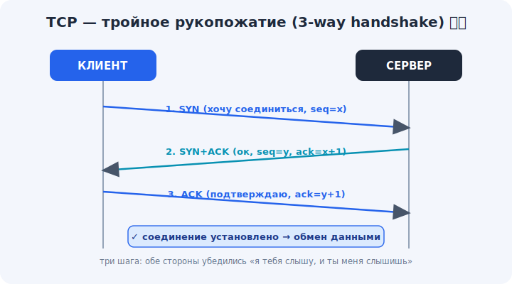

# 09 · TCP — надёжная доставка 🖼️⭐⭐

> 🎯 **Цель блока (ЯДРО трека):** понять TCP — протокол, который гарантирует, что данные дойдут
> **полностью и по порядку**: рукопожатие, подтверждения, повторы.

---

## 📖 Что обещает TCP

**TCP** (Transmission Control Protocol) — надёжный транспорт. Он гарантирует:

```
   ✅ доставку     — потерянное переотправит
   ✅ порядок      — соберёт пакеты в правильной последовательности
   ✅ без дублей    — отбросит повторы
   ✅ целостность  — проверит контрольной суммой
   ✅ поток         — для программы это непрерывный поток байт, а не пакеты
```

💡 Аналогия — **телефонный звонок**: сначала дозваниваешься (устанавливаешь связь), говоришь
по очереди, переспрашиваешь, если не расслышал, в конце прощаешься. TCP — основа веба, почты,
файлов: всего, где важна **целостность**.

---

## ⭐⭐ Установка соединения: «тройное рукопожатие»

TCP — соединение с **установкой** (connection-oriented). Перед передачей данных стороны
делают **3-way handshake**:

🖼️


```
   КЛИЕНT                                СЕРВЕР
     │ ──── SYN (хочу соединиться, seq=x) ───► │
     │ ◄─── SYN+ACK (ок; и я хочу, seq=y, ack=x+1) │
     │ ──── ACK (подтверждаю, ack=y+1) ─────► │
     │ ════════ соединение установлено ═══════ │
     │ ◄──────── обмен данными ──────────────► │
```

💡 Три шага нужны, чтобы **обе** стороны убедились: «я тебя слышу, и ты меня слышишь».
Обмениваются начальными номерами последовательности (seq) — с них начнётся нумерация байт.
Это та самая «установка связи», которой нет у UDP.

---

## ⭐⭐ Надёжность: номера и подтверждения (ACK)

Каждый байт в TCP **пронумерован**. Получатель шлёт **ACK** — «получил всё до номера N».

```
   отправитель: шлёт байты 1..100
   получатель:  ACK 101  («жду со 101-го, всё до него есть»)
   отправитель: шлёт 101..200
   ... пакет потерялся? ACK не пришёл → отправитель ПЕРЕОТПРАВИТ
```

💡 Так TCP **гарантирует** доставку: нет подтверждения за разумное время → повтор. Номера
позволяют и **переупорядочить** пришедшее не по порядку, и **отбросить дубли**. Получатель
всегда отдаёт программе байты строго по порядку — отсюда «поток».

---

## 📖 Завершение соединения

Закрывают соединение тоже аккуратно — обменом FIN/ACK (часто «четырёхстороннее прощание»):

```
   клиент: FIN (закончил слать)
   сервер: ACK ... FIN (тоже закончил)
   клиент: ACK  → соединение закрыто
```

💡 Аккуратное закрытие гарантирует, что **обе** стороны доотправили всё и согласились
завершиться. Грубый обрыв (RST) — это уже аварийное прекращение.

---

## ⭐ Цена надёжности

```
   👍 надёжно, по порядку, удобно для программиста (поток байт)
   👎 медленнее на старте (рукопожатие = лишний круг туда-обратно)
   👎 накладные расходы (ACK, нумерация, буферы)
   👎 «head-of-line blocking»: один потерянный пакет тормозит всё за ним
```

💡 За гарантии платят задержкой и сложностью. Когда это неприемлемо (живое видео, игры) —
берут UDP (модуль 10). Это и есть главный выбор транспорта (модуль 11).

---

## ⚠️ Ловушки

- ❌ Думать, что TCP «шлёт пакеты». Для программы TCP — **поток байт**; границы сообщений он
  не сохраняет (одно `send` может прийти как два `recv` и наоборот).
- ❌ Считать рукопожатие формальностью — это реальный круг туда-обратно (влияет на задержку).
- ❌ Полагать, что TCP шифрует. Нет — надёжность ≠ безопасность (шифрует TLS, модуль 14).

---

## 🛠️ Практика

1. В Wireshark поймай открытие любого HTTPS-сайта и найди **SYN, SYN+ACK, ACK** — увидь
   рукопожатие вживую. Затем найди ACK-и в ходе передачи.
2. `curl -v` — обрати внимание на «Connected to …» (это после рукопожатия).
3. Объясни на пойманном обмене, как номера seq/ack растут.

---

## ✅ Задачи

1. **Перечисли** гарантии TCP.
2. **Опиши** тройное рукопожатие по шагам и зачем оно.
3. **Объясни**, как ACK и номера обеспечивают надёжность и порядок.
4. **Назови** цену надёжности (минусы TCP).

---

## ❓ Проверь себя

1. Что гарантирует TCP?
2. Как и зачем работает 3-way handshake?
3. Как TCP узнаёт, что пакет потерян, и что делает?
4. Почему TCP — это «поток байт», а не «пакеты» для программы?

---

## ✅ Чек-лист

- [ ] Знаю гарантии TCP (доставка, порядок, целостность, поток)
- [ ] Понимаю тройное рукопожатие
- [ ] Понимаю ACK, номера и переотправку
- [ ] Понимаю цену надёжности

➡️ Следующий (ядро): [10 · UDP — скорость без гарантий](10-udp.md)
