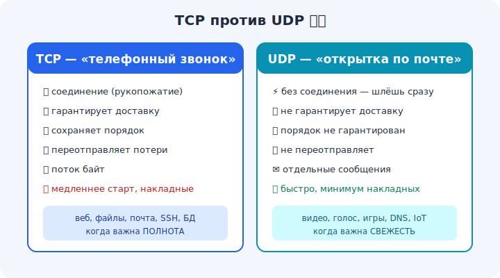

# 10 · UDP — скорость без гарантий 🖼️⭐⭐

> 🎯 **Цель блока (ЯДРО трека):** понять UDP — простой и быстрый транспорт без установки
> соединения и без гарантий доставки, и когда он лучше TCP.

---

## 📖 Что такое UDP

**UDP** (User Datagram Protocol) — «лёгкий» транспорт. Он **не** устанавливает соединение,
**не** гарантирует доставку и порядок. Просто берёт твои данные, добавляет минимальный
заголовок (порты + длина + контрольная сумма) и **отправляет**.

```
   UDP-дейтаграмма:
   [ порт отправителя | порт получателя | длина | контрольная сумма | ДАННЫЕ ]
```

💡 Аналогия — **открытка по почте**: бросил в ящик и забыл. Дойдёт — хорошо; потеряется —
никто не переотправит; придёт не по порядку — UDP не переставит. Зато **быстро и просто**.

---

## ⭐⭐ Чем UDP отличается от TCP (по сути)

```
   TCP                              UDP
   ───────────────────────────────────────────────────
   соединение (handshake)          без соединения — шлёшь сразу
   гарантирует доставку            НЕ гарантирует (потери возможны)
   сохраняет порядок               порядок НЕ гарантирован
   переотправляет потери           НЕ переотправляет
   поток байт                      отдельные сообщения (дейтаграммы)
   больше задержка/накладные        минимум накладных, быстро
```

🖼️


💡 ⭐⭐ Главная мысль: UDP **отдаёт надёжность ради скорости и простоты**. Если потеря пакета не
страшна или приложение само решит, что с ней делать — UDP выигрывает. Сохранение **границ
сообщений** (одно `send` = одно `recv`) — тоже плюс UDP перед потоком TCP.

---

## ⭐ Где UDP незаменим

```
   🎮 онлайн-игры        — лучше пропустить старый кадр, чем ждать переотправку
   📞 голос/видео (VoIP)  — устаревший пакет уже не нужен, важна «живость»
   📡 DNS (запрос-ответ)  — крошечный обмен, рукопожатие — лишняя задержка
   📺 стриминг реального времени, IoT-датчики, многие игры
```

💡 Принцип: **где «свежесть» важнее полноты** — UDP. Потерянный кадр видео уже не актуален к
моменту переотправки; лучше показать следующий. А вот файл по UDP слать нельзя — побьётся.

---

## 📖 «Надёжный UDP» и QUIC

Иногда хотят скорость UDP **плюс** некоторую надёжность — тогда её реализуют **поверх** UDP в
самом приложении (свои подтверждения только для важного). Так устроен современный протокол
**QUIC** (основа HTTP/3, модуль 18): он на UDP, но добавляет надёжность, шифрование и быстрый
старт — без минусов TCP вроде head-of-line blocking.

💡 То есть «TCP vs UDP» — не «надёжно vs ненадёжно навсегда». UDP даёт чистый быстрый канал, а
нужные гарантии можно добрать сверху ровно там, где надо.

---

## ⚠️ Ловушки

- ❌ Слать по UDP то, что не терпит потерь (файлы, платежи) без своей надёжности.
- ❌ Думать, что UDP «хуже» TCP. Он **другой** — для своих задач он лучше.
- ❌ Ожидать порядок и отсутствие дублей в UDP. Их нет — это забота приложения.
- ❌ Считать, что UDP не нужен — на нём DNS, видеозвонки, игры и HTTP/3.

---

## 🛠️ Практика

1. В Wireshark поймай DNS-запрос — увидь, что он по **UDP** (порт 53), без рукопожатия.
2. Сравни в Wireshark открытие сайта (TCP, с SYN/ACK) и DNS-запрос (UDP, сразу данные).
3. `nc -u` (netcat в UDP-режиме) — отправь датаграмму и заметь: подтверждений нет.

---

## ✅ Задачи

1. **Перечисли** отличия UDP от TCP (минимум 5).
2. **Назови** 4 сценария, где UDP уместнее TCP, и объясни почему.
3. **Объясни** принцип «свежесть важнее полноты».
4. **Опиши**, как поверх UDP добавляют надёжность (идея QUIC).

---

## ❓ Проверь себя

1. Что НЕ гарантирует UDP?
2. Чем UDP выигрывает у TCP?
3. Почему голос/видео/игры часто на UDP?
4. Что такое QUIC и зачем он на UDP?

---

## ✅ Чек-лист

- [ ] Понимаю, что UDP без соединения и без гарантий
- [ ] Знаю ключевые отличия от TCP
- [ ] Понимаю, где UDP уместнее (свежесть > полнота)
- [ ] Знаю про «надёжный UDP»/QUIC

➡️ Следующий: [11 · TCP vs UDP — когда что](11-tcp-vs-udp.md)
