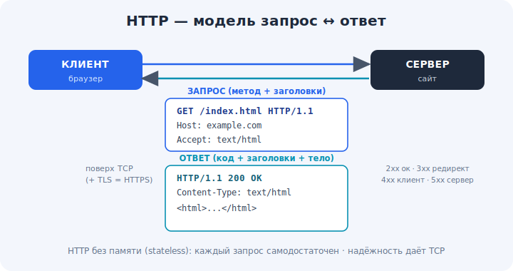

# 13 · HTTP и HTTPS — основа веба 🖼️⭐

> 🎯 **Цель блока:** понять HTTP — протокол, на котором работает веб: запрос/ответ, методы,
> коды состояния, заголовки — и что добавляет «S» в HTTPS.

---

## 📖 HTTP = язык запросов и ответов

**HTTP** (HyperText Transfer Protocol) — прикладной протокол (7-й слой), работающий **поверх
TCP**. Модель простая: клиент шлёт **запрос**, сервер шлёт **ответ**.

🖼️


```
   ЗАПРОС                              ОТВЕТ
   GET /index.html HTTP/1.1            HTTP/1.1 200 OK
   Host: example.com                   Content-Type: text/html
   User-Agent: ...                     Content-Length: 1234
   (пустая строка)                     (пустая строка)
                                       <html>...</html>
```

💡 HTTP **текстовый и без памяти о прошлом** (stateless): каждый запрос самодостаточен; сервер
по умолчанию не помнит предыдущие (состояние добавляют cookie/сессии). Поверх TCP HTTP получает
надёжную доставку (модуль 09) — ему не надо самому заботиться о потерях.

---

## ⭐ Методы (глаголы)

```
   GET     — получить ресурс (страницу, данные)         — без изменений
   POST    — отправить данные (создать, форма)          — меняет состояние
   PUT     — заменить ресурс целиком
   PATCH   — частично изменить
   DELETE  — удалить
   HEAD    — как GET, но только заголовки (без тела)
```

💡 GET «читает», POST/PUT/PATCH/DELETE «пишут». Это основа REST API (модуль 16). GET должен
быть **безопасным** (не менять данные) — важное правило дизайна.

---

## ⭐ Коды состояния (статусы)

Сервер отвечает трёхзначным кодом — по первой цифре понятен класс:

```
   1xx — информация (редко)
   2xx — успех:        200 OK, 201 Created, 204 No Content
   3xx — перенаправление: 301 Moved Permanently, 302 Found, 304 Not Modified
   4xx — ошибка клиента: 400 Bad Request, 401 Unauthorized, 403 Forbidden, 404 Not Found, 429 Too Many Requests
   5xx — ошибка сервера: 500 Internal Server Error, 502 Bad Gateway, 503 Service Unavailable
```

💡 Запомни классы: **4xx — ты не прав** (клиент), **5xx — сервер сломался**. Это первое, что
смотрят при отладке. `200` — всё хорошо, `404` — нет такого ресурса.

---

## 📖 Заголовки

Заголовки — пары «ключ: значение» с метаданными запроса/ответа:

```
   запрос:  Host, User-Agent, Accept, Authorization, Cookie, Content-Type
   ответ:   Content-Type, Content-Length, Set-Cookie, Cache-Control, Location
```

💡 Заголовки управляют форматом (`Content-Type: application/json`), кэшированием, авторизацией,
cookie. Тело (body) — это сами данные (HTML, JSON, картинка).

---

## ⭐ HTTPS = HTTP + TLS

**HTTPS** — это тот же HTTP, но внутри **зашифрованного** канала TLS (модуль 14):

```
   HTTP:  данные идут открытым текстом — кто угодно по пути может прочитать/подменить
   HTTPS: данные шифруются TLS — приватность + целостность + подлинность сервера
```

💡 «Замочек» в браузере = HTTPS = TLS. Сегодня это стандарт для всего веба. Порт HTTP — 80,
HTTPS — 443. Надёжность даёт TCP, **безопасность** — TLS; это разные вещи.

---

## ⚠️ Ловушки

- ❌ Путать «HTTP без памяти» с «нельзя хранить состояние». Состояние есть — через cookie/сессии/токены.
- ❌ Считать 4xx и 5xx «одинаковыми ошибками». 4xx — вина клиента, 5xx — сервера.
- ❌ Думать, что HTTPS «прячет всё». Шифруется содержимое; **какой сайт** ты открыл (домен) часто
  всё ещё виден (DNS, SNI).
- ❌ Использовать GET для изменения данных — это нарушает семантику и вредит (кэш, повторы).

---

## 🛠️ Практика

1. `curl -v https://example.com` — найди строку запроса, метод, заголовки, код ответа.
2. `curl -I https://example.com` (HEAD) — посмотри только заголовки.
3. Открой DevTools браузера (вкладка Network) и посмотри методы, статусы, заголовки реальных запросов.
4. Намеренно зайди на несуществующую страницу — увидь 404; найди сайт с редиректом — увидь 301/302.

---

## ✅ Задачи

1. **Опиши** модель запрос-ответ и структуру HTTP-сообщения.
2. **Перечисли** методы и классы кодов состояния.
3. **Объясни**, что добавляет HTTPS и чем он отличается от HTTP.
4. **Разбери** один реальный запрос в DevTools (метод, статус, заголовки).

---

## ❓ Проверь себя

1. Поверх какого транспорта работает HTTP и почему?
2. Чем отличаются GET и POST?
3. Что значат классы кодов 2xx/3xx/4xx/5xx?
4. Что добавляет TLS в HTTPS?

---

## ✅ Чек-лист

- [ ] Понимаю модель запрос-ответ HTTP
- [ ] Знаю методы и коды состояния
- [ ] Понимаю заголовки и тело
- [ ] Понимаю, что HTTPS = HTTP + TLS

➡️ Следующий: [14 · TLS/SSL — шифрование](14-tls.md)
