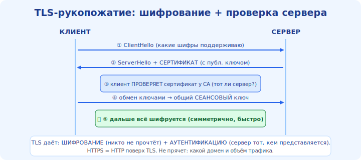

# 14 · TLS/SSL — шифрование и доверие 🖼️⭐

> 🎯 **Цель блока:** понять, как TLS защищает соединение — шифрование, сертификаты,
> удостоверяющие центры — и что на самом деле гарантирует «замочек» в браузере.

---

## 📖 Зачем TLS

Без шифрования данные идут **открытым текстом**: любой на пути (Wi-Fi, провайдер, роутер)
может их прочитать или подменить. **TLS** (Transport Layer Security; старое имя — SSL)
оборачивает соединение в защиту и даёт три вещи:

```
   🔒 конфиденциальность — данные зашифрованы, чужой не прочитает
   ✅ целостность         — подмену по пути обнаружат
   🪪 подлинность         — ты говоришь с НАСТОЯЩИМ сервером, а не с самозванцем
```



💡 TLS работает **между транспортом и приложением**: HTTP, почта, и многое другое могут идти
«внутри» TLS. HTTPS = HTTP + TLS. «Замочек» = TLS установлен.

---

## ⭐ Как устанавливается защита (TLS handshake)

После TCP-рукопожатия (модуль 09) стороны делают **TLS-рукопожатие** — договариваются о ключах:

🖼️
```
   1. клиент: «привет, вот мои поддерживаемые шифры»
   2. сервер: «вот мой СЕРТИФИКАТ (с публичным ключом) и выбранный шифр»
   3. клиент: проверяет сертификат, согласует общий секретный ключ
   4. дальше всё шифруется этим ключом
```

💡 Используется **асимметричная** криптография (пара ключей: публичный/приватный) — чтобы
безопасно согласовать **симметричный** ключ, которым потом быстро шифруют данные. Детали
криптографии — отдельная тема; для сети важна **схема доверия** (ниже).

---

## ⭐ Сертификаты и удостоверяющие центры (CA)

Откуда клиент знает, что сервер — настоящий, а не самозванец? Из **сертификата**, подписанного
доверенным **удостоверяющим центром** (Certificate Authority, CA).

```
   CA (которому доверяет твой браузер/ОС)
        │ подписывает
   сертификат example.com  ──► сервер предъявляет его при handshake
        │
   браузер проверяет подпись CA → «да, это правда example.com» → 🔒
```

💡 В твоей ОС/браузере вшит список **доверенных CA**. Если сертификат подписан ими и совпадает
с доменом и не просрочен — соединение доверенное. Если нет — браузер показывает
**предупреждение** («сертификат недействителен»).

⚠️ Это **цепочка доверия**: ты доверяешь CA → CA подтверждает сервер. Поэтому компрометация CA
или игнор предупреждений опасны.

---

## 📖 Что TLS НЕ прячет

```
   ✅ шифрует:  содержимое (какие страницы, данные форм, пароли)
   ❌ не прячет: ФАКТ соединения и обычно ДОМЕН назначения
                 (виден провайдеру через DNS и поле SNI; есть улучшения вроде ECH)
```

💡 HTTPS прячет «что ты делаешь на сайте», но «к какому сайту подключился» часто всё ещё
наблюдаемо. Полную приватность назначения добавляют VPN/Tor/шифрованный DNS (модуль 19).

---

## ⚠️ Ловушки

- ❌ Игнорировать предупреждение о сертификате «чтобы быстрее». Это может быть атака (модуль 20).
- ❌ Думать, что HTTPS = «сайт безопасный/честный». TLS подтверждает **подлинность канала**, а не
  добрые намерения владельца сайта.
- ❌ Путать надёжность (TCP) и безопасность (TLS) — разные слои, разные задачи.
- ❌ Считать, что HTTPS скрывает, **какой** сайт ты открыл — обычно нет.

---

## 🛠️ Практика

1. Нажми на «замочек» в браузере → посмотри сертификат: кем выдан (CA), кому, срок действия.
2. `curl -v https://example.com` — найди строки про TLS handshake и сертификат.
3. Зайди на тестовый сайт с «плохим» сертификатом (например, `expired.badssl.com`) — увидь
   предупреждение и пойми, от чего оно защищает.

---

## ✅ Задачи

1. **Назови** три гарантии TLS.
2. **Опиши** TLS-рукопожатие и роль сертификата.
3. **Объясни** цепочку доверия через CA.
4. **Перечисли**, что TLS прячет, а что — нет.

---

## ❓ Проверь себя

1. Что даёт TLS (3 свойства)?
2. Как клиент убеждается, что сервер настоящий?
3. Что такое CA и цепочка доверия?
4. Что HTTPS НЕ скрывает?

---

## ✅ Чек-лист

- [ ] Понимаю три гарантии TLS
- [ ] Понимаю TLS-рукопожатие и сертификаты
- [ ] Понимаю роль CA и цепочку доверия
- [ ] Знаю границы того, что прячет HTTPS

➡️ Следующий: [15 · Прикладные протоколы](15-app-protocols.md)
