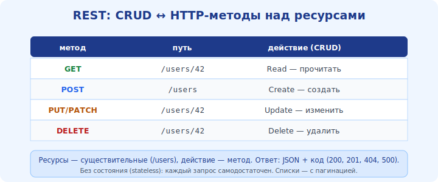

# 16 · REST API и форматы данных 🖼️⭐

> 🎯 **Цель блока:** понять, как программы общаются по сети через **API** поверх HTTP — стиль
> REST, ресурсы, методы, статусы и формат JSON.

---

## 📖 API = интерфейс для программ, не для людей

Сайт отдаёт **страницы** людям. **API** (Application Programming Interface) отдаёт **данные**
программам. Самый распространённый веб-API — **REST поверх HTTP**.

🖼️
```
   человек → браузер → HTML-страница (для глаз)
   программа → HTTP-запрос к API → JSON-данные (для кода)
```



💡 Мобильное приложение, фронтенд, другой сервис — все они дёргают API и получают
структурированные данные (обычно JSON), а не HTML. Это «клей» между сервисами (перекликается с
треком Интеграция: REST/gRPC как способ связать программы).

---

## ⭐ REST: ресурсы + методы HTTP

**REST** — стиль, где всё представлено **ресурсами** (объектами) по адресам (URL), а действия
выражены **методами HTTP** (модуль 13):

```
   GET    /users        → список пользователей
   GET    /users/42     → пользователь №42
   POST   /users        → создать пользователя (данные в теле)
   PUT    /users/42     → заменить пользователя 42
   PATCH  /users/42     → частично изменить
   DELETE /users/42     → удалить
```

💡 Идея: **существительное в URL** (ресурс), **глагол в методе** (действие). `GET /users/42`
читается как «получить пользователя 42». Это предсказуемо и единообразно.

---

## ⭐ Коды состояния в API

API использует те же HTTP-статусы (модуль 13), и это важная часть контракта:

```
   200 OK              — успех (есть тело)
   201 Created         — создано (после POST)
   204 No Content      — успех без тела (после DELETE)
   400 Bad Request     — кривой запрос клиента
   401 Unauthorized    — нужна авторизация
   404 Not Found       — нет такого ресурса
   429 Too Many Requests — превышен лимит запросов
   500 ...             — ошибка на сервере
```

💡 Хороший API возвращает **правильные** коды: не «200 с ошибкой внутри», а `404`/`400`/`401`
по смыслу. Это позволяет клиенту реагировать программно (перекликается с дизайном API в треках
языков, раздел «Проекты и API»).

---

## ⭐ JSON — язык обмена

**JSON** (JavaScript Object Notation) — текстовый формат данных, понятный людям и программам:

```json
{
  "id": 42,
  "name": "Алиса",
  "active": true,
  "roles": ["admin", "user"]
}
```

💡 JSON — стандарт обмена в вебе: объекты `{}`, массивы `[]`, строки, числа, true/false, null.
Заголовок `Content-Type: application/json` говорит, что тело — JSON. Альтернативы: XML (старее),
бинарные форматы (быстрее, для нагруженных систем).

---

## 📖 Авторизация и лимиты

```
   ключ/токен:  заголовок  Authorization: Bearer <токен>   (кто ты)
   лимиты:      429 Too Many Requests + заголовки о лимите (как часто можно)
```

💡 API обычно требует **ключ или токен** (чтобы знать, кто и сколько запрашивает) и
ограничивает частоту запросов (**rate limit**). Ключи — это секреты: их не кладут в код/git, а
хранят в переменных окружения (как в треках языков).

---

## ⚠️ Ловушки

- ❌ Возвращать `200 OK` при ошибке — клиент не сможет отличить успех от провала. Используй
  правильные коды.
- ❌ Глаголы в URL (`/getUser`, `/deleteUser`) вместо метода+ресурса (`GET /users/42`).
- ❌ Хранить API-ключи в коде/репозитории — выноси в переменные окружения.
- ❌ Игнорировать `429`/лимиты — клиент должен уметь притормозить и повторить.

---

## 🛠️ Практика

1. Дёрни публичный API через curl, например:
   `curl https://api.github.com/users/torvalds` — рассмотри JSON-ответ.
2. Добавь `-i`, чтобы увидеть код состояния и заголовки (`Content-Type: application/json`).
3. Найди API с разными методами (или почитай доку) и сопоставь действия с GET/POST/PUT/DELETE.
4. Намеренно запроси несуществующий ресурс — получи `404` и JSON с ошибкой.

---

## ✅ Задачи

1. **Объясни**, чем API отличается от обычной веб-страницы.
2. **Сопоставь** действия CRUD с методами HTTP и примерами URL.
3. **Подбери** правильные коды состояния для 5 ситуаций.
4. **Напиши** пример JSON-объекта и объясни его типы.

---

## ❓ Проверь себя

1. Что такое REST API и поверх чего он работает?
2. Как в REST выражают ресурс и действие?
3. Зачем важны правильные коды состояния?
4. Что такое JSON и как указывают, что тело — JSON?

---

## ✅ Чек-лист

- [ ] Понимаю, что такое веб-API и REST
- [ ] Связываю CRUD с методами HTTP
- [ ] Понимаю роль кодов состояния в API
- [ ] Знаю JSON и основы авторизации/лимитов

➡️ Следующий: [17 · Сокет-программирование](17-sockets-programming.md)
