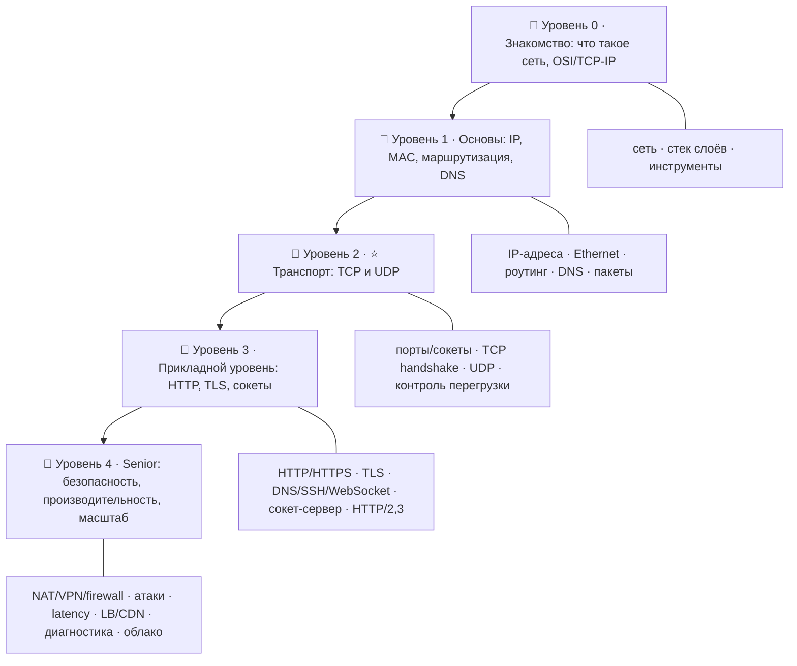

# 🌐 Дорожная карта: Компьютерные сети и интернет — от новичка до Senior

> 🎯 **Цель трека:** понять, **как на самом деле работает интернет** — от провода и IP-адреса
> до TCP/UDP, HTTP, TLS и облачной инфраструктуры. Ядро — **транспортный уровень (TCP/UDP)**:
> как данные надёжно (или быстро) путешествуют от одной программы к другой.

Это **восьмой трек** курса. Он про **сети**: что происходит между «нажал Enter в браузере»
и «страница загрузилась». Ты научишься не только пользоваться сетью, но и понимать,
диагностировать и проектировать её.

🧠 **Связь с темой курса.** В языках ядро — память (где живут байты). В сетях те же байты
**путешествуют**: данные лежат в буферах памяти, упаковываются в пакеты, едут по проводам и
снова попадают в память на другом конце. Сокет — это «труба» между памятью двух программ.
Понимание памяти + понимание сети = полная картина того, как программы обмениваются данными.

---

## 🗺️ Карта трека

| Уровень | Папка | О чём |
|--------|-------|-------|
| 🥚 0 · Знакомство | `00-setup` | Что такое сеть и интернет, модель OSI и стек TCP/IP, инструменты (ping, curl, Wireshark). |
| 🐣 1 · Основы | `01-basics` | IP-адреса, MAC/Ethernet, маршрутизация, DNS, пакеты и инкапсуляция. |
| 🐥 2 · ⭐ Транспорт | `02-transport` | Порты и сокеты, **TCP** (надёжность), **UDP** (скорость), TCP vs UDP, контроль перегрузки. |
| 🦅 3 · Прикладной | `03-application` | HTTP/HTTPS, TLS, прикладные протоколы, REST/JSON, сокет-программирование, HTTP/2 и HTTP/3. |
| 🚀 4 · Senior | `04-advanced` | NAT/firewall/VPN, сетевые атаки и защита, производительность, балансировка/CDN, диагностика, облако. |

---

## 🎯 Чему ты научишься

- Понимать **модель OSI и стек TCP/IP** — из каких слоёв состоит сеть.
- Разбираться в **IP-адресах, подсетях, маршрутизации и DNS**.
- Глубоко понимать **TCP и UDP** — ядро транспорта — и выбирать между ними.
- Знать, как работают **HTTP/HTTPS, TLS, WebSocket** и современный веб (HTTP/2, HTTP/3).
- Писать простой **сокет-клиент и сервер** своими руками.
- Понимать **NAT, firewall, VPN, прокси** и сетевую **безопасность**.
- Диагностировать сеть инструментами: **ping, traceroute, Wireshark, tcpdump, ss/netstat**.
- Думать о **производительности и масштабе**: latency, throughput, балансировка, CDN.

---

## 🧩 Как устроен каждый модуль

1. **📖 Теория** — простым языком, со схемами.
2. **🖼️ Схема** — как это работает «по проводам».
3. **🛠️ Практика** — реальные команды (ping, curl, dig, netcat…).
4. **⚠️ Ловушки** — где обычно путаются.
5. **✅ Задачи** и **❓ Проверка себя**.
6. **Чек-лист** «готов идти дальше».

➡️ Начать: [00 · Что такое компьютерная сеть](00-setup/00-what-is-network.md)

> 💡 Многое можно пощупать прямо в терминале (`ping`, `curl`, `dig`, `traceroute`) — практика
> важнее зубрёжки. Глубже всего — наблюдать реальные пакеты в Wireshark.
