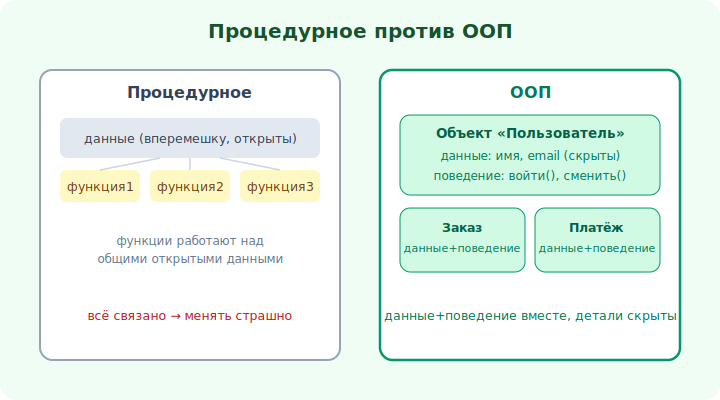

# 00 · Что такое ООП и зачем оно 🖼️

> 🎯 **Цель блока:** понять, что такое объектно-ориентированное программирование, чем оно
> отличается от процедурного, и какую проблему решает.

---

## 📖 ООП — способ организовать сложность

Программы растут. Когда кода становится много, главная боль — **сложность**: всё связано со
всем, изменение в одном месте ломает другое. **ООП** (объектно-ориентированное программирование)
— это способ **организовать** код так, чтобы со сложностью можно было справляться.

Идея: вместо «данные отдельно, функции отдельно» — объединить **данные и поведение** в
**объекты**, которые моделируют сущности задачи.

🖼️


```
   ПРОЦЕДУРНОЕ:                      ООП:
   данные ───┐                       ┌─ Объект «Пользователь» ─┐
   функция1 ─┼─ всё вперемешку       │ данные: имя, email      │
   функция2 ─┤  работают над         │ поведение: войти(),     │
   функция3 ─┘  общими данными       │           сменить_пароль│
                                     └─────────────────────────┘
```

💡 В ООП каждый объект — «маленькая программа» со своим состоянием и своими действиями. Сложная
система = много объектов, которые **общаются** друг с другом. Это ближе к тому, как мы мыслим о
реальном мире (заказы, пользователи, счета).

---

## ⭐ Парадигмы программирования

ООП — одна из **парадигм** (стилей мышления о коде):

```
   процедурное   — программа = последовательность процедур над данными (C, скрипты)
   объектное     — программа = объекты с состоянием и поведением (Java, C#, Python, C++)
   функциональное — программа = композиция чистых функций без состояния (Haskell, частично Rust)
```

💡 Это **не** «одна правильная, остальные плохие». Это инструменты под задачу. ООП особенно
силён там, где есть **сущности с состоянием и поведением** (бизнес-системы, GUI, игры). Хороший
Senior владеет несколькими парадигмами и сочетает их (модуль 24).

---

## ⭐ Какую проблему решает ООП

```
   1. УПРАВЛЕНИЕ СЛОЖНОСТЬЮ — разбить большую систему на понятные объекты
   2. ПОВТОРНОЕ ИСПОЛЬЗОВАНИЕ — объекты и классы можно переиспользовать
   3. ИЗОЛЯЦИЯ ИЗМЕНЕНИЙ — спрятать детали так, чтобы изменения не расползались
   4. МОДЕЛИРОВАНИЕ — код отражает предметную область (заказ, клиент, платёж)
```

💡 Главная ценность — **управление изменениями**. Код живёт годами и постоянно меняется. ООП (и
хороший дизайн вообще) делает так, чтобы менять было **безопасно и локально**, а не «дёрнул тут —
сломалось там».

---

## 📖 Объекты вокруг нас

Чтобы «увидеть» объекты, мысли существительными предметной области:

```
   интернет-магазин → объекты: Товар, Корзина, Заказ, Клиент, Платёж
   игра             → объекты: Игрок, Враг, Оружие, Уровень
   банк             → объекты: Счёт, Транзакция, Клиент, Карта
```

💡 У каждого — **состояние** (что он знает: баланс счёта) и **поведение** (что он умеет:
пополнить, снять). Найти объекты в задаче — первый навык ООП-проектирования.

---

## ⚠️ Заблуждения

- ❌ «ООП = классы везде». Класс — инструмент; иногда функция проще и лучше.
- ❌ «ООП всегда лучше». Для математики/обработки данных функциональный стиль часто чище.
- ❌ «Главное — наследование». На деле важнее **инкапсуляция** и **полиморфизм**; наследованием
  часто злоупотребляют (модуль 10, 16).
- ❌ «ООП — это про синтаксис». ООП — это про **мышление** объектами и проектирование.

---

## 🛠️ Практика

1. Возьми знакомую систему (магазин, чат, игра) и выпиши 5–7 **объектов** из неё.
2. Для каждого — его **состояние** (данные) и **поведение** (действия).
3. Подумай, как они **общаются** (Заказ содержит Товары, Клиент делает Заказ).

---

## ✅ Задачи

1. **Объясни** разницу процедурного и объектного подходов.
2. **Назови** 4 проблемы, которые решает ООП.
3. **Выдели** объекты из 2 предметных областей с их состоянием и поведением.
4. **Объясни**, почему ООП — не единственная и не всегда лучшая парадигма.

---

## ❓ Проверь себя

1. Что объединяет объект (в отличие от процедурного подхода)?
2. Какие есть парадигмы программирования?
3. Какую главную проблему решает ООП?
4. Как найти объекты в задаче?

---

## ✅ Чек-лист

- [ ] Понимаю ООП как способ организовать сложность
- [ ] Различаю процедурный, объектный, функциональный стили
- [ ] Знаю, какие проблемы решает ООП
- [ ] Умею выделять объекты с состоянием и поведением

➡️ Следующий: [01 · Класс и объект](01-class-object.md)
