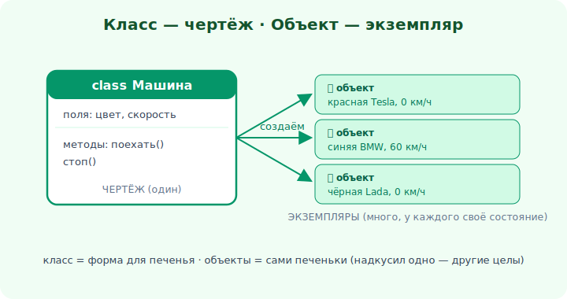

# 01 · Класс и объект 🖼️⭐

> 🎯 **Цель блока:** понять фундамент ООП — что такое класс (чертёж) и объект (экземпляр), и
> чем они отличаются.

---

## ⭐ Класс — чертёж, объект — экземпляр

```
   КЛАСС   — описание/чертёж: какие данные и какое поведение у сущности
   ОБЪЕКТ  — конкретный экземпляр класса со своими значениями
```

🖼️


```
   class Машина:          ← ЧЕРТЁЖ (один)
       цвет, скорость
       поехать(), стоп()
        │
        ├─► объект: красная Tesla, 0 км/ч   ┐
        ├─► объект: синяя BMW, 60 км/ч       ├─ ЭКЗЕМПЛЯРЫ (много)
        └─► объект: чёрная Lada, 0 км/ч      ┘
```

💡 Аналогия: класс — это **форма для печенья**, объекты — сами **печеньки**. Из одной формы —
много печений, и каждое потом живёт своей жизнью (надкусили одно — другие целы). Класс пишут
один раз, объектов создают сколько нужно.

---

## ⭐ Поля и методы

Класс описывает две вещи:

```
   ПОЛЯ (атрибуты/свойства) — данные, СОСТОЯНИЕ объекта (что он знает)
   МЕТОДЫ                   — функции внутри класса, ПОВЕДЕНИЕ (что он умеет)
```

```python
class Счёт:
    def __init__(self, баланс):   # конструктор: задаёт начальное состояние
        self.баланс = баланс       # ПОЛЕ (состояние)

    def пополнить(self, сумма):    # МЕТОД (поведение)
        self.баланс += сумма
```

```python
a = Счёт(100)      # создали ОБЪЕКТ (экземпляр)
a.пополнить(50)    # вызвали МЕТОД → состояние a изменилось
print(a.баланс)    # 150
```

💡 `self` (в Python; `this` в Java/C++/C#) — это «сам объект»: через него метод обращается к
**своим** полям. У каждого объекта свои значения полей, но методы — общие (из класса).

---

## 📖 Создание объекта (инстанцирование)

```
   Счёт(100)
   ▼
   1. выделяется новый объект
   2. вызывается конструктор (__init__/constructor) → задаёт начальное состояние
   3. возвращается готовый объект
```

💡 **Конструктор** — особый метод, который «настраивает» объект при рождении. Подробнее —
модуль 03. Каждый объект независим: изменение одного не трогает других (печеньки!).

---

## ⭐ Класс vs объект — не путать

```
   Машина          — класс (понятие, чертёж, существует один)
   моя красная Tesla — объект (конкретная вещь, существует в памяти, можно потрогать)

   у класса нет «цвета = красный» — это есть у ОБЪЕКТА
   у объекта нет «определения метода поехать» — оно в КЛАССЕ
```

💡 Частая путаница новичков. Запомни: **класс описывает, объект существует**. Пишешь класс
один раз — создаёшь объекты много раз, каждый со своим состоянием.

---

## ⚠️ Ловушки

- ❌ Путать класс (чертёж) и объект (экземпляр).
- ❌ Думать, что объекты делят состояние. У каждого — своё (если поле не статическое, модуль 07).
- ❌ Забывать `self`/`this` — без него метод не знает, с чьими данными работать.
- ❌ Складывать в класс всё подряд. Класс должен моделировать **одну** понятную сущность.

---

## 🛠️ Практика

1. Опиши класс `Книга` с полями (название, автор, страницы) и методами (`открыть`, `описание`).
2. Создай 3 объекта-книги с разными значениями — убедись, что они независимы.
3. Объясни на своём классе, где класс, где объект, где поле, где метод.

---

## ✅ Задачи

1. **Объясни** разницу класса и объекта на аналогии.
2. **Разведи** поля (состояние) и методы (поведение).
3. **Напиши** простой класс с конструктором, полем и методом.
4. **Создай** несколько объектов и покажи их независимость.

---

## ❓ Проверь себя

1. Чем класс отличается от объекта?
2. Что такое поля и методы?
3. Зачем нужен `self`/`this`?
4. Что происходит при создании объекта?

---

## ✅ Чек-лист

- [ ] Понимаю класс как чертёж, объект как экземпляр
- [ ] Различаю поля (состояние) и методы (поведение)
- [ ] Понимаю роль `self`/`this`
- [ ] Умею написать класс и создать объекты

➡️ Следующий: [02 · Языки и инструменты](02-tools.md)
