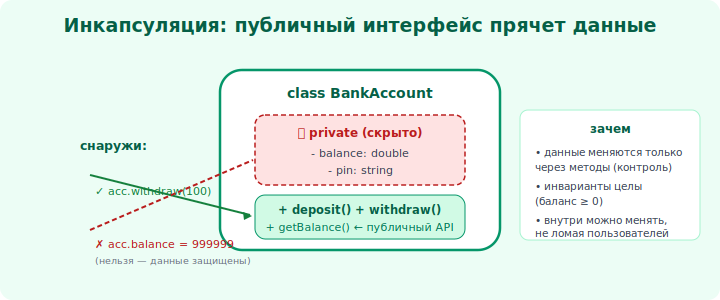

# 05 · Инкапсуляция и сокрытие 🖼️⭐

> 🎯 **Цель блока:** понять инкапсуляцию — объединение данных с поведением и **сокрытие**
> внутренностей — один из важнейших принципов ООП (и ядра уровня 2).

---

## 📖 Инкапсуляция = данные + поведение + защита

**Инкапсуляция** — это:
1. **объединить** данные и работающее с ними поведение в одном объекте;
2. **скрыть** внутренние детали, оставив наружу только понятный интерфейс.

🖼️
```
   ┌──── Объект «Счёт» ────────────────┐
   │  снаружи видно (интерфейс):        │
   │    пополнить()  снять()  баланс()  │  ← через них общаются
   │  ─────────────────────────────────│
   │  скрыто внутри:                    │
   │    _баланс, проверки, логика       │  ← никто снаружи не трогает
   └────────────────────────────────────┘
```



💡 Аналогия: банкомат. Снаружи — кнопки (интерфейс: снять, проверить баланс). Внутри — сейф,
проверки, журнал (скрыто). Ты пользуешься кнопками, но не лезешь в сейф руками. Объект так же:
наружу — кнопки-методы, внутрь — никому нельзя.

---

## ⭐ Зачем скрывать: свобода менять внутренности

Главная выгода инкапсуляции — **изоляция изменений**:

```
   если поле _баланс скрыто и доступ только через методы:
     → можешь поменять ВНУТРЕННЕЕ устройство (хранить в копейках, в БД, кэшировать)
     → внешний код НЕ сломается: он зовёт те же пополнить()/баланс()

   если поле баланс торчит наружу и все его меняют напрямую:
     → любое изменение внутреннего устройства ломает ВЕСЬ код, который к нему лез
```

💡 ⭐ Это и есть сила инкапсуляции: **граница**, за которой ты свободен менять реализацию, не
ломая остальных. Без неё система превращается в «клубок», где всё связано со всем (высокое
зацепление, модуль 17).

---

## 📖 Уровни доступа

Языки дают модификаторы доступа:

```
   public     — видно всем (интерфейс объекта)
   private    — только внутри класса (детали реализации)
   protected  — класс и его наследники

   Python: соглашение — _одно_подчёркивание (приватное по договорённости),
           __два (усиленное сокрытие через name mangling)
   Java/C++/C#: ключевые слова private/protected/public
```

💡 Правило: **поля — приватные, доступ — через методы** (или свойства). Снаружи торчит минимум.
Чем уже «публичная поверхность» объекта, тем легче его менять и тестировать.

---

## ⭐ Геттеры, сеттеры и свойства

```python
class Температура:
    def __init__(self, c):
        self._celsius = c
    @property
    def celsius(self):           # геттер
        return self._celsius
    @celsius.setter
    def celsius(self, value):    # сеттер с проверкой!
        if value < -273.15:
            raise ValueError("ниже абсолютного нуля")
        self._celsius = value
```

💡 Свойства/геттеры-сеттеры дают **контролируемый** доступ: можно проверить, преобразовать,
залогировать. Но ⚠️ не делай сеттер на каждое поле бездумно — это «инкапсуляция понарошку»
(поле всё равно полностью открыто). Сеттер нужен там, где есть **логика/проверка**.

---

## ⚠️ Ловушки

- ❌ Публичные изменяемые поля — внешний код привязывается к внутреннему устройству.
- ❌ Геттер+сеттер на каждое поле «на всякий случай» — это просто открытое поле в обёртке.
- ❌ «Дырявая» инкапсуляция: метод возвращает внутренний список, и его меняют снаружи (отдавай
  копию или неизменяемое представление).
- ❌ Считать инкапсуляцию «бюрократией». Это твоя свобода менять реализацию.

---

## 🛠️ Практика

1. Сделай поле `_баланс` приватным, доступ — только через методы. Попробуй залезть напрямую —
   почувствуй границу.
2. Поменяй **внутреннее** хранение (например, в копейках) — убедись, что внешний код не сломался.
3. Найди в своём классе «дырявую» инкапсуляцию (метод отдаёт внутренний список) и почини.

---

## ✅ Задачи

1. **Объясни** инкапсуляцию (объединение + сокрытие) и её главную выгоду.
2. **Покажи**, как сокрытие позволяет менять реализацию без поломки внешнего кода.
3. **Объясни** уровни доступа (public/private/protected).
4. **Объясни**, когда нужен сеттер, а когда он лишний.

---

## ❓ Проверь себя

1. Из чего состоит инкапсуляция?
2. Почему скрытие внутренностей даёт свободу менять реализацию?
3. Какие есть уровни доступа?
4. Когда геттер/сеттер оправдан, а когда — нет?

---

## ✅ Чек-лист

- [ ] Понимаю инкапсуляцию (данные+поведение+сокрытие)
- [ ] Понимаю, что сокрытие изолирует изменения
- [ ] Знаю уровни доступа
- [ ] Использую геттеры/сеттеры осмысленно, а не везде

➡️ Следующий: [06 · Композиция и агрегация](06-composition.md)
